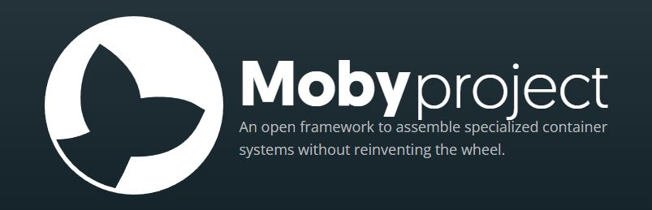
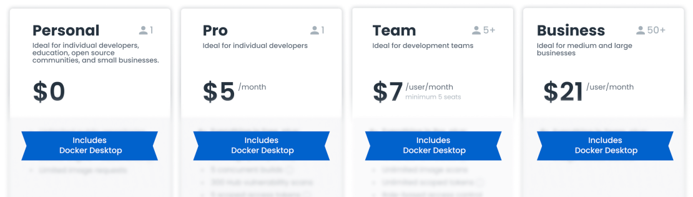
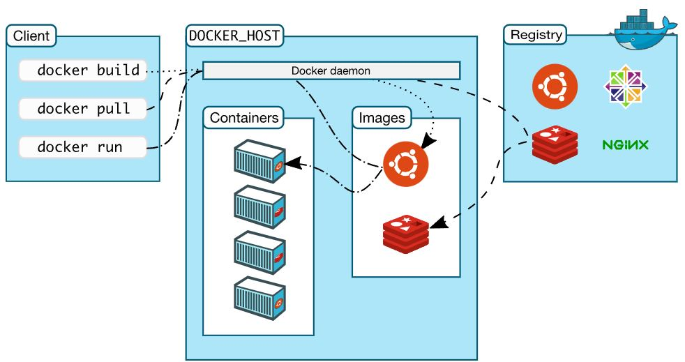

# What is Docker ?

- [What are containers?](#what-are-containers-and-why-should-i-use-them)
- [Why are containers important?](#why-are-containers-important)
- [The Moby project](#the-moby-project)
- [Docker products](#docker-products)
- [Container architecture](#docker-architecture)

# What Are Containers and Why Should I Use Them?

This first chapter will introduce you to the world of containers and their orchestration. This book starts from the very beginning, in that it assumes that you have no prior knowledge of containers, and will give you a very practical introduction to the topic.

In this chapter, we will focus on the software supply chain and the friction within it. Then, we'll present containers, which are used to reduce this friction and add enterprise-grade security on top of it. We'll also look into how containers and the ecosystem around them are assembled. We'll specifically point out the distinction between the upstream **Open Source Software (OSS)** components, united under the code name [Moby](https://mobyproject.org/), that form the building blocks of the downstream products of Docker and other vendors.

**Docker**, a subset of the Moby project, is a software framework for building, running, and managing containers on servers and the cloud. The term "docker" may refer to either the tools (the commands and a daemon) or to the Dockerfile file format.

### Alternatives to Docker
Linux containers have facilitated a massive shift in high-availability computing. There are many toolsets out there to help you run services, or even your entire operating system, in containers. The **Open Container Initiative (OCI)** is an industry standards organization that encourages innovation while avoiding the danger of vendor lock-in. Thanks to the OCI, you have a choice when choosing a container toolchain, including **Docker**, **CRI-O**, **Podman**, **LXC**, and others.

- Docker overview: https://docs.docker.com/engine/docker-overview/
- CRI-O : https://cri-o.io/
- Podman : https://podman.io/
- LXC: https://linuxcontainers.org/

# Why are containers important?

### Before Docker containers
For many years now, enterprise software has typically been deployed either on “bare metal” (i.e. installed on an operating system that has complete control over the underlying hardware) or in a virtual machine (i.e. installed on an operating system that shares the underlying hardware with other “guest” operating systems). Naturally, installing on bare metal made the software painfully difficult to move around and difficult to update—two constraints that made it hard for IT to respond nimbly to changes in business needs.

Then virtualization came along. Virtualization platforms (also known as “hypervisors”) allowed multiple virtual machines to share a single physical system, each virtual machine emulating the behavior of an entire system, complete with its own operating system, storage, and I/O, in an isolated fashion. IT could now respond more effectively to changes in business requirements, because VMs could be cloned, copied, migrated, and spun up or down to meet demand or conserve resources.

Virtual machines also helped cut costs, because more VMs could be consolidated onto fewer physical machines. Legacy systems running older applications could be turned into VMs and physically decommissioned to save even more money.

But virtual machines still have their share of problems. Virtual machines are large (gigabytes), each one containing a full operating system. Only so many virtualized apps can be consolidated onto a single system. Provisioning a VM still takes a fair amount of time. Finally, the portability of VMs is limited. After a certain point, VMs are not able to deliver the kind of speed, agility, and savings that fast-moving businesses are demanding.

### Docker container benefits
Containers work a little like VMs, but in a far more specific and granular way. They isolate a single application and its dependencies—all of the external software libraries the app requires to run—both from the underlying operating system and from other containers. All of the containerized apps share a single, common operating system (either Linux or Windows), but they are compartmentalized from one another and from the system at large.

### The benefits of Docker containers show up in many places. Here are some of the major advantages of Docker and containers:

Docker enables more efficient use of system resources
Instances of containerized apps use far less memory than virtual machines, they start up and stop more quickly, and they can be packed far more densely on their host hardware. All of this amounts to less spending on IT.

The cost savings will vary depending on what apps are in play and how resource-intensive they may be, but containers invariably work out as more efficient than VMs. It’s also possible to save on costs of software licenses, because you need many fewer operating system instances to run the same workloads.

### Docker enables faster software delivery cycles
Enterprise software must respond quickly to changing conditions. That means both easy scaling to meet demand and easy updating to add new features as the business requires. 

Docker containers make it easy to put new versions of software, with new business features, into production quickly—and to quickly roll back to a previous version if you need to. They also make it easier to implement strategies like blue/green deployments.

### Docker enables application portability
Where you run an enterprise application matters—behind the firewall, for the sake of keeping things close by and secure; or out in a public cloud, for easy public access and high elasticity of resources. Because Docker containers encapsulate everything an application needs to run (and only those things), they allow applications to be shuttled easily between environments. Any host with the Docker runtime installed—be it a developer’s laptop or a public cloud instance—can run a Docker container.

### Docker shines for microservices architecture
Lightweight, portable, and self-contained, Docker containers make it easier to build software along forward-thinking lines, so that you’re not trying to solve tomorrow’s problems with yesterday’s development methods.

One of the software patterns containers make easier is microservices, where applications are constituted from many loosely coupled components. By decomposing traditional, “monolithic” applications into separate services, microservices allow the different parts of a line-of-business app to be scaled, modified, and serviced separately—by separate teams and on separate timelines, if that suits the needs of the business. 

Containers aren’t required to implement microservices, but they are perfectly suited to the microservices approach and to agile development processes generally.

# The Moby project
Originally, when Docker (the company) introduced Docker containers, everything was open source. Docker didn't have any commercial products at this time. The Docker engine that the company developed was a monolithic piece of software. It contained many logical parts, such as the container runtime, a network library, a **RESTful (REST) API**, a command-line interface, and much more.

The Moby project provides components that are used for image management, secret management, configuration management, and networking and provisioning, to name just a few. Also, part of the Moby project is special Moby tools that are, for example, used to assemble components into runnable artifacts.

Some components that technically belong to the Moby project have been donated by Docker to the **Cloud-Native Computing Foundation (CNCF)** and thus do not appear in the list of components anymore. The most prominent ones are notary, containerd, and runc, where the first is used for content trust and the latter two form the container runtime.

### What is Moby?

Moby is an open framework created by Docker to assemble specialized container systems without reinventing the wheel. It provides a “lego set” of dozens of standard components and a framework for assembling them into custom platforms. At the core of Moby is a framework to assemble specialized container systems which provides:
####  Components
A library of containerized components for all vital aspects of a container system: OS, container runtime, orchestration, infrastructure management, networking, storage, security, build, image distribution, etc.
#### Tools
Tools to assemble the components into runnable artifacts for a variety of platforms and architectures: bare metal (both x86 and Arm); executables for Linux, Mac and Windows; VM images for popular cloud and virtualization providers.
#### Assemblies
A set of reference assemblies which can be used as-is, modified, or used as inspiration to create your own. All Moby components are containers, so creating new components is as easy as building a new OCI-compatible container.

- The Moby project: https://mobyproject.org/

# Docker products

To meet these challenges, today we’re announcing updates and extensions to our product subscriptions: **Personal, Pro, Team, and Business**. These updated product subscriptions provide the productivity and collaboration developers rely on with the scale, security, and trusted content businesses require, and do so in a manner sustainable for Docker.

### What you need to know:
We’re introducing a new product subscription, Docker Business, for organizations using Docker at scale for application development and require features like secure software supply chain management, single sign-on (SSO), container registry access controls, and more.

Our Docker Subscription Service Agreement includes a change to the terms for Docker Desktop:
**Docker Desktop** remains free for small businesses (fewer than 250 employees AND less than $10 million in annual revenue), personal use, education, and non-commercial open source projects.

It requires a paid subscription (**Pro, Team or Business**), starting at $5 per user per month, for professional use in larger businesses. 

While the effective date of these terms is August 31, 2021, there is a grace period until January 31, 2022 for those that require a paid subscription to use Docker Desktop.

Docker Pro, Docker Team, and Docker Business subscriptions include commercial use of Docker Desktop.

The existing Docker Free subscription has been renamed **Docker Personal**.

No changes to Docker Engine or any upstream open source Docker or Moby project.

### Docker Personal = Free
The new Docker Personal subscription replaces the Docker Free subscription. With its focus on open source communities, individual developers, education, and small businesses – which together account for more than half of Docker users – Docker Personal is free for these communities and continues to allow free use of all its components – including Docker CLI, Docker Compose, Docker Build/BuildKit, Docker Engine, Docker Desktop, Docker Hub, Docker Official Images, and more.

- Docker products: https://www.docker.com/get-started

# Docker architecture
Docker uses a client-server architecture. The Docker client talks to the Docker daemon, which does the heavy lifting of building, running, and distributing your Docker containers. The Docker client and daemon can run on the same system, or you can connect a Docker client to a remote Docker daemon. The Docker client and daemon communicate using a REST API, over UNIX sockets or a network interface. Another Docker client is Docker Compose, that lets you work with applications consisting of a set of containers.

## Docker Architecture Diagram

### The Docker daemon
The Docker daemon (dockerd) listens for Docker API requests and manages Docker objects such as images, containers, networks, and volumes. A daemon can also communicate with other daemons to manage Docker services.

### The Docker client
The Docker client (docker) is the primary way that many Docker users interact with Docker. When you use commands such as docker run, the client sends these commands to dockerd, which carries them out. The docker command uses the Docker API. The Docker client can communicate with more than one daemon.

### Docker registries
A Docker registry stores Docker images. Docker Hub is a public registry that anyone can use, and Docker is configured to look for images on Docker Hub by default. You can even run your own private registry.

When you use the docker pull or docker run commands, the required images are pulled from your configured registry. When you use the docker push command, your image is pushed to your configured registry.

### Docker objects
When you use Docker, you are creating and using images, containers, networks, volumes, plugins, and other objects. This section is a brief overview of some of those objects.

### Images
An image is a read-only template with instructions for creating a Docker container. Often, an image is based on another image, with some additional customization. For example, you may build an image which is based on the ubuntu image, but installs the Apache web server and your application, as well as the configuration details needed to make your application run.

You might create your own images or you might only use those created by others and published in a registry. To build your own image, you create a Dockerfile with a simple syntax for defining the steps needed to create the image and run it. Each instruction in a Dockerfile creates a layer in the image. When you change the Dockerfile and rebuild the image, only those layers which have changed are rebuilt. This is part of what makes images so lightweight, small, and fast, when compared to other virtualization technologies.

### Containers
A container is a runnable instance of an image. You can create, start, stop, move, or delete a container using the Docker API or CLI. You can connect a container to one or more networks, attach storage to it, or even create a new image based on its current state.

By default, a container is relatively well isolated from other containers and its host machine. You can control how isolated a container’s network, storage, or other underlying subsystems are from other containers or from the host machine.

A container is defined by its image as well as any configuration options you provide to it when you create or start it. When a container is removed, any changes to its state that are not stored in persistent storage disappear.

- Cloud-Native Computing Foundation: https://www.cncf.io/ (Free Trainings)
- Containerd – an industry-standard container runtime: https://containerd.io/

