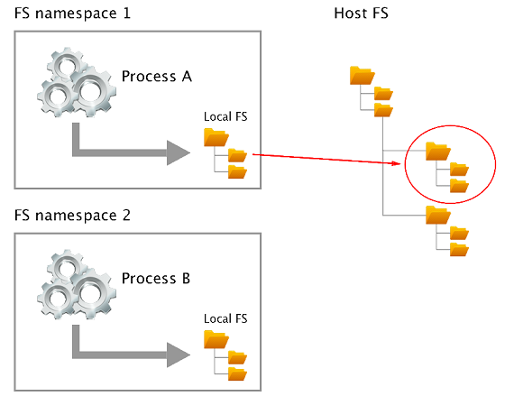
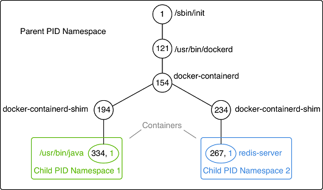

# Anatomy of containers
Many people wrongly compare containers to VMs. However, this is a questionable comparison. Containers are not just lightweight VMs. OK then, what is the correct description of a container?

Containers are specially encapsulated and secured processes running on the host system. Containers leverage a lot of features and primitives available in the Linux OS. The most important ones are namespaces and cgroups. All processes running in containers only share the same Linux kernel of the underlying host operating system. This is fundamentally different compared with VMs, as each VM contains its own full-blown operating system.

The startup times of a typical container can be measured in milliseconds, while a VM normally needs several seconds to minutes to start up. VMs are meant to be long-living. It is a primary goal of each operations engineer to maximize the uptime of their VMs. Contrary to that, containers are meant to be ephemeral. They come and go relatively quickly.

Let's first get a high-level overview of the architecture that enables us to run containers.

# Architecture
Here, we have an architectural diagram on how this all fits together:

High-level architecture of Docker

In the lower part of the preceding diagram, we have the Linux operating system with its **cgroups, Namespaces**, and **Layer Capabilities** as well as **Other OS Functionality** that we do not need to explicitly mention here. Then, there is an intermediary layer composed of **containerd** and **runc**. On top of all that now sits the **Docker engine**. The **Docker engine** offers a RESTful interface to the outside world that can be accessed by any tool, such as the Docker CLI, Docker for macOS, and Docker for Windows or Kubernetes to name just a few.

Let's now describe the main building blocks in a bit more detail.

# Namespaces
Linux namespaces had been around for years before they were leveraged by Docker for their containers. A namespace is an abstraction of global resources such as filesystems, network access, and process trees (also named PID namespaces) or the system group IDs and user IDs. A Linux system is initialized with a single instance of each namespace type. After initialization, additional namespaces can be created or joined.

The Linux namespaces originated in 2002 in the 2.4.19 kernel. In kernel version 3.8, user namespaces were introduced and with it, namespaces were ready to be used by containers.

If we wrap a running process, say, in a filesystem namespace, then this process has the illusion that it owns its own complete filesystem. This, of course, is not true; it is only a virtual filesystem. From the perspective of the host, the contained process gets a shielded subsection of the overall filesystem. It is like a filesystem in a filesystem:

Filesystem namespaces on Linux
The same applies to all of the other global resources for which namespaces exist. The user ID namespace is another example. Having a user namespace, we can now define a **jdoe** user many times on the system as long as it is living in its own namespace.

The PID namespace is what keeps processes in one container from seeing or interacting with processes in another container. A process might have the apparent **PID 1**inside a container, but if we examine it from the host system, it would have an ordinary PID, say **334**:

Process tree on a Docker host

In a given namespace, we can run one to many processes. That is important when we talk about containers, and we have experienced that already when we executed another process in an already-running container.

# Control groups (cgroups)
Linux cgroups are used to limit, manage, and isolate resource usage of collections of processes running on a system. Resources are CPU time, system memory, network bandwidth, or combinations of these resources, and so on.

Engineers at Google originally implemented this feature in 2006. The cgroups functionality was merged into the Linux kernel mainline in kernel version 2.6.24, which was released in January 2008.

Using cgroups, administrators can limit the resources that containers can consume. With this, we can avoid, for example, the classical noisy neighbor problem, where a rogue process running in a container consumes all CPU time or reserves massive amounts of RAM and, as such, starves all of the other processes running on the host, whether they're containerized or not.

# Union filesystem (Unionfs)
Unionfs forms the backbone of what is known as container images. We will discuss container images in detail in the next chapter. At this time, we want to just understand a bit better what Unionfs is, and how it works. Unionfs is mainly used on Linux and allows files and directories of distinct filesystems to be overlaid to form a single coherent filesystem. In this context, the individual filesystems are called branches. Contents of directories that have the same path within the merged branches will be seen together in a single merged directory, within the new virtual filesystem. When merging branches, the priority between the branches is specified. In that way, when two branches contain the same file, the one with the higher priority is seen in the final filesystem.

# Container plumbing
The basement on top of which the Docker engine is built; is the container plumbing and is formed by two components, runc and containerd.

Originally, Docker was built in a monolithic way and contained all of the functionality necessary to run containers. Over time, this became too rigid and Docker started to break out parts of the functionality into their own components. Two important components are runc and containerd.

# runC
runC is a lightweight, portable container runtime. It provides full support for Linux namespaces as well as native support for all security features available on Linux, such as SELinux, AppArmor, seccomp, and cgroups.

runC is a tool for spawning and running containers according to the **Open Container Initiative (OCI)** specification. It is a formally specified configuration format, governed by the **Open Container Project (OCP)** under the auspices of the Linux Foundation.

# Containerd
runC is a low-level implementation of a container runtime; containerd builds on top of it and adds higher-level features, such as image transfer and storage, container execution, and supervision as well as network and storage attachments. With this, it manages the complete life cycle of containers. Containerd is the reference implementation of the OCI specifications and is by far the most popular and widely used container runtime.

Containerd was donated to and accepted by the CNCF in 2017. There exist alternative implementations of the OCI specification. Some of them are rkt by CoreOS, CRI-O by RedHat, and LXD by Linux Containers. However, containerd at this time is by far the most popular container runtime and is the default runtime of Kubernetes 1.8 or later and the Docker platform.