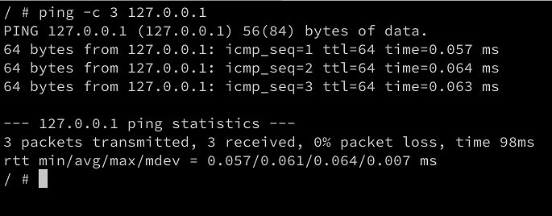
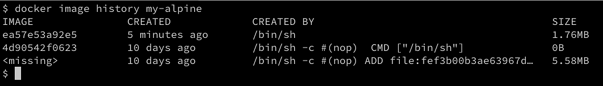
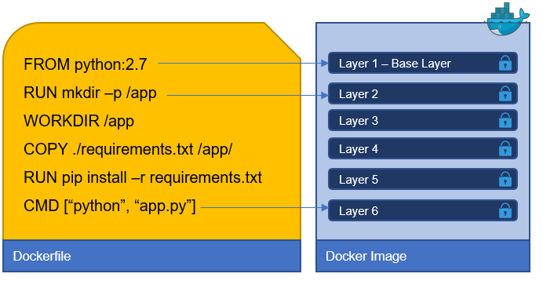
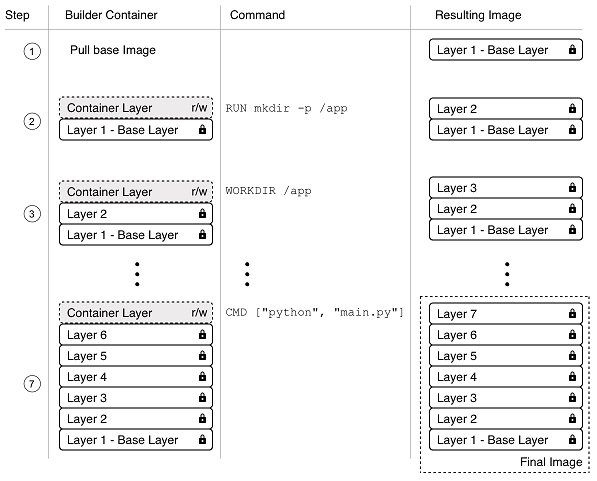

[](../M-02/README.md)

# **Creating images**
There are three ways to create a new container image on your system. The first one is by interactively building a container that contains all the additions and changes one desires, and then committing those changes into a new image. The second, and most important, way is to use a **Dockerfile** to describe what's in the new image, and then build the image using that **Dockerfile** as a manifest. Finally, the third way of creating an image is by importing it into the system from a tarball.

Now, let's look at these three ways in detail.

# Interactive image creation
The first way we can create a custom image is by interactively building a container. That is, we start with a base image that we want to use as a template and run a container of it interactively. Let's say that this is the Alpine image.

To interactively create an image follow along:

- The command to run the container would be as follows:


***PowerShell***
```
docker container run -it `
    --name sample `
    alpine:3.10 /bin/sh
```

The preceding command runs a container based on the **alpine:3.10** image.

We run the container interactively with an attached teletypewriter (TTY) using the **-it** parameter, name it **sample** with the **--name** parameter, and—finally—run a shell inside the container using **/bin/sh**.

In the Terminal window where you run the preceding command, you should see something similar to this:

```
Unable to find image 'alpine:3.10' locally
3.10: Pulling from library/alpine
921b31ab772b: Pull complete
Digest: sha256:ca1c944a4f8486a153024d9965aafbe24f5723c1d5c02f4964c045a16d19dc54
Status: Downloaded newer image for alpine:3.10
/ #
```

By default, the **alpine** container does not have the **ping** tool installed. Let's assume we want to create a new custom image that has **ping** installed.

Inside the container, we can then run the following command:

```
/ # apk update && apk add iputils
```
This uses the **apk** Alpine package manager to install the **iputils** library, of which **ping**is a part. The output of the preceding command should look approximately like this:


Installing **ping** on Alpine

- Now, we can indeed use ping, as the following code snippet shows:



Using ping from within the container

- Once we have finished our customization, we can quit the container by typing exit at the prompt.
- 
If we now list all containers with the ls **-a** Docker container, we can see that our sample container has a status of **Exited**, but still exists on the system, as shown in the following code block:

***CLI***
``` 
docker container ls -a | grep sample
040fdfe889a6 alpine:3.10 "/bin/sh" 8 minutes ago Exited (0) 4 seconds ago
```

- If we want to see what has changed in our container in relation to the base image, we can use the docker **container diff command**, as follows:

***CLI***
``` 
docker container diff sample
```
The output should present a list of all modifications done on the filesystem of the container, as follows:

```
C /usr
C /usr/sbin
A /usr/sbin/getcap
A /usr/sbin/ipg
A /usr/sbin/tftpd
A /usr/sbin/ninfod
A /usr/sbin/rdisc
A /usr/sbin/rarpd
A /usr/sbin/tracepath
...
A /var/cache/apk/APKINDEX.d8b2a6f4.tar.gz
A /var/cache/apk/APKINDEX.00740ba1.tar.gz
C /bin
C /bin/ping
C /bin/ping6
A /bin/traceroute6
C /lib
C /lib/apk
C /lib/apk/db
C /lib/apk/db/scripts.tar
C /lib/apk/db/triggers
C /lib/apk/db/installed
```

We have shortened the preceding output for better readability. In the list, **A** stands for added, and **C** stands for changed. If we had any deleted files, then those would be prefixed with a **D**.

We can now use the docker container commit command to persist our modifications and create a new image from them, like this:

***CLI***
``` 
docker container commit sample my-alpine
sha256:44bca4141130ee8702e8e8efd1beb3cf4fe5aadb62a0c69a6995afd49c2e7419
```

With the preceding command, we have specified that the new image will be called **my-alpine**. The output generated by the preceding command corresponds to the ID of the newly generated image.

- We can verify this by listing all images on our system, as follows:

***CLI***
``` docker image ls
```

We can see this image ID (shortened) as follows:
```
REPOSITORY   TAG      IMAGE ID       CREATED              SIZE
my-alpine    latest   44bca4141130   About a minute ago   7.34MB
...
```

We can see that the image named **my-alpine** has the expected ID of **44bca4141130** and automatically got a **latest** tag assigned. This happens since we did not explicitly define a tag ourselves. In this case, Docker always defaults to the **latest** tag.

- If we want to see how our custom image has been built, we can use the history command as follows:

***CLI***

``` 
docker image history my-alpine
```
This will print a list of the layers our image consists of, as follows:



History of the my-alpine Docker image 
The first layer in the preceding output is the one that we just created by adding the **iputils** package.

# Using Dockerfiles
Manually creating custom images, as shown in the previous section of this chapter, is very helpful when doing exploration, creating prototypes, or authoring feasibility studies. But it has a serious drawback: it is a manual process and thus is not repeatable or scalable. It is also as error-prone as any other task executed manually by humans. There must be a better way.

This is where the so-called **Dockerfile** comes into play. A **Dockerfile** is a text file that is usually literally called **Dockerfile**. It contains instructions on how to build a custom container image. It is a declarative way of building images.

- Declarative versus imperative:
In computer science, in general, and with Docker specifically, one often uses a **declarative** way of defining a task. One describes the expected outcome and lets the system figure out how to achieve this goal, rather than giving step-by-step instructions to the system on how to achieve this desired outcome. The latter is an **imperative** approach.
Let's look at a sample Dockerfile, as follows:

```
FROM python:2.7
RUN mkdir -p /app
WORKDIR /app
COPY ./requirements.txt /app/
RUN pip install -r requirements.txt
CMD ["python", "main.py"]
```
This is a **Dockerfile** as it is used to containerize a Python 2.7 application. As we can see, the file has six lines, each starting with a keyword such as **FROM**, **RUN**, or **COPY**. It is a convention to write the keywords in all caps, but that is not a must.

Each line of the **Dockerfile** results in a layer in the resulting image. In the following screenshot, the image is drawn upside down compared to the previous illustrations in this chapter, showing an image as a stack of layers. Here, the **Base Layer** is shown on top. Don't let yourself be confused by this. In reality, the base layer is always the lowest layer in the stack:



The relation of Dockerfile and layers in an image

Now, let's look at the individual keywords in more detail.

# The FROM keyword
Every **Dockerfile** starts with the **FROM** keyword. With it, we define which base image we want to start building our custom image from. If we want to build starting with CentOS 7, for example, we would have the following line in the **Dockerfile**:

```
FROM centos:7
```
On Docker Hub, there are curated or official images for all major Linux distros, as well as for all important development frameworks or languages, such as Python, Node.js, Ruby, Go, and many more. Depending on our needs, we should select the most appropriate base image.

For example, if I want to containerize a Python 3.7 application, I might want to select the relevant official **python:3.7** image.

If we really want to start from scratch, we can also use the following statement:

```
FROM scratch
```

This is useful in the context of building super-minimal images that only—for example—contain a single binary: the actual statically linked executable, such as **Hello-World**. The **scratch** image is literally an empty base image.

**FROM scratch** is a **no-op** in the **Dockerfile**, and as such does not generate a layer in the resulting container image.

# The RUN keyword
The next important keyword is RUN. The argument for RUN is any valid Linux command, such as the following:

```
RUN yum install -y wget
```

The preceding command is using the **yum** CentOS package manager to install the **wget** package into the running container. This assumes that our base image is **CentOS or Red Hat Enterprise Linux (RHEL**). If we had Ubuntu as our base image, then the command would look similar to the following:

```
RUN apt-get update && apt-get install -y wget
```

It would look like this because Ubuntu uses **apt-get** as a package manager. Similarly, we could define a line with **RUN**, like this:

```
RUN mkdir -p /app && cd /app
```

We could also do this:

```
RUN tar -xJC /usr/src/python --strip-components=1 -f python.tar.xz
```

Here, the former creates an **/app** folder in the container and navigates to it, and the latter untars a file to a given location. It is completely fine, and even recommended, for you to format a Linux command using more than one physical line, such as this:

```
RUN apt-get update \
  && apt-get install -y --no-install-recommends \
    ca-certificates \
    libexpat1 \
    libffi6 \
    libgdbm3 \
    libreadline7 \
    libsqlite3-0 \
    libssl1.1 \
  && rm -rf /var/lib/apt/lists/*
```

If we use more than one line, we need to put a backslash (**\**) at the end of the lines to indicate to the shell that the command continues on the next line.

For Powershell version

```
RUN apt-get update `
RUN apt-get install -y --no-install-recommends `
    ca-certificates `
    libexpat1 `
    libffi6 `
    libgdbm3 `
    libreadline7 `
    libsqlite3-0 `
    libssl1.1 `
RUN rm -rf /var/lib/apt/lists/*
```

Try to find out what the preceding command does.


# The COPY and ADD keywords

The **COPY** and **ADD** keywords are very important since, in the end, we want to add some content to an existing base image to make it a custom image. Most of the time, these are a few source files of—say—a web application, or a few binaries of a compiled application.

These two keywords are used to copy files and folders from the host into the image that we're building. The two keywords are very similar, with the exception that the **ADD** keyword also lets us copy and unpack TAR files, as well as providing a URL as a source for the files and folders to copy.

Let's look at a few examples of how these two keywords can be used, as follows:

```
COPY . /app
COPY ./web /app/web
COPY sample.txt /data/my-sample.txt
ADD sample.tar /app/bin/
ADD http://example.com/sample.txt /data/
```

In the preceding lines of code, the following applies:

- The first line copies all files and folders from the current directory recursively to the **app** folder inside the container image.
- The second line copies everything in the **web** subfolder to the target folder, **/app/web**. 
- The third line copies a single file, **sample.txt**, into the target folder, **/data**, and at the same time, renames it to **my-sample.txt**. 
- The fourth statement unpacks the **sample.tar** file into the target folder, **/app/bin**. 
- Finally, the last statement copies the remote file, **sample.txt**, into the target file, **/data**. 


Wildcards are allowed in the source path. For example, the following statement copies all files starting with **sample** to the **mydir** folder inside the image:

```
COPY ./sample* /mydir/
```

From a security perspective, it is important to know that, by default, all files and folders inside the image will have a user ID (UID) and a group ID (GID) of 0. The good thing is that for both ADD and COPY, we can change the ownership that the files will have inside the image using the optional --chown flag, as follows:

```
ADD --chown=11:22 ./data/web* /app/data/
```

The preceding statement will copy all files starting with the name **web** and put them into the **/app/data** folder in the image, and at the same time assign **user 11** and **group 22** to these files.

Instead of numbers, one could also use names for the user and group, but then these entities would have to be already defined in the root filesystem of the image at **/etc/passwd** and **/etc/group** respectively; otherwise, the build of the image would fail.

# The WORKDIR keyword
The **WORKDIR** keyword defines the working directory or context that is used when a container is run from our custom image. So, if I want to set the context to the **/app/bin** folder inside the image, my expression in the **Dockerfile** would have to look as follows:

```
WORKDIR /app/bin
```

All activity that happens inside the image after the preceding line will use this directory as the working directory. It is very important to note that the following two snippets from a **Dockerfile**are not the same:

```
RUN cd /app/bin
RUN touch sample.txt
```
Compare the preceding code with the following code:

```
WORKDIR /app/bin
RUN touch sample.txt
```

The former will create the file in the root of the image filesystem, while the latter will create the file at the expected location in the **/app/bin** folder. Only the **WORKDIR** keyword sets the context across the layers of the image. The **cd** command alone is not persisted across layers.

# The CMD and ENTRYPOINT keywords
The **CMD** and **ENTRYPOINT** keywords are special. While all other keywords defined for a **Dockerfile** are executed at the time the image is built by the Docker builder, these two are actually definitions of what will happen when a container is started from the image we define. When the container runtime starts a container, it needs to know what the process or application will be that has to run inside that container. That is exactly what **CMD** and **ENTRYPOINT** are used for—to tell Docker what the start process is and how to start that process.

Now, the differences between **CMD** and **ENTRYPOINT** are subtle, and honestly, most users don't fully understand them or use them in the intended way. Luckily, in most cases, this is not a problem and the container will run anyway; it's just the handling of it that is not as straightforward as it could be.

To better understand how to use the two keywords, let's analyze what a typical Linux command or expression looks like. Let's take the ping utility as an example, as follows:

***CLI***
``` 
ping -c 3 8.8.8.8
```
In the preceding expression, ping is the command and -c 3 8.8.8.8 are the parameters to this command. Let's look at another expression here:

***CLI***
``` 
wget -O - http://example.com/downloads/script.sh
```

Again, in the preceding expression, **wget** is the command and **-O- http://example.com/downloads/script.sh** are the parameters.

Now that we have dealt with this, we can get back to CMD and ENTRYPOINT. ENTRYPOINT is used to define the command of the expression, while CMD is used to define the parameters for the command. Thus, a Dockerfile using Alpine as the base image and defining ping as the process to run in the container could look like this:

```
FROM alpine:3.10
ENTRYPOINT ["ping"]
CMD ["-c","3","8.8.8.8"]
```

For both **ENTRYPOINT** and **CMD**, the values are formatted as a JSON array of strings, where the individual items correspond to the tokens of the expression that are separated by whitespace. This is the preferred way of defining CMD and ENTRYPOINT. It is also called the exec form.

Alternatively, one can also use what's called the shell form, as shown here:

```
CMD command param1 param2
```
We can now build an image called pinger from the preceding Dockerfile, as follows:


***CLI***
``` docker image build -t pinger .
```
Then, we can run a container from the pinger image we just created, like this:

***CLI***
``` docker container run --rm -it pinger
PING 8.8.8.8 (8.8.8.8): 56 data bytes
64 bytes from 8.8.8.8: seq=0 ttl=37 time=19.298 ms
64 bytes from 8.8.8.8: seq=1 ttl=37 time=27.890 ms
64 bytes from 8.8.8.8: seq=2 ttl=37 time=30.702 ms
```

The beauty of this is that I can now override the **CMD** part that I have defined in the **Dockerfile** (remember, it was **["-c", "3","8.8.8.8"]**) when I create a new container by adding the new values at the end of the docker container run expression, like this:

***CLI***
``` 
docker container run --rm -it pinger -w 5 127.0.0.1
```

This will now cause the container to ping the loopback for 5 seconds.

If we want to override what's defined in the **ENTRYPOINT** in the **Dockerfile**, we need to use the **--entrypoint** parameter in the **docker container run** expression. Let's say we want to execute a shell in the container instead of the **ping** command. We could do so by using the following command:

***CLI***
``` 
docker container run --rm -it --entrypoint /bin/sh pinger
```

We will then find ourselves inside the container. Type **exit** to leave the container.

As I already mentioned, we do not necessarily have to follow best practices and define the command through **ENTRYPOINT** and the parameters through **CMD**; we can instead enter the whole expression as a value of **CMD** and it will work, as shown in the following code block:

```
FROM alpine:3.10
CMD wget -O - http://www.google.com
```

Here, I have even used the shell form to define the **CMD**. But what does really happen in this situation where **ENTRYPOINT** is undefined? If you leave **ENTRYPOINT** undefined, then it will have the default value of **/bin/sh -c**, and whatever the value of **CMD** is will be passed as a string to the shell command. The preceding definition would thereby result in entering the following code to run the process inside the container:

```
/bin/sh -c "wget -O - http://www.google.com"
```
Consequently, **/bin/sh** is the main process running inside the container, and it will start a new child process to run the **wget** utility.

# A complex Dockerfile
We have discussed the most important keywords commonly used in Dockerfiles. Let's look at a realistic, and somewhat complex example of a Dockerfile. The interested reader might note that it looks very similar to the first Dockerfile that we presented in this chapter. Here is the content:

```
FROM node:12.5-stretch
RUN mkdir -p /app
WORKDIR /app
COPY package.json /app/
RUN npm install
COPY . /app
ENTRYPOINT ["npm"]
CMD ["start"]
```

OK; so, what is happening here? Evidently, this is a **Dockerfile** that is used to build an image for a Node.js application; we can deduce this from the fact that the **node:12.5-stretch** base image is used. Then, the second line is an instruction to create an **/app** folder in the filesystem of the image. The third line defines the working directory or context in the image to be this new **/app** folder. Then, on line four, we copy a **package.json** file into the **/app** folder inside the image. After this, on line five, we execute the **npm install** command inside the container; remember, our context is the **/app** folder, and thus, **npm** will find the **package.json** file there that we copied on line four.

After all the Node.js dependencies are installed, we copy the rest of the application files from the current folder of the host into the **/app** folder of the image.

Finally, on the last two lines, we define what the startup command will be when a container is run from this image. In our case, it is **npm start**, which will start the Node.js application.

# Building an image
Let's look at a concrete example and build a simple Docker image, as follows:

- In your home directory, create a **DJK** folder (short for **Doker , Jenkins and Kubernets**) with a  **Lab-02-Containers/sample**  subfolder in it, and navigate to this folder, like this:

***CLI***
``` 
cd  ~\Docker\_en\M-02\sample
```

In the preceding folder, create a sample1 subfolder and navigate to it, like this:

```
cd sample
```

Use your favorite editor to create a file called Dockerfile inside this sample folder, with the following content:

```
FROM centos:7
RUN yum install -y wget
```
Save the file and exit your editor.

Back in the Terminal window, we can now build a new container image using the preceding Dockerfile as a manifest or construction plan, like this:

***CLI***

``` 
docker image build -t my-centos .
```

Please note that there is a period at the end of the preceding command. This command means that the Docker builder is creating a new image called **my-centos** using the **Dockerfile** that is present in the current directory. Here, the period at the end of the command stands for current directory. We could also write the preceding command as follows, with the same result:

***CLI***

``` 
docker image build -t my-centos -f Dockerfile .
```

But we can omit the **-f** parameter, since the builder assumes that the **Dockerfile** is literally called **Dockerfile**. We only ever need the **-f** parameter if our **Dockerfile**has a different name or is not located in the current directory.

The preceding command gives us this (shortened) output:
```

Sending build context to Docker daemon 2.048kB
Step 1/2 : FROM centos:7
7: Pulling from library/centos
af4b0a2388c6: Pull complete
Digest: sha256:2671f7a3eea36ce43609e9fe7435ade83094291055f1c96d9d1d1d7c0b986a5d
Status: Downloaded newer image for centos:7
---> ff426288ea90
Step 2/2 : RUN yum install -y wget
---> Running in bb726903820c
Loaded plugins: fastestmirror, ovl
Determining fastest mirrors
* base: mirror.dal10.us.leaseweb.net
* extras: repos-tx.psychz.net
* updates: pubmirrors.dal.corespace.com
Resolving Dependencies
--> Running transaction check
---> Package wget.x86_64 0:1.14-15.el7_4.1 will be installed
...
Installed:
  wget.x86_64 0:1.14-15.el7_4.1
Complete!
Removing intermediate container bb726903820c
---> bc070cc81b87
Successfully built bc070cc81b87
Successfully tagged my-centos:latest
```
- Let's analyze this output, as follows:

First, we have the following line:

```
Sending build context to Docker daemon 2.048kB
```

The first thing the builder does is package the files in the current build context, excluding the files and folder mentioned in the **.dockerignore** file (if present), and sends the resulting **.tar** file to the **Docker daemon**.

Next, we have the following lines:
```
Step 1/2 : FROM centos:7
7: Pulling from library/centos
af4b0a2388c6: Pull complete
Digest: sha256:2671f7a...
Status: Downloaded newer image for centos:7
---> ff426288ea90
```

The first line tells us which step of the **Dockerfile** the builder is currently executing. Here, we only have two statements in the **Dockerfile**, and we are on Step 1 of 2. We can also see what the content of that section is. Here, it is the declaration of the base image, on top of which we want to build our custom image. What the builder then does is pull this image from Docker Hub, if it is not already available in the local cache. The last line of the preceding code snippet indicates which ID the just-built image layer gets assigned by the builder.

- Now, follow the next step. I have shortened it even more than the preceding one to concentrate on the essential part:
- 
```
Step 2/2 : RUN yum install -y wget
---> Running in bb726903820c
...
...
Removing intermediate container bb726903820c
---> bc070cc81b87
```

Here, again, the first line indicates to us that we are in Step 2 of 2. It also shows us the respective entry from the **Dockerfile**. On line two, we can see Running in bb726903820c, which tells us that the builder has created a container with ID **bb726903820c,** inside which it executes the **RUN** command.

We have omitted the output of the **yum install -y wget** command in the snippet since it is not important in this section. When the command is finished, the builder stops the container, commits it to a new layer, and then removes the container. The new layer has ID **bc070cc81b87**, in this particular case.

- At the very end of the output, we encounter the following two lines:

```
Successfully built bc070cc81b87
Successfully tagged my-centos:latest
```
This tells us that the resulting custom image has been given the ID **bc070cc81b87**, and has been tagged with the name **my-centos:latest**.

So, how does the builder work, exactly? It starts with the base image. From this base image, once downloaded into the local cache, the builder creates a container and runs the first statement of the **Dockerfile** inside this container. Then, it stops the container and persists the changes made in the container into a new image layer. The builder then creates a new container from the base image and the new layer and runs the second statement inside this new container. Once again, the result is committed to a new layer. This process is repeated until the very last statement in the Dockerfile is encountered. After having committed the last layer of the new image, the builder creates an ID for this image and tags the image with the name we provided in the **build** command, as shown in the following screenshot:



The image build process visualized

Now that we have analyzed how the build process of a Docker image works and what steps are involved, let's talk about how to further improve this by introducing multi-step builds.

# Multi-step builds
To demonstrate why a **Dockerfile** with multiple build steps is useful, let's make an example **Dockerfile**. Let's take a Hello World application written in C. Here is the code found inside the **hello.c** file:

```
#include <stdio.h>
int main (void)
{
    printf ("Hello, world!\n");
    return 0;
}
```
Follow along to experience the advantages of a multi-step build:

To containerize this application we first write a Dockerfile with the following content:
```
FROM alpine:3.7
RUN apk update && apk add --update alpine-sdk
RUN mkdir /app
WORKDIR /app
COPY . /app
RUN mkdir bin
RUN gcc -Wall hello.c -o bin/hello
CMD /app/bin/hello
```

Next, let's build this image:

***CLI***
``` 
docker image build -t hello-world .
```
This gives us a fairly long output since the builder has to install the **Alpine Software Development Kit (SDK)**, which, among other tools, contains the C++ compiler we need to build the application.

Once the build is done, we can list the image and see its size shown, as follows:

***CLI***
``` docker image ls | grep hello-world
hello-world   latest   e9b...   2 minutes ago   176MB
```

- With a size of 176 MB, the resulting image is way too big. In the end, it is just a Hello World application. The reason for it being so big is that the image not only contains the Hello World binary but also all the tools to compile and link the application from the source code. But this is really not desirable when running the application, say, in production. Ideally, we only want to have the resulting binary in the image and not a whole SDK.

It is precisely for this reason that we should define Dockerfiles as multi-stage. We have some stages that are used to build the final artifacts, and then a final stage, where we use the minimal necessary base image and copy the artifacts into it. This results in very small Docker images. Have a look at this revised Dockerfile:

```
FROM alpine:3.7 AS build
RUN apk update && \
    apk add --update alpine-sdk
RUN mkdir /app
WORKDIR /app
COPY . /app
RUN mkdir bin
RUN gcc hello.c -o bin/hello
 
FROM alpine:3.7
COPY --from=build /app/bin/hello /app/hello
CMD /app/hello
```

Here, we have the first stage with a build alias that is used to compile the application, and then the second stage uses the same alpine:3.7 base image but does not install the SDK, and only copies the binary from the build stage, using the --from parameter, into this final image:

Let's build the image again, as follows:

***CLI***
``` 
docker image build -t hello-world-small .
```
When we compare the sizes of the images, we get the following output:

***CLI***
``` 
docker image ls | grep hello-world
hello-world-small  latest   f98...   20 seconds ago   4.16MB
hello-world        latest   469...   10 minutes ago   176MB
```

We have been able to reduce the size from 176 MB down to 4 MB. This is a reduction in size by a factor of 40. A smaller image has many advantages, such as a smaller attack surface area for hackers, reduced memory and disk consumption, faster startup times of the corresponding containers, and a reduction of the bandwidth needed to download the image from a registry, such as Docker Hub.

# Dockerfile best practices
There are a few recommended best practices to consider when authoring a Dockerfile, which are as follows:

- First and foremost, we need to consider that containers are meant to be ephemeral. By ephemeral, we mean that a container can be stopped and destroyed, and a new one built and put in place with an absolute minimum of setup and configuration. That means that we should try hard to keep the time that is needed to initialize the application running inside the container at a minimum, as well as the time needed to terminate or clean up the application.
- The next best practice tells us that we should order the individual commands in the **Dockerfile** so that we leverage caching as much as possible. Building a layer of an image can take a considerable amount of time—sometimes many seconds, or even minutes. While developing an application, we will have to build the container image for our application multiple times. We want to keep the build times at a minimum.
When we're rebuilding a previously built image, the only layers that are rebuilt are the ones that have changed, but if one layer needs to be rebuilt, all subsequent layers also need to be rebuilt. This is very important to remember. Consider the following example:

```
FROM node:9.4
RUN mkdir -p /app
WORKIR /app
COPY . /app
RUN npm install
CMD ["npm", "start"]
```

In this example, the **npm install** command on line five of the **Dockerfile** usually takes the longest. A classical Node.js application has many external dependencies, and those are all downloaded and installed in this step. This can take minutes until it is done. Therefore, we want to avoid running **npm install** each time we rebuild the image, but a developer changes their source code all the time during the development of an application. That means that line four, the result of the **COPY** command, changes every time, and thus this layer has to be rebuilt. But as we discussed previously, that also means that all subsequent layers have to be rebuilt, which—in this case—includes the **npm install** command. To avoid this, we can slightly modify the Dockerfile and have the following:

```
FROM node:9.4
RUN mkdir -p /app
WORKIR /app
COPY package.json /app/
RUN npm install
COPY . /app
CMD ["npm", "start"]
```

What we have done here is, on line four, we only copied the single file that the **npm install** command needs as a source, which is the **package.json** file. This file rarely changes in a typical development process. As a consequence, the npm install command also has to be executed only when the **package.json** file changes. All the remaining, frequently changed content is added to the image after the **npm install** command.

- A further best practice is to keep the number of layers that make up your image relatively small. The more layers an image has, the more the graph driver needs to work to consolidate the layers into a single root filesystem for the corresponding container. Of course, this takes time, and thus the fewer layers an image has, the faster the startup time for the container can be.

But how can we keep our number of layers low? Remember that in a Dockerfile, each line that starts with a keyword such as FROM, COPY, or RUN creates a new layer. The easiest way to reduce the number of layers is to combine multiple individual RUN commands into a single one. For example, say that we had the following in a Dockerfile:

```
RUN apt-get update
RUN apt-get install -y ca-certificates
RUN rm -rf /var/lib/apt/lists/*
```
We could combine these into a single concatenated expression, as follows:


```
RUN apt-get update \
    && apt-get install -y ca-certificates \
    && rm -rf /var/lib/apt/lists/*
```

The former will generate three layers in the resulting image, while the latter only creates a single layer.

The next three best practices all result in smaller images. Why is this important? Smaller images reduce the time and bandwidth needed to download the image from a registry. They also reduce the amount of disk space needed to store a copy locally on the Docker host and the memory needed to load the image. Finally, smaller images also mean a smaller attack surface for hackers. Here are the best practices mentioned:

- The first best practice that helps to reduce the image size is to use a **.dockerignore** file. We want to avoid copying unnecessary files and folders into an image, to keep it as lean as possible. A **.dockerignore** file works in exactly the same way as a **.gitignore** file, for those who are familiar with Git. In a **.dockerignore** file, we can configure patterns to exclude certain files or folders from being included in the context when building the image.
- The next best practice is to avoid installing unnecessary packages into the filesystem of the image. Once again, this is to keep the image as lean as possible.
- Last but not least, it is recommended that you use multi-stage builds so that the resulting image is as small as possible and only contains the absolute minimum needed to run your application or application service.

# Saving and loading images
The third way to create a new container image is by importing or loading it from a file. A container image is nothing more than a tarball. To demonstrate this, we can use the docker image save  command to export an existing image to a tarball, like this:

***CLI***
``` 
docker image save -o ./backup/my-alpine.tar my-alpine
```
The preceding command takes our **my-alpine** image that we previously built and exports it into a file called  **./backup/my-alpine.tar**.

If, on the other hand, we have an existing tarball and want to import it as an image into our system, we can use the docker **image load command**, as follows:


***CLI***
``` 
docker image load -i ./backup/my-alpine.tar
```

In the next section, we will discuss how we can create Docker images for existing legacy applications, and thus run them in a container, and profit from this.