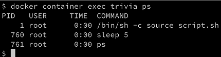

[](../M-02/README.md)

# Exec into a running container
Sometimes, we want to run another process inside an already-running container. A typical reason could be to try to debug a misbehaving container. How can we do this? First, we need to know either the ID or the name of the container, and then we can define which process we want to run and how we want it to run. Once again, we use our currently running trivia container and we run a shell interactively inside it with the following command:

```
docker container exec -i -t random_trivia-container /bin/sh
```

The **-i** flag signifies that we want to run the additional process interactively, and **-t** tells Docker that we want it to provide us with a TTY (a Terminal emulator) for the command. Finally, the process we run is **/bin/sh.**

If we execute the preceding command in our Terminal, then we will be presented with a new prompt, **#**. We're now in a shell inside the trivia container. We can easily prove that by, for example, executing the **ps** command, which will list all running processes in the context:

- run inside container
```
ps
```


The result should look somewhat similar to this:


List of processes running inside the trivia container

We can clearly see that the process with **PID 1** is the command that we have defined to run inside the trivia container. The process with **PID 1** is also named the main process.

Leave the container by pressing Ctrl + D. We cannot only execute additional processes interactive in a container. Please consider the following command:

```
docker container exec random_trivia-container ps
```

The output evidently looks very similar to the preceding output:



List of processes running inside the trivia container
We can even run processes as a daemon using the **-d** flag and define environment variables using the **-e** flag variables, as follows:

***CLI***
```
$ docker container exec -it \
    -e MY_VAR="Hello World" \
    random_trivia-container /bin/sh

/app # echo $MY_VAR
Hello World
/app # <CTRL-d>
```

***PowerShell***
```
  docker container exec -it `
    -e MY_VAR="Hello World" `
    random_trivia-container /bin/sh
```

Run inside container 

```
echo $MY_VAR
```

Great, we have learned how to execute into a running container and run additional processes. But there is another important way to mingle with a running container.