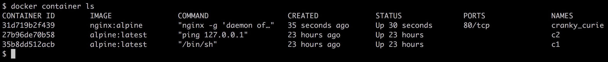

[](../M-02/README.md)

# Starting, stopping, and removing containers
You have successfully run a container in the previous section. Now, we want to investigate in detail what exactly happened and why. Let's look again at the command we used:

```
$ docker container run alpine echo "Hello World" 
```
This command contains multiple parts. First and foremost, we have the word **docker**. This is the name of the **Docker Command-Line Interface (CLI)** tool, which we are using to interact with the Docker engine that is responsible to run containers. Next, we have the word **container**, which indicates the context we are working with. As we want to run a **container**, our context is the word container. Next is the actual command we want to execute in the given context, which is **run**.

Let me recap—so far, we have **docker container run**, which means, Hey Docker, we want to run a container.

Now we also need to tell Docker which container to run. In this case, this is the so-called alpine container.

- **Tip:** alpine is a minimal Docker image based on Alpine Linux with a complete package index and is only 5 MB in size.

Finally, we need to define what kind of process or task shall be executed inside the container when it is running. In our case, this is the last part of the command, echo **"Hello World"**.

Maybe the following screenshot can help you to get a better idea of the whole thing:


Anatomy of the docker container run expression

Now that we have understood the various parts of a command to run a container, let's try to run another container with a different process running inside it. Type the following command into your Terminal:

```
docker container run centos ping -c 5 127.0.0.1
```

You should see output in your Terminal window similar to the following:

```
Unable to find image 'centos:latest' locally
latest: Pulling from library/centos
8ba884070f61: Pull complete
Digest: sha256:b5e66c4651870a1ad435cd75922fe2cb943c9e973a9673822d1414824a1d0475
Status: Downloaded newer image for centos:latest
PING 127.0.0.1 (127.0.0.1) 56(84) bytes of data.
64 bytes from 127.0.0.1: icmp_seq=1 ttl=64 time=0.104 ms
64 bytes from 127.0.0.1: icmp_seq=2 ttl=64 time=0.059 ms
64 bytes from 127.0.0.1: icmp_seq=3 ttl=64 time=0.081 ms
64 bytes from 127.0.0.1: icmp_seq=4 ttl=64 time=0.050 ms
64 bytes from 127.0.0.1: icmp_seq=5 ttl=64 time=0.055 ms
--- 127.0.0.1 ping statistics ---
5 packets transmitted, 5 received, 0% packet loss, time 4127ms
rtt min/avg/max/mdev = 0.050/0.069/0.104/0.022 ms
```

What changed is that this time, the container image we're using is **centos** and the process we're executing inside the centos container is **ping -c 5 127.0.0.1**, which pings the loopback address five times until it stops.

- **Tip :** centos is the official Docker image for CentOS Linux, which is a community-supported distribution derived from sources freely provided to the public by **Red Hat** for **Red Hat Enterprise Linux (RHEL)**.
Let's analyze the output in detail.

The first line is as follows:

```
Unable to find image 'centos:latest' locally
```

This tells us that Docker didn't find an image named **centos:latest** in the local cache of the system. So, Docker knows that it has to pull the image from some registry where container images are stored. By default, your Docker environment is configured so that images are pulled from Docker Hub at **docker.io.** This is expressed by the second line, as follows:

```
latest: Pulling from library/centos 
```
The next three lines of output are as follows:

```
8ba884070f61: Pull complete
Digest: sha256:b5e66c4651870a1ad435cd75922fe2cb943c9e973a9673822d1414824a1d0475
Status: Downloaded newer image for centos:latest
```
This tells us that Docker has successfully pulled the **centos:latest** image from Docker Hub.

All of the subsequent lines of the output are generated by the process we ran inside the container, which is the Ping tool in this case. If you have been attentive so far, then you might have noticed the **latest** keyword occurring a few times. Each image has a version (also called **tag**), and if we don't specify a version explicitly, then Docker automatically assumes it is **latest**.

If we run the preceding container again on our system, the first five lines of the output will be missing since, this time, Docker will find the container image cached locally and hence won't have to download it first. Try it out and verify what I just told you.

# Running a random Trivia question container
For the subsequent sections of this chapter, we need a container that runs continuously in the background and produces some interesting output. That's why we have chosen an algorithm that produces random Trivia questions. The API that produces that free random Trivia can be found at http://jservice.io/.

Now the goal is to have a process running inside a container that produces a new random Trivia question every five seconds and outputs the question to STDOUT. The following script will do exactly that:

```
while : 
do 
 wget -qO- http://jservice.io/api/random | jq .[0].question 
 sleep 5 
done
```

## Install Jq for Json, wget, curl for compatibility with linux
```
choco install jq -y
choco install wget -y
choco install curl -y
 
wget -qO- http://jservice.io/api/random | jq .[0].question 
```
# Powershell
```
while ($true) {
    
$uri = "http://jservice.io/api/random"
$game = Invoke-RestMethod -Uri $uri
$game.question
"----------------------------------------------"
Write-Host $game.answer -ForegroundColor Green
"______________________________________________"
Start-Sleep -seconds 5

}
```

Try it in a Terminal window. Stop the script by pressing Ctrl + C. The output should look similar to this:

```
After the swarm's flight, these insects of the order isoptera lose their wings & eat you out of house & home
----------------------------------------------
termites
______________________________________________
It's the high-speed train that runs between NYC & Washington, D.C.
----------------------------------------------
the Metroliner
______________________________________________
In the hand game known as roshambo, it's what scissors beats
----------------------------------------------
paper
______________________________________________
Used extensively by the Romans, it's a bridge built to transport water, not people
----------------------------------------------
an aqueduct
^C
```

Each response is a different Trivia question.

- **Note:** You may need to install jq first on your macOS or Windows computer. jq is a handy tool often used to nicely filter and format JSON output, which increases the readability of it on the screen.

Now, let's run this logic in an **Ubuntu** container. Since this is not just a simple command, we want to wrap the preceding script in a script file and execute that one. To make things simpler, I have created a Docker image called **Trivia** that contains all of the necessary logic, so that we can just use it here. Later on, once we have introduced Docker images, we will analyze this container image further. For the moment, let's just use it as is. 
There are also command line options to configure it more such as **-t** to allocate a **pseudo-tty** to the process, and **-i** to keep STDIN open even if not attached. 

Importantly, the --rm option tells Docker to automatically remove the container when it exits. This example shows how to start a Docker container in foreground mode:

cd ..M-02\Example\11_Python_Random_Trivia

```
docker build -t random_trivia .  
docker container run -it -d --name random_trivia-container  random_trivia   

```
In the preceding expression, we have used two new command-line parameters, **-d** and **--name**. Now, **-d** tells Docker to run the process running in the container as a Linux daemon. The **--name** parameter, in turn, can be used to give the container an explicit name. In the preceding sample, the name we chose is *random_trivia-container*.

If we don't specify an explicit container name when we run a container, then Docker will automatically assign the container a random but unique name. This name will be composed of the name of a famous scientist and an adjective. Such names could be **boring_borg** or **angry_goldberg**. They're quite humorous, our Docker engineers, aren't they?

One important takeaway is that the container name has to be unique on the system. Let's make sure that the jockes container is up and running:

```
docker container ls -l
```
This should give us something like this (shortened for readability):

```
CONTAINER ID   IMAGE           COMMAND            CREATED         STATUS         PORTS     NAMES
0b085c282602   random_trivia   "python3 app.py"   9 seconds ago   Up 8 seconds             random_trivia-container
```

The important part of the preceding output is the **STATUS** column, which in this case is Up 9 seconds. That is, the container has been up and running for **15 seconds** now.

Don't worry if the last Docker command is not yet familiar to you, we will come back to it in the next section.

To complete this section, let's stop and remove the **random_trivia-container** container with the following command:

```
docker rm -f random_trivia-container
```
Now it is time to learn how to list containers running or dangling on our system.

# Listing containers
As we continue to run containers over time, we get a lot of them in our system. To find out what is currently running on our host, we can use the **container ls** command, as follows:

```
docker container ls
```

This will list all currently running containers. Such a list might look similar to this:



List of all containers running on the system

By default, Docker outputs seven columns with the following meanings:


If we want to list not only the currently running containers but all containers that are defined on our system, then we can use the command-line parameter -a or --all, as follows:

```
docker container ls -a
```
This will list containers in any state, such as created, running, or exited.

Sometimes, we want to just list the IDs of all containers. For this, we have the -q parameter:

```
docker container ls -q
```
You might wonder where this is useful. I will show you a command where it is very helpful right here:

```
docker container rm -f $(docker container ls -a -q)
```
PowerShell
```
$id = docker container ls -a -q
docker container rm -f  $id
```
Lean back and take a deep breath. Then, try to find out what the preceding command does. Don't read any further until you find the answer or give up.

The preceding command deletes all containers that are currently defined on the system, including the stopped ones. The **rm** command stands for remove, and it will be explained soon.

In the previous section, we used the **-l** parameter in the list command. Try to use Docker help to find out what the **-l** parameter stands for. You can invoke help for the list command as follows:

```
docker container ps

docker run -d -p 81:80 docker/getting-started

```


Next, let's learn how to stop and restart containers.

# Stopping and starting containers
- Sometimes, we want to (temporarily) stop a running container. Let's try this out with the Trivia container we used previously:

Run the container again with this command:
```
docker container run -d -it --name random_trivia-container random_trivia
```
Now, if we want to stop this container, then we can do so by issuing this command:

```
docker container stop random_trivia-container
```

When you try to stop the Trivia container, you will probably note that it takes a while until this command is executed. To be precise, it takes about 10 seconds. Why is this the case?

Docker sends a Linux **SIGTERM** signal to the main process running inside the container. If the process doesn't react to this signal and terminate itself, Docker waits for 10 seconds and then sends **SIGKILL**, which will kill the process forcefully and terminate the container.

In the preceding command, we have used the name of the container to specify which container we want to stop. But we could have also used the container ID instead.

*How do we get the ID of a container*? There are several ways of doing so. The manual approach is to list all running containers and find the one that we're looking for in the list. From there, we copy its ID. A more automated way is to use some shell scripting and environment variables. If, for example, we want to get the ID of the Trivia container, we can use this expression:

```
export CONTAINER_ID=$(docker container ls -a | grep trivia | awk '{print $1}')
```

- **Tip:** We are using the -a parameter with the Docker container ls command to list all containers, even the stopped ones. This is necessary in this case since we stopped the trivia container a moment ago.

Now, instead of using the container name, we can use the **$CONTAINER_ID** variable in our expression:

```
docker container stop $CONTAINER_ID 
```

Once we have stopped the container, its status changes to **Exited**.

If a container is stopped, it can be started again using the **docker container start** command. Let's do this with our random_trivia-container. It is good to have it running again, as we'll need it in the subsequent sections of this chapter:

```
docker container start random_trivia-container
```
It is now time to discuss what to do with stopped containers that we don't need anymore.

# Removing containers
When we run the **docker container ls -a** command, we can see quite a few containers that are in the Exited status. If we don't need these containers anymore, then it is a good thing to remove them from memory; otherwise, they unnecessarily occupy precious resources. The command to remove a container is as follows:

```
docker container rm <container ID>
```

Another command to remove a container is the following:

```
docker container rm <container name>
```
Try to remove one of your exited containers using its ID.

Sometimes, removing a container will not work as it is still running. If we want to force a removal, no matter what the condition of the container currently is, we can use the command-line parameter **-f** or **--force**.