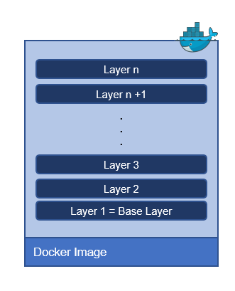
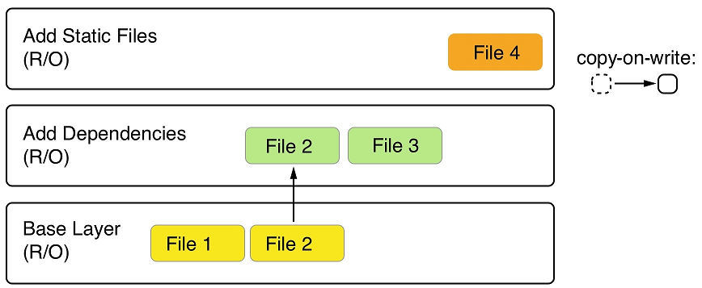

# What are images?
In Linux, everything is a file. The whole operating system is basically a filesystem with files and folders stored on the local disk. This is an important fact to remember when looking at what container images are. As we will see, an image is basically a big tarball containing a filesystem. More specifically, it contains a layered filesystem.

# The layered filesystem
Container images are templates from which containers are created. These images are not made up of just one monolithic block but are composed of many layers. The first layer in the image is also called the base layer. We can see this in the following graphic:

The image as a stack of layers

Each individual layer contains files and folders. Each layer only contains the changes to the filesystem with respect to the underlying layers. Docker uses a Union filesystem—as discussed in, *Mastering Containers*— to create a virtual filesystem out of the set of layers. A storage driver handles the details regarding the way these layers interact with each other. Different storage drivers are available that have advantages and disadvantages in different situations.

The layers of a container image are all immutable. Immutable means that once generated, the layer cannot ever be changed. The only possible operation affecting the layer is its physical deletion. This immutability of layers is important because it opens up a tremendous amount of opportunities, as we will see.

In the following screenshot, we can see what a custom image for a web application, using Nginx as a web server, could look like:

A sample custom image based on **Alpine** and **Nginx**
Our base layer here consists of the **Alpine Linux** distribution. Then, on top of that, we have an Add Nginx layer where Nginx is added on top of Alpine. Finally, the third layer contains all the files that make up the web application, such as HTML, CSS, and JavaScript files.

As has been said previously, each image starts with a base image. Typically, this base image is one of the official images found on Docker Hub, such as a Linux distro, Alpine, Ubuntu, or CentOS. However, it is also possible to create an image from scratch.

Docker Hub is a public registry for container images. It is a central hub ideally suited for sharing public container images.
 
Each layer only contains the delta of changes in regard to the previous set of layers. The content of each layer is mapped to a special folder on the host system, which is usually a subfolder of **/var/lib/docker/**.

Since layers are immutable, they can be cached without ever becoming stale. This is a big advantage, as we will see.

# The writable container layer
As we have discussed, a container image is made of a stack of immutable or read-only layers. When the Docker Engine creates a container from such an image, it adds a writable container layer on top of this stack of immutable layers. Our stack now looks as follows:

The writable container layer

The **Container Layer** is marked as read/write. Another advantage of the immutability of image layers is that they can be shared among many containers created from this image. All that is needed is a thin, writable container layer for each container, as shown in the following screenshot:

Multiple containers sharing the same image layers

This technique, of course, results in a tremendous reduction in the resources that are consumed. Furthermore, this helps to decrease the loading time of a container since only a thin container layer has to be created once the image layers have been loaded into memory, which only happens for the first container.

# Copy-on-write

Docker uses the copy-on-write technique when dealing with images. Copy-on-write is a strategy for sharing and copying files for maximum efficiency. If a layer uses a file or folder that is available in one of the low-lying layers, then it just uses it. If, on the other hand, a layer wants to modify, say, a file from a low-lying layer, then it first copies this file up to the target layer and then modifies it. In the following screenshot, we can see a glimpse of what this means:

Docker image using copy-on-write

The second layer wants to modify **File 2**, which is present in the **Base Layer**. Thus, it copies it up and then modifies it. Now, let's say that we're sitting in the top layer of the preceding screenshot. This layer will use **File 1** from the **Base Layer** and **File 2** and **File 3** from the second layer.

# Graph drivers
Graph drivers are what enable the Union filesystem. Graph drivers are also called storage drivers and are used when dealing with layered container images. A graph driver consolidates multiple image layers into a root filesystem for the mount namespace of the container. Or, put differently, the driver controls how images and containers are stored and managed on the Docker host.

Docker supports several different graph drivers using a pluggable architecture. The preferred driver is **overlay2**, followed by **overlay**.