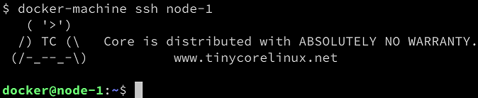

# **Creating and mounting data volumes**
All meaningful applications consume or produce data. Yet containers are, preferably, meant to be stateless. How are we going to deal with this? One way is to use Docker volumes. Volumes allow containers to consume, produce, and modify a state. Volumes have a life cycle that goes beyond the life cycle of containers. When a container that uses a volume dies, the volume continues to exist. This is great for the durability of the state.

# Modifying the container layer
Before we dive into volumes, let's first discuss what happens if an application in a container changes something in the filesystem of the container. In this case, the changes are all happening in the writable container layer that we introduced in Mastering Containers. Let's quickly demonstrate this by running a container, and execute a script in it that is creating a new file, like this:

```
$ docker container run --name demo \
    alpine /bin/sh -c 'echo "This is a test" > sample.txt'
```

The preceding command creates a container named demo, and, inside this container, creates a file called sample.txt with the content **This is a test**. The container exits after running the **echo** command but remains in memory, available for us to do our investigations. Let's use the **diff** command to find out what has changed in the container's filesystem in relation to the filesystem of the original image, as follows:

```
$ docker container diff demo
```
The output should look like this:

```
A /sample.txt
```

Evidently, a new file, as indicated by the **A**, has been added to the filesystem of the container, as expected. Since all layers that stem from the underlying image (**alpine**, in this case) are immutable, the change could only happen in the writeable container layer.

- **Note:**Files that have changed compared to the original image will be marked with a **C**, and those that have been deleted, with a **D**.

If we now remove the container from memory, its container layer will also be removed, and with it, all the changes will be irreversibly deleted. If we need our changes to persist even beyond the lifetime of the container, this is not a solution. Luckily, we have better options, in the form of Docker volumes. Let's get to know them.

# Creating volumes
Since at this time, when using Docker for Desktop on a macOS or Windows computer, containers are not running natively on macOS or Windows but rather in a **(hidden) VM created by Docker for Desktop**, for illustrative purposes it is best we use **docker-machine** to create and use an explicit VM running Docker. At this point, we assume that you have Docker Toolbox installed on your system. If not, then please go back to, **Setting up a Working Environment**, where we provide detailed instructions on how to install Toolbox:

Use **docker-machine** to list all VMs currently running in VirtualBox, as follows:

```
$ docker-machine ls 
```

If you do not have a VM called node-1 listed, then please create one with the following command:

```
docker-machine create — driver hyperv — hyperv-virtual-switch "External Virtual Switch" manager1
```
Refer back to  Setting up a Working Environment, on how to create a Hyper-V-based VM with docker-machine if you are running on Windows with Hyper-V enabled.

If, on the other hand, you have a VM called node-1 but it is not running, then please start it, as follows:
```
$ docker-machine start node-1
```
Now that everything is ready, use docker-machine to SSH into this VM, like this:

```
$ docker-machine ssh node-1
```

You should be greeted by this welcome image:



docker-machine VM welcome message

To create a new data volume, we can use the **docker volume create** command. This will create a named volume that can then be mounted into a container and used for persistent data access or storage. The following command creates a volume called **sample**, using the default volume driver:

```
$ docker volume create sample 
```

The default volume driver is the so-called local driver, which stores the data locally in the host filesystem.

- The easiest way to find out where the data is stored on the host is by using the **docker volume inspect** command on the volume we just created. The actual location can differ from system to system, and so, this is the safest way to find the target folder. You can see this command in the following code block:
```
$ docker volume inspect sample 
[ 
    { 
        "CreatedAt": "2019-08-02T06:59:13Z",
        "Driver": "local",
        "Labels": {},
        "Mountpoint": "/mnt/sda1/var/lib/docker/volumes/sample/_data",
        "Name": "my-data",
        "Options": {},
        "Scope": "local"
    } 
] 
```
The host folder can be found in the output under **Mountpoint**. In our case, when using **docker-machine** with a LinuxKit-based VM running in VirtualBox, the folder is **/mnt/sda1/var/lib/docker/volumes/sample/_data**.

The target folder is often a protected folder, and we thus might need to use **sudo** to navigate to this folder and execute any operations in it.

On our LinuxKit-based VM in Docker Toolbox, access is also denied, yet we don't have sudo available either. Is that the end of our exploration?

Luckily not; I have prepared a **fundamentalsofdocker/nsenter** utility container that allows us to access the backing folder of our sample volume we created earlier.

- We need to run this container in privileged mode to get access to this protected part of the filesystem, like this:
```
$ docker run -it --rm --privileged --pid=host fundamentalsofdocker/nsenter
/ #
```

- **Note:** We are running the container with the --privileged flag. This means that any app running in the container gets access to the devices of the host. The **--pid=host** flag signifies that the container is allowed to access the process tree of the host (the hidden VM in which the Docker daemon is running). Now, the preceding container runs the Linux **nsente**r tool to enter the Linux namespace of the host and then runs a shell within there. From this shell, we are thus granted access to all resources managed by the host.

When running the container, we basically execute the following command inside the container:
**nsenter -t 1 -m -u -n -i sh**

If that sounds complicated to you, don't worry; you will understand more as we proceed through this book. If there is one takeaway for you out of this, then it is to realize how powerful the right use of containers can be.

From within this container, we can now navigate to the folder representing the mount point of the volume, and then list its content, as follows:

```
/ # cd /mnt/sda1/var/lib/docker/volumes/sample/_data
/ # ls -l
total 0
```

The folder is currently empty since we have not yet stored any data in the volume.

- Exit the tool container by pressing Ctrl + D.

There are other volume drivers available from third parties, in the form of plugins. We can use the **--driver** parameter in the **create** command to select a different volume driver. Other volume drivers use different types of storage systems to back a volume, such as cloud storage, **Network File System (NFS)** drives, software-defined storage, and more. The discussion of the correct usage of other volume drivers is beyond the scope of this book, though.

# Mounting a volume
Once we have created a named volume, we can mount it into a container by following these steps:

- For this, we can use the -v parameter in the docker container run command, like this:
```
$ docker container run --name test -it -v sample:/data  alpine /bin/sh
Unable to find image 'alpine:latest' locally
latest: Pulling from library/alpine
050382585609: Pull complete
Digest: sha256:6a92cd1fcdc8d8cdec60f33dda4db2cb1fcdcacf3410a8e05b3741f44a9b5998
Status: Downloaded newer image for alpine:latest
/ #
```
The preceding command mounts the **sample** volume to the **/data** folder inside the container.

Inside the container, we can now create files in the /data folder and then exit, as follows:

```
/ # cd /data / # echo "Some data" > data.txt 
/ # echo "Some more data" > data2.txt 
/ # exit
```

If we navigate to the host folder that contains the data of the volume and list its content, we should see the two files we just created inside the container (remember: we need to use the **fundamentalsofdocker/nsenter** tool container to do so), as follows:

```
$ docker run -it --rm --privileged --pid=host  fundamentalsofdocker/nsenter
/ # cd /mnt/sda1/var/lib/docker/volumes/sample/_data
/ # ls -l  
total 8 
-rw-r--r-- 1 root root 10 Jan 28 22:23 data.txt
-rw-r--r-- 1 root root 15 Jan 28 22:23 data2.txt
```

We can even try to output the content of, say, the second file, like this:

```
/ # cat data2.txt
```
Let's try to create a file in this folder from the host, and then use the volume with another container, like this:
```
/ # echo "This file we create on the host" > host-data.txt 
```
Exit the tool container by pressing Ctrl + D.

Now, let's delete the test container, and run another one based on CentOS. This time, we are even mounting our volume to a different container folder, /app/data, like this:

```
$ docker container rm test2
$ docker container run --name test2 -it -v my-data:/app/data  centos:7 /bin/bash

Unable to find image 'centos:7' locally
7: Pulling from library/centos
8ba884070f61: Pull complete
Digest: sha256:a799dd8a2ded4a83484bbae769d97655392b3f86533ceb7dd96bbac929809f3c
Status: Downloaded newer image for centos:7
[root@275c1fe31ec0 /]#

```
Once inside the centos container, we can navigate to the /app/data folder to which we have mounted the volume, and list its content, as follows:
```
[root@275c1fe31ec0 /]# cd /app/data 
[root@275c1fe31ec0 /]# ls -l 
```
As expected, we should see these three files:

```
-rw-r--r-- 1 root root 10 Aug 2 22:23 data.txt
-rw-r--r-- 1 root root 15 Aug 2 22:23 data2.txt
-rw-r--r-- 1 root root 32 Aug 2 22:31 host-data.txt
```

This is the definitive proof that data in a Docker volume persists beyond the lifetime of a container, and also, that volumes can be reused by other, even different, containers from the one that used it first.

It is important to note that the folder inside the container to which we mount a Docker volume is excluded from the Union filesystem. That is, each change inside this folder and any of its subfolders will not be part of the container layer, but will be persisted in the backing storage provided by the volume driver. This fact is really important since the container layer is deleted when the corresponding container is stopped and removed from the system.

Exit the **centos** container with Ctrl + D. Now, exit the **node-1** VM by pressing Ctrl + D again. 

# Removing volumes
Volumes can be removed using the **docker volume rm**command. It is important to remember that removing a volume destroys the containing data irreversibly, and thus is to be considered a dangerous command. Docker helps us a bit in this regard, as it does not allow us to delete a volume that is still in use by a container. Always make sure before you remove or delete a volume that you either have a backup of its data or you really don't need this data anymore. Let's see how to remove volumes by following these steps:

The following command deletes our **sample** volume that we created earlier:
```
$ docker volume rm sample 
```

- After executing the preceding command, double-check that the folder on the host has been deleted.
- To remove all running containers in order to clean up the system, run the following command:

```
$ docker container rm -f $(docker container ls -aq) 
```
 
- **Note** that by using the **-v** or **--volume** flag in the command you use to remove a container, you can ask the system to also remove any volume associated with that particular container. Of course, that will only work if the particular volume is only used by this container.

In the next section, we will show how we can access the backing folder of a volume when working with Docker for Desktop.

# Accessing volumes created with Docker for Desktop
Follow these steps:

Let's create a sample volume and inspect it using Docker for Desktop on our macOS or Windows machine, like this:
```
$ docker volume create sample
$ docker volume inspect sample
[
    {
        "CreatedAt": "2019-08-02T07:44:08Z",
        "Driver": "local",
        "Labels": {},
        "Mountpoint": "/var/lib/docker/volumes/sample/_data",
        "Name": "sample",
        "Options": {},
        "Scope": "local"
    }
]
```

The **Mountpoint** is shown as **/var/lib/docker/volumes/sample/_data**, but you will discover that there is no such folder on your macOS or Windows machine. The reason is that the path shown is in relation to the hidden VM that Docker for Windows uses to run containers. At this time, Linux containers cannot run natively on macOS, nor on Windows.

- Next, let's generate two files with data in the volume from within an alpine container. To run the container and mount the sample volume to the /data folder of the container, use the following code:

```
$ docker container run --rm -it -v sample:/data alpine /bin/sh
```
Generate two files in the /data folder inside the container, like this:
```
/ # echo "Hello world" > /data/sample.txt
/ # echo "Other message" > /data/other.txt
```
Exit the alpine container by pressing Ctrl + D.

As mentioned earlier, we cannot directly access the backing folder of the **sample** volume from our macOS or from Windows. This is because the volume is in the hidden VM running on macOS or Windows that is used to run the Linux container in Docker for Desktop.

To access that hidden VM from our macOS, we have two options. We can either use a special container and run it in privileged mode, or we can use the screen utility to screen into the Docker driver. The first method is also applicable to Docker for Windows.

- Let's start with the first method mentioned, by running a container from the fundamentalsofdocker/nsenter image. We have been using this container already in the previous section. Run the following code:

```
$ docker run -it --rm --privileged --pid=host fundamentalsofdocker/nsenter
/ #
```

We can now navigate to the folder backing our sample volume, like this:

```
/ # cd /var/lib/docker/volumes/sample/_data
```
Let's see what is in this folder by running this code:

```
/ # ls -l 
total 8
-rw-r--r-- 1 root root 14 Aug 2 08:07 other.txt
-rw-r--r-- 1 root root 12 Aug 2 08:07 sample.txt
```

Let's try to create a file from within this special container, and then list the content of the folder, as follows:

```
/ # echo "I love Docker" > docker.txt
/ # ls -l
total 12
-rw-r--r-- 1 root root 14 Aug 2 08:08 docker.txt
-rw-r--r-- 1 root root 14 Aug 2 08:07 other.txt
-rw-r--r-- 1 root root 12 Aug 2 08:07 sample.txt
```

And now, we have the files in the backing folder of the sample volume.

- To exit our special privileged container, we can just press Ctrl + D.

# Now that we have explored the first option, and if you're using macOS, let's try the **screen** tool, as follows:
```
$ screen ~/Library/Containers/com.docker.docker/Data/com.docker.driver.amd64-linux/tty
```

By doing so, we will be greeted by an empty screen. Hit Enter, and a **docker-desktop:~#** command-line prompt will be displayed. We can now navigate to the volume folder, like this:
```
docker-desktop:~# cd /var/lib/docker/volumes/sample/_data
```
Let's create another file with some data in it, and then list the content of the folder, as follows:
```
docker-desktop:~# echo "Some other test" > test.txt 
docker-desktop:~# ls -l
total 16
-rw-r--r-- 1 root root 14 Aug 2 08:08 docker.txt
-rw-r--r-- 1 root root 14 Aug 2 08:07 other.txt
-rw-r--r-- 1 root root 12 Aug 2 08:07 sample.txt
-rw-r--r-- 1 root root 16 Aug 2 08:10 test.txt
```

To exit this session with the Docker VM, press Ctrl + A + K.
We have now created data using three different methods, as follows: 

- From within a container that has a sample volume mounted.
- Using a special privileged folder to access the hidden VM used by Docker for Desktop, and directly writing into the backing folder of the sample volume. 
- Only on macOS, using the screen utility to enter into the hidden VM, and also directly writing into the backing folder of the sample volume. 