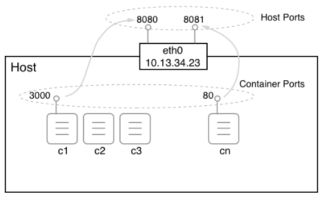
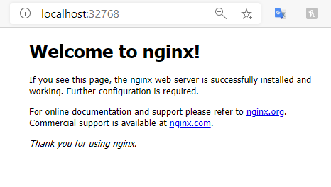

[](../M-04/README.md)
# **Managing container port**

Now that we know how we can isolate firewall containers from each other by placing them on different networks, and that we can have a container attached to more than one network, we have one problem that remains unsolved. How can we expose an application service to the outside world? Imagine a container running a web server hosting our webAPI from before. We want customers from the internet to be able to access this API. We have designed it to be a publicly accessible API. To achieve this, we have to, figuratively speaking, open a gate in our firewall through which we can funnel external traffic to our API. For security reasons, we don't just want to open the doors wide; we want to have a single controlled gate that traffic flows through.

We can create such a gate by mapping a container port to an available port on the host. We're also calling this opening a gate to the container port to publish a port. Remember that the container has its own virtual network stack, as does the host. Therefore, container ports and host ports exist completely independently and by default have nothing in common at all. But we can now wire a container port with a free host port and funnel external traffic through this link, as illustrated in the following diagram :



Mapping container ports to host ports
But now, it is time to demonstrate how we can actually map a container port to a host port. This is done when creating a container. We have different ways of doing so:

1. First, we can let Docker decide which host port our container port shall be mapped to. Docker will then select one of the free host ports in the range of 32xxx. This automatic mapping is done by using the -P parameter :

```
$ docker container run --name web -P -d nginx:alpine
```
The preceding command runs an nginx server in a container. nginx is listening at port 80 inside the container. With the -P parameter, we're telling Docker to map all the exposed container ports to a free port in the 32xxx range. We can find out which host port Docker is using by using the docker container port command:

```
$ docker container port web
80/tcp -> 0.0.0.0:32768
```
The nginx container only exposes port 80, and we can see that it has been mapped to the host port 32768. If we open a new browser window and navigate to localhost:32768, we should see the following screen:



2. An alternative way to find out which host port Docker is using for our container is to inspect it. The host port is part of the NetworkSettings node:
```
#bash
$ docker container inspect web | grep HostPort
#PS 
docker container inspect web | ? {$_ -like "*HostPort*"}

"HostPort": "32768"
```

3. Finally, the third way of getting this information is to list the container:

```
$ docker container ls
CONTAINER ID    IMAGE         ...   PORTS                  NAMES
56e46a14b6f7    nginx:alpine  ...   0.0.0.0:32768->80/tcp  web
```

- **Note**: Please note that in the preceding output, the **/tcp** part tells us that the port has been opened for communication with the TCP protocol, but not for the UDP protocol. TCP is the default, and if we want to specify that we want to open the port for UDP, then we have to specify this explicitly. **0.0.0.0** in the mapping tells us that traffic from any host IP address can now reach container port **80** of the web container.
- 
Sometimes, we want to map a container port to a very specific host port. We can do this by using the **-p** parameter (or **--publish**). Let's look at how this is done with the following command:


```
$ docker container run --name web2 -p 8080:80 -d nginx:alpine
```
The value of the -p parameter is in the form of **`<host port>:<container port>`**. Therefore, in the preceding case, we map container port **80**to host port **8080**. Once the **web2**container runs, we can test it in the browser by navigating to **localhost:8080**, and we should be greeted by the same nginx welcome page that we saw in the previous example that dealt with automatic port mapping.

When using the UDP protocol for communication over a certain port, the publish parameter will look like **`-p 3000:4321/udp`**. Note that if we want to allow communication with both TCP and UDP protocols over the same port, then we have to map each protocol separately.