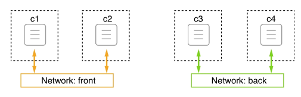
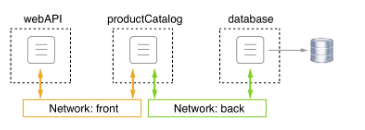

# Network Firewall

Docker has always had the mantra of security first. This philosophy had a direct influence on how networking in a single and multi-host Docker environment was designed and implemented. Software-defined networks are easy and cheap to create, yet they perfectly firewall containers that are attached to this network from other non-attached containers, and from the outside world. All containers that belong to the same network can freely communicate with each other, while others have no means to do so.

In the following diagram, we have two networks called front and back. Attached to the **front network**, we have containers **c1** and **c2**, and attached to the **back network**, we have containers **c3** and **c4**. c**1** and **c2** can freely communicate with each other, as can **c3** and **c4**. But **c1** and **c2** have no way to communicate with either **c3** or **c4**, and vice versa:

Docker networks

Now, what about the situation where we have an application consisting of three services: **webAPI** , **productCatalog** , and **database** ? We want **webAPI**  to be able to communicate with productCatalog, but not with the database, and we want **productCatalog** to be able to communicate with the database service. We can solve this situation by placing **webAPI**  and the database on different networks and attaching **productCatalog**  to both of these networks, as shown in the following diagram:

Container attached to multiple networks

Since creating SDNs is cheap, and each network provides added security by isolating resources from unauthorized access, it is highly recommended that you design and run applications so that they use multiple networks and only run services on the same network that absolutely need to communicate with each other. In the preceding example, there is absolutely no need for the webAPI component to ever communicate directly with the database service, so we have put them on different networks. If the worst-case scenario happens and a hacker compromises the webAPI, they cannot access the database from there without also hacking the **productCatalog** service.
