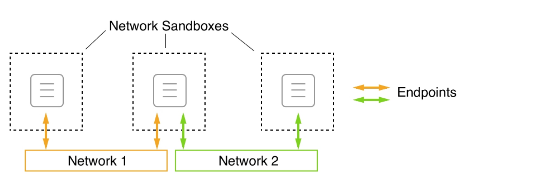
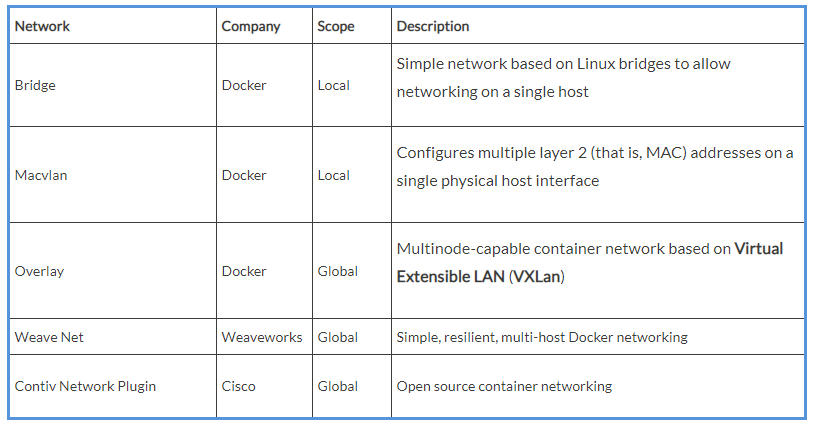

# **Dissecting the container network model**

So far, we have been mostly working with single containers. But in reality, a containerized business application consists of several containers that need to collaborate to achieve a goal. Therefore, we need a way for individual containers to communicate with each other. This is achieved by establishing pathways that we can use to send data packets back and forth between containers. These pathways are called networks. Docker has defined a very simple networking model, the so-called **container network model (CNM)**, to specify the requirements that any software that implements a container network has to fulfill. The following is a graphical representation of the CNM:

The Docker CNM

The **CNM** has three elements – **sandbox**, **endpoint**, and **network** :

- **Sandbox:** The sandbox perfectly isolates a container from the outside world. No inbound network connection is allowed into the sandboxed container. But, it is very unlikely that a container will be of any value in a system if absolutely no communication with it is possible. To work around this, we have element number two, which is the endpoint.
- **Endpoint:** An endpoint is a controlled gateway from the outside world into the network's sandbox that shields the container. The endpoint connects the network sandbox (but not the container) to the third element of the model, which is the network.
- **Network:** The network is the pathway that transports the data packets of an instance of communication from endpoint to endpoint or, ultimately, from container to container.

It is important to note that a network sandbox can have zero to many endpoints, or, said differently, each container living in a network sandbox can either be attached to no network at all or it can be attached to multiple different networks at the same time. In the preceding diagram, the middle of the three **Network Sandboxes** is attached to both **Network 1** and **Network 2** through an **endpoint**.

This networking model is very generic and does not specify where the individual containers that communicate with each other over a network run. All containers could, for example, run on one and the same host (local) or they could be distributed across a cluster of hosts (global).

Of course, the CNM is just a model describing how networking works among containers. To be able to use networking with our containers, we need real implementations of the CNM. For both local and global scope, we have multiple implementations of the CNM. In the following table, we've given a short overview of the existing implementations and their main characteristics. The list is in no particular order:

 All network types not directly provided by Docker can be added to a Docker host as a plugin.
