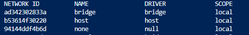
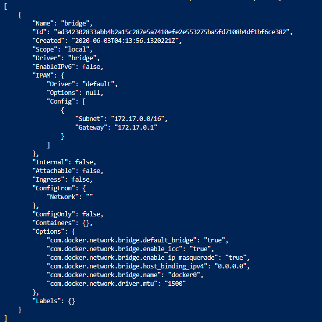
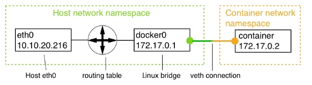
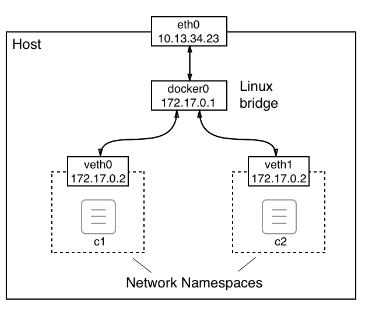

[](../M-04/README.md)
# Working with bridge networking

The Docker bridge network is the first implementation of the container network model that we're going to look at in detail. This network implementation is based on the Linux bridge. When the Docker daemon runs for the first time, it creates a Linux bridge and calls it **docker0**. 

This is the default behavior and can be changed by changing the configuration. Docker then creates a network with this Linux bridge and calls the network **bridge**. All the containers that we create on a Docker host and that we do not explicitly bind to another network leads to Docker automatically attaching to this bridge network.

To verify that we indeed have a network called **bridge** of the **bridge** type defined on our host, we can list all the networks on the host with the following command:

```bash
docker network ls
```

### Output :



Listing all the Docker networks available by default

In your case, the IDs will be different, but the rest of the output should look the same. We do indeed have a first network called bridge using the bridge driver. The scope being local just means that this type of network is restricted to a single host and cannot span multiple hosts. In Chapter, Introduction to Docker Swarm, we will also discuss other types of networks that have a global scope, meaning they can span whole clusters of hosts.

Now, let's look a little bit deeper into what this bridge network is all about. For this, we are going to use the Docker `inspect` command:


```bash
docker network inspect bridge
```

When executed, this outputs a big chunk of detailed information about the network in question. This information should look as follows:



We saw the `ID`, `Name`, `Driver`, and `Scope` values when we listed all the networks, so that is nothing new. But let's have a look at the **IP address management (IPAM)** block. IPAM is a piece of software that is used to track IP addresses that are used on a computer. The important part of the **IPAM** block is the **Config** node with its values for **Subnet** and **Gateway**. The subnet for the bridge network is defined by default as **172.17.0.0/16**. This means that all containers attached to this network will get an IP address assigned by Docker that is taken from the given range, which  is **172.17.0.2** to **172.17.255.255**. The **172.17.0.1** address is reserved for the router of this network whose role in this type of network is taken by the Linux bridge. We can expect that the very first container that will be attached to this network by Docker will get the **172.17.0.2** address. All subsequent containers will get a higher number; the following diagram illustrates this fact:



The bridge network

In the preceding diagram, we can see the network namespace of the host, which includes the host's **eth0** endpoint, which is typically a NIC if the Docker host runs on bare metal or a virtual NIC if the Docker host is a VM. All traffic to the host comes through **eth0**. The **Linux bridge** is responsible for routing the network traffic between the host's network and the subnet of the bridge network.

By default, only egress traffic is allowed, and all ingress is blocked. What this means is that while containerized applications can reach the internet, they cannot be reached by any outside traffic. Each container attached to the network gets its own **virtual ethernet (veth)** connection with the bridge. This is illustrated in the following diagram:



Details of the bridge network

The preceding diagram shows us the world from the perspective of the **Host**. We will explore what this situation looks like from within a container later on in this section.

We are not limited to just the bridge network, as Docker allows us to define our own custom bridge networks. This is not just a feature that is nice to have, but it is a recommended best practice to not run all containers on the same network. Instead, we should use additional bridge networks to further isolate containers that have no need to communicate with each other. To create a custom bridge network called `sample-net`, use the following command:

```bash
docker network create --driver bridge sample-net
docker network ls
```
If we do this, we can then inspect what subnet Docker has created for this new custom network, as follows:

```bash
#Bash
docker network inspect sample-net | grep Subnet

#PS
docker network inspect sample-net | ? { $_  -like "*Subnet*" }
```


Evidently, Docker has just assigned the next free block of IP addresses to our new custom bridge network. If, for some reason, we want to specify our own subnet range when creating a network, we can do so by using the --subnet parameter:


```bash
docker network create --driver bridge --subnet "10.1.0.0/16" somelocal-net
docker network ls
docker network inspect somelocal-net | ? { $_  -like "*Subnet*"  }
```

**Tip: To avoid conflicts due to duplicate IP addresses, make sure you avoid creating networks with overlapping subnets.**

Now that we have discussed what a bridge network is and how we can create a custom bridge network, we want to understand how we can attach containers to these networks. First, let's interactively run an Alpine container without specifying the network to be attached:


```bash
docker container run --name c1 -it --rm alpine:latest /bin/sh
```

**In another Terminal window, let's inspect the c1 container:**

```bash
docker container inspect c1
.....

       "NetworkSettings": {
            "Bridge": "",
            "SandboxID": "23382819ab00d393a48e3c211eee032703b9c7e57a0de814dd93fb5e2dbbda59",
            "HairpinMode": false,
            "LinkLocalIPv6Address": "",
            "LinkLocalIPv6PrefixLen": 0,
            "Ports": {},
            "SandboxKey": "/var/run/docker/netns/23382819ab00",
            "SecondaryIPAddresses": null,
            "SecondaryIPv6Addresses": null,
            "EndpointID": "8e8979ad1b3b14db42b84909b559a836fb36b99e9d81b6bc9667c72fe5902e83",
            "Gateway": "172.17.0.1",
            "GlobalIPv6Address": "",
            "GlobalIPv6PrefixLen": 0,
            "IPAddress": "172.17.0.2",
            "IPPrefixLen": 16,
            "IPv6Gateway": "",
            "MacAddress": "02:42:ac:11:00:02",
            "Networks": {
                "bridge": {
                    "IPAMConfig": null,
                    "Links": null,
                    "Aliases": null,
                    "NetworkID": "ad342302833abb4b2a15c287e5a7410efe2e553275ba5fd7108b4df1bf6ce382",
                    "EndpointID": "8e8979ad1b3b14db42b84909b559a836fb36b99e9d81b6bc9667c72fe5902e83",
                    "Gateway": "172.17.0.1",
                    "IPAddress": "172.17.0.2",
                    "IPPrefixLen": 16,
                    "IPv6Gateway": "",
                    "GlobalIPv6Address": "",
                    "GlobalIPv6PrefixLen": 0,
                    "MacAddress": "02:42:ac:11:00:02",
                    "DriverOpts": null
                }
            }
        }
    }
]

```
The NetworkSettings section of the container metadata
In the preceding output, we can see that the container is indeed attached to the bridge network since NetworkID is equal to **ad342302...**, which we can see from the preceding code is the ID of the **bridge network**. We can also see that the container got the IP address of **172.17.0.2** assigned as expected and that the gateway is at **172.17.0.1**. Please note that the container also had a MacAddress associated with it. This is important as the **Linux bridge** uses the **MacAddress** for routing.

So far, we have approached this from the outside of the container's network namespace. Now, let's see what the situation looks like when we're not only inside the container but inside the containers' network namespace. Inside the **c1 **container, let's use the ip tool to inspect what's going on. Run the ip addr command and observe the output that is generated, as follows:


```bash
ip addr
```


Container namespace, as seen by the IP tool

The interesting part of the preceding output is number 17, that is, the eth0 endpoint. The veth0 endpoint that the Linux bridge created outside of the container namespace is mapped to eth0 inside the container. Docker always maps the first endpoint of a container network namespace to eth0, as seen from inside the namespace. If the network namespace is attached to an additional network, then that endpoint will be mapped to eth1, and so on.

Since at this point we're not really interested in any endpoint other than eth0, we could have used a more specific variant of the command, which would have given us the following:


```bash
ip addr show eth0
17: eth0@if18: <BROADCAST,MULTICAST,UP,LOWER_UP,M-DOWN> mtu 1500 qdisc noqueue state UP 
    link/ether 02:42:ac:11:00:02 brd ff:ff:ff:ff:ff:ff
    inet 172.17.0.2/16 brd 172.17.255.255 scope global eth0
       valid_lft forever preferred_lft forever
```

In the output, we can also see what MAC address `(02:42:ac:11:00:02)` and what IP `(172.17.0.2)` have been associated with this container network namespace by Docker.

We can also get some information about how requests are routed by using the `ip route` command:

```bash
/ # ip route
default via 172.17.0.1 dev eth0
172.17.0.0/16 dev eth0 scope link  src 172.17.0.2
```

This output tells us that all the traffic to the gateway at 172.17.0.1 is routed through the eth0 device.

Now, let's run another container called c2 on the same network:

```bash
docker container run --name c2 -d alpine:latest ping 127.0.0.1
```

The c2 container will also be attached to the bridge network since we have not specified any other network. 

Its IP address will be the next free one from the subnet, which is 172.17.0.3, as we can readily test:

```bash
docker container inspect --format "{{.NetworkSettings.IPAddress}}" c2
172.17.0.3
```

Now, we have two containers attached to the bridge network. We can try to inspect this network once again to find a list of all containers attached to it in the output:

```bash
docker network inspect bridge
.....
        "Containers": {
            "4c7443980ac94227da1548cb18f9979785fee0c7e5cd4c62065e2d98ccfcafd4": {
                "Name": "c2",
                "EndpointID": "536ba9f9cd30abf18c22034f9999ef9b2cbcfb97f5b24a117853c654f362e00e",
                "MacAddress": "02:42:ac:11:00:03",
                "IPv4Address": "172.17.0.3/16",
                "IPv6Address": ""
            },
            "a4bd419daa94a26df8654ec871a6f878034f3f7b6fec7226ebe50f5aa913e52f": {
                "Name": "c1",
                "EndpointID": "8e8979ad1b3b14db42b84909b559a836fb36b99e9d81b6bc9667c72fe5902e83",
                "MacAddress": "02:42:ac:11:00:02",
                "IPv4Address": "172.17.0.2/16",
                "IPv6Address": ""
            }
        }


```
This information can be found under the Containers node:


Once again, we have shortened the output to the relevant part for readability.

Now, let's create two additional containers, c3 and c4, and attach them to somelocal-net. For this, we'll use the --network parameter:


```
docker container run --name c3 -d --network somelocal-net alpine:latest ping 127.0.0.1
docker container run --name c4 -d --network somelocal-net alpine:latest ping 127.0.0.1

docker container exec -it c3 /bin/sh
docker container exec -it c4 /bin/sh
```

Let's inspect network somelocal-net and confirm that containers c3 and c4 are indeed attached to it:

```bash
docker network inspect somelocal-net

...
"Containers": {
            "408710fed3eafd65b4decdae84317b80c2d41192d6795e924db7b92abbe836d5": {
                "Name": "c3",
                "EndpointID": "b1a0924c986b6d39def3e17c75615fbd9a421cb9eb72d16fdfdce459b39efa9a",
                "MacAddress": "02:42:0a:01:00:03",
                "IPv4Address": "10.1.0.3/16",
                "IPv6Address": ""
            },
            "4abde2ea3a02ba37df2093f6fdf923847f1bb8ba0e71fad4b14a88a4bb5169a3": {
                "Name": "c4",
                "EndpointID": "d97e5714d2c6b9f3b616ecb20df8d827b5ecd23bcb9c41076b5e2836afa84800",
                "MacAddress": "02:42:0a:01:00:02",
                "IPv4Address": "10.1.0.2/16",
                "IPv6Address": ""
            }
        },
```

The next question we're going to ask ourselves is whether the c3 and c4 containers can freely communicate with each other. 

To demonstrate that this is indeed the case, we can exec into the c3 container:

```
docker container exec -it c3 /bin/sh
```

Once inside the container, we can try to ping container c4 by name and by IP address:

```bash
/ # ping c4
PING c4 (10.1.0.2): 56 data bytes
64 bytes from 10.1.0.2: seq=0 ttl=64 time=1.620 ms
64 bytes from 10.1.0.2: seq=1 ttl=64 time=0.204 ms
^C
--- c4 ping statistics ---
2 packets transmitted, 2 packets received, 0% packet loss
round-trip min/avg/max = 0.204/0.912/1.620 ms

/ # ping c3
PING c3 (10.1.0.3): 56 data bytes
64 bytes from 10.1.0.3: seq=0 ttl=64 time=0.235 ms
64 bytes from 10.1.0.3: seq=1 ttl=64 time=0.310 ms
^C
--- c3 ping statistics ---
3 packets transmitted, 3 packets received, 0% packet loss
round-trip min/avg/max = 0.235/0.282/0.310 ms

/ # ping 10.1.0.3
PING 10.1.0.3 (10.1.0.3): 56 data bytes
64 bytes from 10.1.0.3: seq=0 ttl=64 time=0.469 ms
64 bytes from 10.1.0.3: seq=1 ttl=64 time=0.392 ms
^C


/ # ping c2
ping: bad address 'c2'

/ # ping 172.17.0.3
PING 172.17.0.3 (172.17.0.3): 56 data bytes
^C
--- 172.17.0.3 ping statistics ---
19 packets transmitted, 0 packets received, 100% packet loss

```

The preceding command remained hanging and I had to terminate the command with Ctrl+C. From the output of pinging **c2**, we can also see that the name resolution does not work across networks. This is the expected behavior. Networks provide an extra layer of isolation, and thus security, to containers.

Earlier, we learned that a container can be attached to multiple networks. Let's attach the c5 container to the **sample-net** and **somelocal-net** networks at the same time:

```powershell
docker container run --name c1 -d --network sample-net alpine:latest ping 127.0.0.1
docker container run --name c2 -d --network sample-net alpine:latest ping 127.0.0.1

docker container run --name c3 -d --network somelocal-net alpine:latest ping 127.0.0.1
docker container run --name c4 -d --network somelocal-net alpine:latest ping 127.0.0.1

docker network connect sample-net c3
docker network connect sample-net c4

docker container run --name c5 -d --network somelocal-net alpine:latest ping 127.0.0.1
docker network connect sample-net c5
```

The answer in both cases confirms to us that the communication between containers attached to the same network is working as expected. The fact that we can even use the name of the container we want to connect to shows us that the name resolution provided by the Docker DNS service works inside this network.

Now, we want to make sure that the bridge and the test-net networks are firewalled from each other. 

## Clean up

```bash
docker network rm somelocal-net
Error response from daemon: error while removing network: network somelocal-net id aca5e3d4bff...
```

## Remove containers
```bash
docker container rm -f $(docker container ls -aq)
```
## Now, we can remove the two custom networks that we created:

```bash
docker network rm sample-net
docker network rm somelocal-net

#or delete all
docker network prune --force

```
I used the **--force** (or **-f**) argument here to prevent Docker from reconfirming that I really want to remove all unused networks.

