[](../M-05/README.md)
# **Using test containers**
For each serious software project out there, it is highly recommended to have plenty of tests in place. There are various test categories such as unit tests, integration tests, stress and load tests, and end-to-end tests. I have tried to visualize the different categories in the following screenshot:

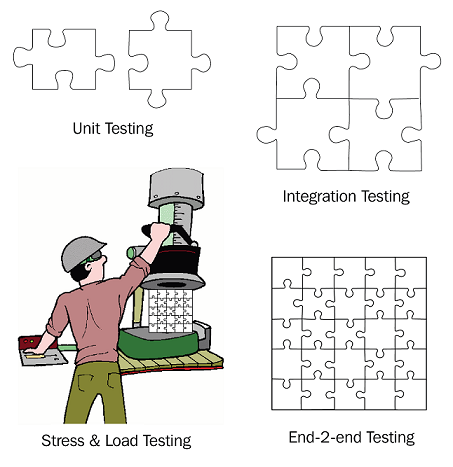

Categories of application tests

Unit tests assert the correctness and quality of an individual, isolated piece of the overall application or application service. Integration tests make sure that pieces that are closely related work together as expected. Stress and load tests often take the application or service as a whole and assert a correct behavior under various edge cases such as high load through multiple concurrent requests handled by the service, or by flooding the service with a huge amount of data. Finally, end-to-end tests simulate a real user working with the application or application service. The typical tasks that a user would do are automated.

 The code or component under test is often called a **System Under Test (SUT)**.

Unit tests are in their nature tightly coupled to the actual code or SUT. It is, hence, necessary that those tests run in the same context as the code under test. Hence, the test code lives in the same container as the SUT. All external dependencies of the SUT are either mocked or stubbed.

Integration tests, stress and load tests, and end-to-end tests, on the other hand, act on public interfaces of the system under test and it is, hence, most common to run that test code in a separate container:

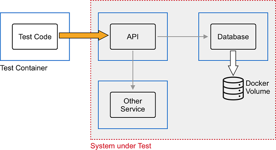


Integration tests using containers

In the preceding diagram, we can see the **Test Code** running in its own **Test Container**. The Test Code accesses the public interface of the API component that also runs in a dedicated container. The API component has external dependencies such as Other Service and **Database** that each run in their dedicated container. In this case, the whole ensemble of **API, Other Service**, and **Database** is our system under test, or SUT.

What exactly would stress and load tests look like? Imagine a situation where we have a Kafka Streams application we want to put under test. The following diagram gives an idea of what exactly we could test, from a high level:

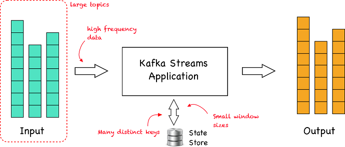

Stress and load test a Kafka Streams application

In a nutshell, a **Kafka Streams application** consumes data from one or more topics stored in Apache Kafka(R). The application filters, transforms, or aggregates the data. The resulting data is written back to one or several topics in Kafka. Typically, when working with Kafka, we deal with real-time data streaming into Kafka. Tests could now simulate the following:

- Large topics with a huge amount of records
- Data flowing into Kafka with a very high frequency
- Data being grouped by the application under test, where there is a lot of distinct keys, each one with low cardinality
- Data aggregated by time windows where the size of the window is small, for example, each only a few seconds long

End-to-end tests automate the users that interact with an application by the use of tools such as the Selenium Web Driver, which provides a developer means to automate actions on a given web page such as filling out fields in a form or clicking buttons.

# Integration tests for a Node.js application
Let's now have a look at a sample integration test implemented in Node.js. Here is the setup that we are going to look into:


Integration tests for an Express JS Application

Following are the steps to create such an integration test:

- Let's first prepare our project folder structure. We create the project root and navigate to it:
```
cd ~\M-05\sample\integration-test-node
```

Within this folder, we create three subfolders, tests, api, and database:

Now, we open VS Code from the project root:
```
code .
```

To the **database** folder, add an **init-script.sql** file with the following content:

```
CREATE TABLE hobbies(
   hobby_id serial PRIMARY KEY,
   hobby VARCHAR (255) UNIQUE NOT NULL
);

insert into hobbies(hobby) values('swimming');
insert into hobbies(hobby) values('diving');
insert into hobbies(hobby) values('jogging');
insert into hobbies(hobby) values('dancing');
insert into hobbies(hobby) values('cooking');
```

The preceding script will create a **hobbies** table in our Postgres database that we are going to use and fill it with some seed data. Save the file.

- Now we can start the database. Of course, we are going to use the official Docker image for Postgres to run the database in a container. But first, we will create a Docker volume where the database will store its files. We will call the volume pg-data:
- 
```
docker volume create pg-data
```

Now, it's time to run the database container. From within the project root folder (integration-test-node), run the following:

```
$ docker container run -d \
    --name postgres \
    -p 5432:5432 \
    -v $(pwd)/database:/docker-entrypoint-initdb.d \
    -v pg-data:/var/lib/postgresql/data \
    -e POSTGRES_USER=dbuser \
    -e POSTGRES_DB=sample-db \
    postgres:11.5-alpine
```

Note that the folder from which you run the preceding command matters, due to the volume mounting we are using for the database initialization script, **init-script.sql**. Also note that we are using environment variables to define the name and user of the database in Postgres, and we are mapping port **5432** of Postgres to the equivalent port on our host machine.

After you have started the database container, double-check that it runs as expected by retrieving its logs:

```
$ docker container logs postgres
```

You should see something similar to this:

```
...
server started
CREATE DATABASE

/usr/local/bin/docker-entrypoint.sh: running /docker-entrypoint-initdb.d/init-db.sql
CREATE TABLE
INSERT 0 1
INSERT 0 1
INSERT 0 1
INSERT 0 1
INSERT 0 1

...

PostgreSQL init process complete; ready for start up.

2019-09-07 17:22:30.056 UTC [1] LOG: listening on IPv4 address "0.0.0.0", port 5432
...
```

Note, we have shortened the output for better readability. The important parts of the preceding output are the first few lines, where we can see that the database has picked up our initialization script, created the **hobbies** table and seeded it with five records. Also important is the last line, telling us that the database is ready to work. The container logs are always your first stop when troubleshooting problems!

With that, our first piece of the SUT is ready. Let's move on to the next one, which is our API implemented in Express JS:

In the Terminal window, navigate to the api folder:

```
cd ~M-05\sample\integration-test-node\api
```


Then, run npm init to initialize the API project. Just accept all defaults:

```
$ npm init
```

The resulting package.json file should look like this:

```
{
  "name": "api",
  "version": "1.0.0",
  "description": "",
  "main": "index.js",
  "scripts": {
    "test": "echo \"Error: no test specified\" && exit 1"
  },
  "author": "",
  "license": "ISC"
}
```

Modify the **scripts** node of the preceding file so that it contains a start command:

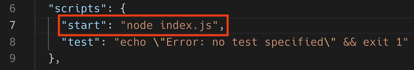

 
Adding a start script to the package.json file

We then have to install Express JS and can do so with the following command:

```
$ npm install express --save
```

This will install the library and all of its dependencies and add a dependencies node to our package.json file that looks similar to this:


Adding Express JS as a dependency to the API

- In the api folder, create a **server.js** file and add the following code snippet:

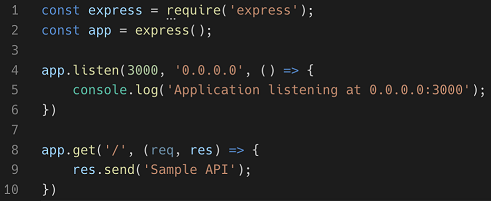

Simple Express JS API

This is a simple Express JS API with only the / endpoint implemented. It serves as a starting point for our exploration into integration testing. Note that the API will be listening at port 3000, on all endpoints inside the container (0.0.0.0).

- Now we can start the API with **npm start** and then test the home endpoint, for example, with curl:

```
$ curl localhost:3000
Sample API
```
After all of these steps, we're ready to scaffold the test environment.

- We will be using jasmine to write our tests. Navigate to the tests folder and run **npm init** to initialize the test project:

```
$ cd ~\M-05\sample\integration-test-node\tests
    npm init
```

Accept all of the defaults.

Next, add jasmine to the project:
```
$ npm install --save-dev jasmine
```
Then initialize jasmine for this project:
```
$ node node_modules/jasmine/bin/jasmine init
```

We also need to change our **package.json** file so that the scripts block looks like this:


Adding a test script for our integration tests
- We cannot run the tests any time by executing npm test from within the tests folder. The first time we run it, we will get an error since we have not yet added any tests:

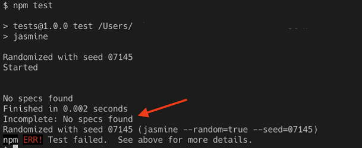


The first run fails since no tests were found

- Now in the spec/support subfolder of the project, let's create a jasmine.json file. This will contain the configuration settings for the jasmine test framework. Add the following code snippet to this file and save:

```
{
  "spec_dir": "spec",
  "spec_files": [
    "**/*[sS]pec.js"
  ],
  "stopSpecOnExpectationFailure": false,
  "random": false
}
```

Since we are going to author integration tests we will want to access the SUT via its public interface, which, in our case, is a RESTful API. Hence, we need a client library that allows us to do so. My choice is the Requests library. Let's add it to our project:

```
$ npm install request --save-dev
```

Add an **api-spec.js** file to the **spec** subfolder of the project. It will contain our test functions. Let's start with the first one:

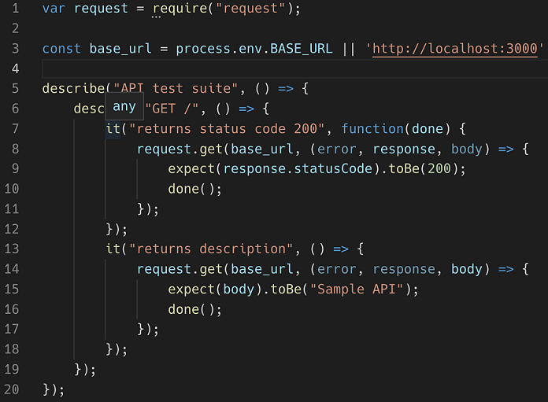

Sample test suite for the API

We are using the request library to make RESTful calls to our API (line 1). Then, on line 3, we're defining the base URL on which the API is listening. Note, the code that we use allows us to override the default of http://localhost:3000 with whatever we define in an environment variable called BASE_URL. Line 5 defines our test suite, which, on line 6, has a test for GET /. We then assert two outcomes, namely that the status code of a GET call to / is 200 (OK) and that the text returned in the body of the response is equal to Sample API.

- If we run the test now, we get the following outcome:

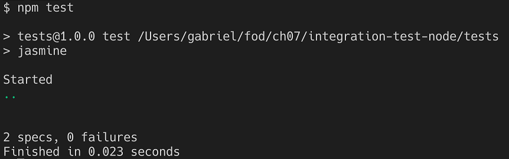

Successfully running Jasmine-based integration tests

We have two specifications—another word for tests—running; all of them are successful since we have zero failures reported.

- Before we continue, please stop the API and remove the Postgres container with **docker container rm -f postgres.**

So far so good, but now let's bring containers to the table. That's what we are most excited about, isn't it? We're excited to run everything, including test code in containers. If you recall, we are going to deal with three containers, the database, the API, and the container with the test code. For the database, we are just using the standard Postgres Docker image, but, for the API and tests, we will create our own images:

- Let's start with the API. To the api folder, add a Dockerfile file with this content:

```
FROM node:alpine
WORKDIR /usr/src/app
COPY package.json ./
RUN npm install
COPY . .
EXPOSE 3000
CMD npm start
```

This is just a very standard way of creating a container image for a Node.js based application. There's nothing special here. 

To the **tests**folder, also add a Dockerfile with this content:

```
FROM node:alpine
WORKDIR /usr/src/app
COPY package.json ./
RUN npm install
COPY . .
CMD npm test
```

Now, we're ready to run all three containers, in the right sequence. To simplify this task, let's create a shell script that does exactly that. Add a **test.sh** file to the **integration-test-node** folder, our project root folder. Add the following content to this file and save:
```
docker image build -t api-node api
docker image build -t tests-node tests

docker network create test-net

docker container run --rm -d \
    --name postgres \
    --net test-net \
    -v $(pwd)/database:/docker-entrypoint-initdb.d \
    -v pg-data:/var/lib/postgresql/data \
    -e POSTGRES_USER=dbuser \
    -e POSTGRES_DB=sample-db \
    postgres:11.5-alpine

docker container run --rm -d \
    --name api \
    --net test-net \
    api-node

echo "Sleeping for 5 sec..."
sleep 5

docker container run --rm -it \
    --name tests \
    --net test-net \
    -e BASE_URL="http://api:3000" \
    tests-node
```

On the first two lines of the script, we make sure that the two container images for API and tests are built with the newest code. Then, we create a Docker network called **test-net** on which we will run all three containers. Don't worry about the details of this as we will explain networks in detail in , Single Host Networking. For the moment, suffice to say that if all containers run on the same network, then the applications running inside those containers can see each other as if they were running natively on the host, and they can call each other by name.

The next command starts the database container, followed by the command that starts the API. Then, we pause for a few seconds to give the database and the API time to completely start up and initialize, before we start the third and final container, the tests container.

- Make this file an executable with the following:
```
$ chmod +x ./test.sh
```
Now you can run it:
```
$ ./test.sh
```
If everything works as expected, you should see something along these lines (shortened for readability):

```
...
Successfully built 44e0900aaae2
Successfully tagged tests-node:latest
b4f233c3578898ae851dc6facaa310b014ec86f4507afd0a5afb10027f10c79d
728eb5a573d2c3c1f3a44154e172ed9565606af8e7653afb560ee7e99275ecf6
0474ea5e0afbcc4d9cd966de17e991a6e9a3cec85c53a934545c9352abf87bc6
Sleeping for 10 sec...

> tests@1.0.0 test /usr/src/app
> jasmine

Started
..


2 specs, 0 failures
Finished in 0.072 seconds
```

We can also create a script that cleans up after testing. For this, add a file called cleanup.sh and make it an executable the same way as you've done with the test.sh script. Add the following code snippet to this file:

```
docker container rm -f postgres api
docker network rm test-net
docker volume rm pg-data
```

Line one removes the **postgres** and **api** containers. Line 2 removes the network we used for the third container, and finally, line 3 removes the volume used by Postgres. After each test run, execute this file with **./cleanup.sh**.

Now you can start adding more code to your API component and more integration tests. Each time you want to test new or modified code, just run the test.sh script.

- **TIP:** Challenge: How can you optimize this process further, so that fewer manual steps are required? 
Use what we have learned in, Debugging Code Running in Containers.


# The Testcontainers project
If you're a Java developer, then there is a nice project called Testcontainers (https://testcontainers.org). In their own words, the project can be summarized as follows:

- "Testcontainers is a Java library that supports JUnit tests, providing lightweight, throwaway instances of common databases, Selenium web browsers, or anything else that can run in  Docker container."

To experiment with Testcontainer follow along:
First create a testcontainer-node folder and navigate to it:

```
cd c:\DJK\\Lab-05-Supercharge-Automation\sample\testcontainers-node
```

Next open VS Code from within that folder with **code ..** Create three subfolders, **database, api**, and **tests**, within the same folder. To the api folder, add a package.json file with the following content:

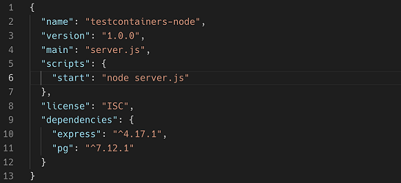

Content of package.json for the API

- Add a **server.js** file to the **api** folder with this content:

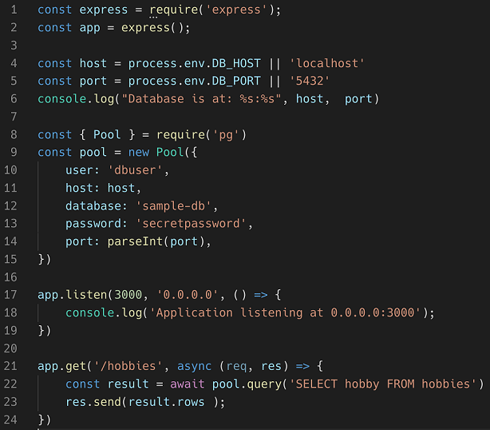

The sample API using the pg library to access Postgres

Here, we create an Express JS application listening at port **3000.** The application uses the **pg** library, which is a client library for Postgres, to access our database. On lines **8** through **15**, we are defining a connection pool object that will allow us to connect to Postgres and retrieve or write data. On lines 21 through 24, we're defining a **GET** method on the /hobbies endpoint, which returns the list of hobbies that are retrieved from the database via the SQL query, **SELECT hobby FROM hobbies**.

Now add a Dockerfile to the same folder with this content:


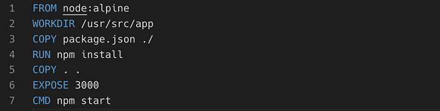

Dockerfile for the API

This is exactly the same definition as we used in the previous example. With this, the API is ready to be used. Let's now continue with the tests that will use the **testcontainer** library to simplify container-based testing.

In your Terminal, navigate to the tests folder that we created earlier and use npm init to initialize it as a Node.js project. Accept all of the defaults. Next, use npm to install the request library and the testcontainers library:

```
$ npm install request --save-dev
$ npm install testcontainers --save-dev
```

The result of this is a package.json file that should look similar to this:

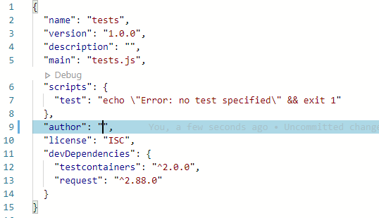

The package.json file for the tests project

Now, still in the **tests** folder, create a **tests.js** file and add the following code snippet:
```
const request = require("request");
const path = require('path');
const dns = require('dns');
const os = require('os');
const { GenericContainer } = require("testcontainers");

(async () => {
 // TODO
})();
```

Note how we're requesting a new object such as the **request** object, which will help us to access the RESTful interface of our sample API component. We are also requesting the **GenericContainer** object from the **testcontainers** library that will allow us to build and run any container.

We then define an async self-invoking function, which will be the wrapper for our setup and test code. It has to be an async function since, inside it, we will be awaiting other async functions, such as the various methods used from the **testcontainers** library.

As a very first step, we want to use the testcontainers library to create a Postgres container with the necessary seed data loaded. Let's add this code snippet after **//TODO**:
```
const localPath = path.resolve(__dirname, "../database");
const dbContainer = await new GenericContainer("postgres")
    .withName("postgres")
    .withExposedPorts(5432)
    .withEnv("POSTGRES_USER", "dbuser")
    .withEnv("POSTGRES_DB", "sample-db")
    .withBindMount(localPath, "/docker-entrypoint-initdb.d")
    .withTmpFs({ "/temp_pgdata": "rw,noexec,nosuid,size=65536k" })
    .start();
```
The preceding snippet has some similarities with a **Docker run** command. That is no accident since we are instructing the **testcontainers** library to do exactly that and run an instance of PostgreSQL for us.

Next, we need to find out to which host port the exposed port **5432** is mapped. We can do that with the following logic:
```
const dbPort = dbContainer.getMappedPort(5432);
```
We will need this information since the API component will have to access Postgres via this port.

- We also need to know which IP address the host is reachable from within a container—note, localhost won't work from within a container since that would map to the loopback adapter of the container's own network stack. We can get this host IP address like this:
```
const myIP4 = await lookupPromise();
```
The **lookupPromise** function is a wrapper function to make the normal async **dns.lookup** function return a promise so that we can **await** it. Here is its definition:

```
async function lookupPromise(){
    return new Promise((resolve, reject) => {
        dns.lookup(os.hostname(), (err, address, family) => {
            if(err) throw reject(err);
            resolve(address);
        });
   });
};
```

Now, with this information, we are ready to instruct the **testcontainer** library to first build the container image for the API and then run a container from this image. Let's start with the build:
```
const buildContext = path.resolve(__dirname, "../api");
const apiContainer = await GenericContainer
    .fromDockerfile(buildContext)
    .build();
```

Note how this command uses the Dockerfile that we defined in the **api** subfolder.

Once we have the **apiContainer** variable referencing the new image, we can use this to run a container from it:
```
const startedApiContainer = await apiContainer
    .withName("api")
    .withExposedPorts(3000)
    .withEnv("DB_HOST", myIP4)
    .withEnv("DB_PORT", dbPort)
    .start();
```

Once again, we need to find out to which host port the exposed port 3000 of the API component has been mapped. The **testcontainer** library makes this a breeze:

```
const apiPort = startedApiContainer.getMappedPort(3000);
```

With this last line, we have finished the test setup code and can now finally start implementing some tests. We start by defining the base URL for the API component that we want to access. Then, we use the request library to make an HTTP GET request to the /hobbies endpoint:
```
const base_url = `http://localhost:${apiPort}`
request.get(base_url + "/hobbies", (error, response, body) => {
    //Test code here...
})
```
Let's now implement some assertions right after the //Test code here... comment:
```
console.log("> expecting status code 200");
if(response.statusCode != 200){
    logError(`Unexpected status code ${response.statusCode}`);
}
```

First, we log our expectation to the console as a feedback when running tests. Then, we assert that the returned status code is **200**, and, if not, we log an error. The **logError** helper function just writes the given message in red to the console, and prefixes it with *****ERR**. Here is the definition of this function:

```
function logError(message){
    console.log('\x1b[31m%s\x1b[0m', `***ERR: ${message}`);
}
```
Let's add two more assertions:

```
const hobbies = JSON.parse(body);
console.log("> expecting length of hobbies == 5");
if(hobbies.length != 5){
    logError(`${hobbies.length} != 5`);
}
console.log("> expecting first hobby == swimming");
if(hobbies[0].hobby != "swimming"){
    logError(`${hobbies[0].hobby} != swimming`);
}
```
I leave it up to you, dear reader, to find out what these assertions do exactly.

At the end of the assertions, we have to clean up so that we're ready for a next run:
```
await startedApiContainer.stop()
await dbContainer.stop();
```
What we're doing is just stopping the API and the database container. This will automatically remove them from memory too.

Now we can run this test suite using the following command from within the tests subfolder:
```
$ node tests.js
```
The output in my case looks like this (note, I have sprinkled a few console.log statements in the code to more easily follow along what exactly is happening at a give time):

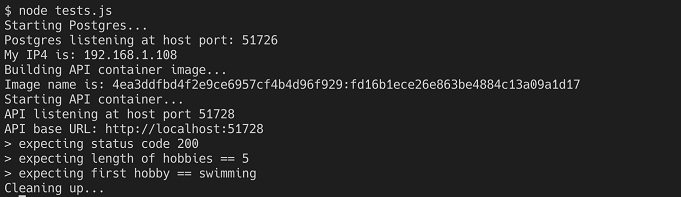

Running the testcontainer-based integration tests

The full code is given in the sample code repository that you cloned from GitHub. If you have problems running your tests, please compare your implementation to the given sample solution.

Now that we have a good understanding of how to use containers to run our integration tests, we'll move on to another very popular use case for container based automation, namely, building a Continuous Integration and Continuous Deployment or Delivery (CI/CD) pipeline.