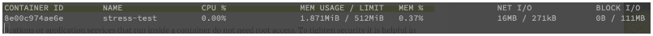

[](../M-06/README.md)
# All of the tips and tricks of a Docker pro

In this section, I will present a few very useful tips and tricks that make the lives of advanced Docker users so much easier. We will start with some guidance on how to keep your Docker environment clean.

# Keeping your Docker environment clean
First, we want to learn how we can delete dangling images. According to Docker, dangling images are layers that have no relationship to any tagged images. Such image layers are certainly useless to us and can quickly fill up our disk—it's better to remove them from time to time. Here is the command:


```bash
$ docker image prune -f
```

Please note that I have added the -f parameter to the prune command. This is to prevent the CLI from asking for a confirmation that we really want to delete those superfluous layers.

Stopped containers can waste precious resources too. If you're sure that you don't need these containers anymore, then you should remove them, either individually with the following:


```bash
$ docker container rm <container-id>
```

Or, you can remove them as a batch with the following:


```bash
$ docker container prune --force
```

It is worth mentioning once again that, instead of <container-id>, we can also use <container-name> to identify a container.

Unused Docker volumes too can quickly fill up disk space. It is a good practice to tender your volumes, specifically in a development or CI environment where you create a lot of mostly temporary volumes. But I have to warn you, Docker volumes are meant to store data. Often, this data must live longer than the life cycle of a container. This is specifically true in a production or production-like environment where the data is often mission-critical. Hence, be 100% sure of what you're doing when using the following command to prune volumes on your Docker host:

```bash
$ docker volume prune
WARNING! This will remove all local volumes not used by at least one container.
Are you sure you want to continue? [y/N]
```


I recommend using this command without the **-f (or --force)** flag. It is a dangerous and terminal operation and it's better to give yourself a second chance to reconsider your action. Without the flag, the CLI outputs the warning you see in the preceding. You have to explicitly confirm by typing y and pressing the Enter key. 

On production or production-like systems, you should abstain from the preceding command and rather delete unwanted volumes one at a time by using this command:


```bash
$ docker volume rm <volume-name>
```

I should also mention that there is a command to prune Docker networks. But since we have not yet officially introduced networks, I will defer this to , Single-Host Networking .

# Formatting the output of common Docker commands
Have you at times wished that your Terminal window was infinitely wide since the output of a Docker command such as docker container ps is scrambled across several lines per item? Worry not, as you can customize the output to your liking. Almost all commands that produce an output have a --format argument, which accepts a so-called Go template as a parameter.

 If you wonder why a Go template, it's because most of Docker is written in this popular low-level language. Let's look at an example. Assume we want to only show the name of the container, the name of the image, and the state of the container, separated by tabs, output by the docker container ps command. The format would then look like this:


```bash
docker container ps -a --format "table {{.Names}}\t{{.Image}}\t{{.Status}}"
```

**Please be aware that the format string is case sensitive**. Also, note the addition of the -a parameter to include stopped containers in the output. A sample output could look like this:

```bash
NAMES              IMAGE            STATUS
elated_haslett     alpine           Up 2 seconds
brave_chebyshev    hello-world      Exited (0) 3 minutes ago
```

This is definitely nicer to display even on a narrow Terminal window than the unformatted one scattering wildly over multiple lines.

# Filtering the output of common Docker commands
Similar to what we have done in the previous section by pretty-printing the output of Docker commands, we can also filter what is output. There are quite a few filters that are supported. Please find the full list for each command in the Docker online documentation. The format of filters is straightforward and of the type **--filter <key>=<value>**. If we need to combine more than one filter, we can just combine multiple of these statements. Let's do an example with the docker image ls command as I have a lot of images on my workstation:

```bash
 docker image ls --filter dangling=false --filter "reference=docker*:latest"
 docker image ls --filter dangling=false --filter "reference=*:latest"
 docker image ls --filter dangling=false --filter "reference=fredysa/*:*"

```

The preceding filter only outputs images that are not dangling, that is, real images whose fully qualified name is of the form <registry>/<user|org><repository>:<tag>, and the tag is equal to latest. The output on my machine looks like this:


```bash
REPOSITORY                                  TAG     IMAGE ID      CREATED   SIZE
docker.bintray.io/jfrog/artifactory-cpp-ce  latest  092f11699785  9 months  ago 900MB
docker.bintray.io/jfrog/artifactory-oss     latest  a8a8901c0230  9 months  ago 897MB
```

Having shown how to pretty print and filter output generated by the Docker CLI, it is now time to talk once more about building Docker images and how to optimize this process.


# Limiting resources consumed by a container
One of the great features of a container, apart from encapsulating application processes, is the possibility of limiting the resources a single container can consume at. This includes CPU and memory consumption. Let's have a look at how limiting the amount of memory (RAM) works:


```powershell
 docker container run --rm -it `
    --name stress-test `
    --memory 512M `
    ubuntu:19.04 /bin/bash
```


Once inside the container, install the stress tool, which we will use to simulate memory pressure:


```bash
/# apt-get update && apt-get install -y stress
```


Open another Terminal window and execute the docker stats command. You should see something like this:



docker stats showing a resource-limited container
Look at  MEM USAGE and LIMIT. Currently, the container uses only 1.87MiB memory and has a limit of 512MB. The latter corresponds to what we have configured for this container. Now, let's use stress to simulate four workers, which try to malloc() memory in blocks of 256MB. Run this command inside the container to do so:

```bash
/# stress -m 4
```


In the Terminal running Docker stats, observe how the value for **MEM USAGE** approaches but never exceeds **LIMIT**. This is exactly the behavior we expected from Docker. Docker uses Linux cgroups to enforce those limits.

We could similarly limit the amount of **CPU** a container can consume with the **--cpu**switch.

**With this operation, engineers can avoid the noisy neighbor problem on a busy Docker host, where a single container starves all of the others by consuming an excessive amount of resources.**


# Read-only filesystem

To protect your applications against malicious hacker attacks, it is often advised to define the filesystem of the container or part of it as read-only. This makes the most sense for stateless services. Assume that you have a billing service running in a container as part of your distributed, mission-critical application. You could run your billing service as follows:

 
```powershell
docker container run -d --rm -it `
 --name billing `
 --read-only `
 alpine
```


The --read-only flag mounts the container's filesystem as read-only. If a hacker succeeds in entering your billing container and tries to change an application maliciously by, say, replacing one of the binaries with a compromised one, then this operation would fail. We can easily demonstrate that with the following commands:


```powershell
docker container run -d --rm -it `
 --name billing `
 --read-only `
 ubuntu
```

!run in wsl
```bash
docker container exec -it billing  sh -c 'echo "You are doomed!" > ./sample.txt'
```
```
"You are doomed! " > sample.txt
```

sh: can't create ./sample.txt: Read-only file system
The first command runs a container with a read-only filesystem and the second command tries to execute another process in this container, which is supposed to write something to the filesystem—in this case, a simple text file. This fails, as we can see in the preceding output, with the error message Read-only file system.


# Avoid running a containerized app as root 

Most applications or application services that run inside a container do not need root access. To tighten security, it is helpful in those scenarios to run these processes with minimal necessary privileges. These applications should not be run as root nor assume that they have root-level privileges.

Once again, let's illustrate what we mean with an example. Assume we have a file with top-secret content. We want to secure this file on our Unix-based system using the chmod tool so that only users with root permission can access it.

Let's assume I am logged in as gabriel on the dev host and hence my prompt is user@dev $. I can use sudo su to impersonate a superuser. I have to enter the superuser password though:

**Tip! Use wsl**

```bash
user@dev $ sudo su
Password: <root password>
root@dev $
```

Now, as the root user, I can create this file called top-secret.txt and secure it:


```bash
root@dev $ echo "You should not see this." > top-secret.txt
root@dev $ chmod 600 ./top-secret.txt
root@dev $ exit
user@dev $
```

If I try to access the file as gabriel, the following happens:


```bash
user@dev $ cat ./top-secret.txt
cat: ./top-secret.txt: Permission denied
```


I get Permission denied, which is what we wanted. No other user except root can access this file. Now, let's build a Docker image that contains this secured file and when a container is created from it, tries to output its content. The Dockerfile could look like this:


```
FROM ubuntu:latest
COPY ./top-secret.txt /secrets/
# simulate use of restricted file
CMD cat /secrets/top-secret.txt
```

We can build an image from that Dockerfile (as root!) with the following:

```bash
user@dev $ sudo su
Password: <root password>
root@dev $ docker image build -t demo-image .
root@dev $ exit
user@dev $
```
Then, when running a container from that image we get:

```bash
user@dev $ docker container run demo-image
```
Output :
```bash
You should not see this.
```
OK, so although I am impersonating the gabriel user on the host and running the container under this user account, the application running inside the container automatically runs as root, and hence has full access to protected resources. That's bad, so let's fix it! Instead of running with the default, we define an explicit user inside the container. The modified Dockerfile looks like this:


```
FROM ubuntu:latest
RUN groupadd -g 3000 demo-group 
RUN useradd -r -u 4000 -g demo-group demo-user
USER demo-user
COPY ./top-secret.txt /secrets/
# simulate use of restricted file
CMD cat /secrets/top-secret.txt
```


We use the groupadd tool to define a new group, demo-group, with the ID 3000. Then, we use the useradd tool to add a new user, demo-user, to this group. The user has the ID 4000 inside the container. Finally, with the USER demo-user statement, we declare that all subsequent operations should be executed as demo-user.

**Rebuild the image—again as root—and then try to run a container from it:**

```bash
user@dev $ sudo su
Password: <root password>
root@dev $ docker image build -t demo-image .
root@dev $ exit
user@dev $ docker container run demo-image
cat: /secrets/top-secret.txt: Permission denied
```


And as you can see on the last line, the application running inside the container runs with restricted permissions and cannot access resources that need root-level access. By the way, what do you think would happen if I ran the container as root? Try it out!

**These have been a few tips and tricks for pros that are useful in the day-to-day usage of containers. There are many more. Google them. It is worth it.**
