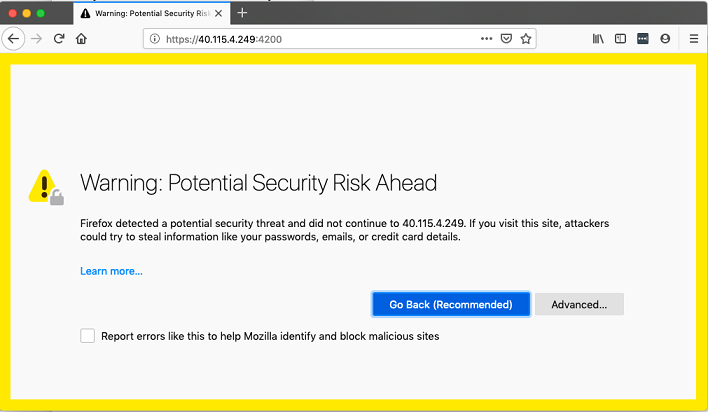
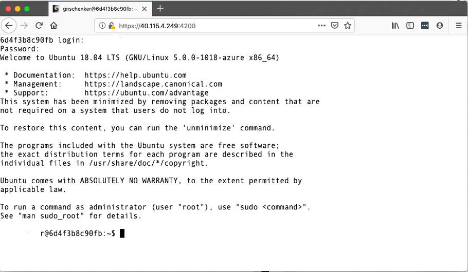

[](../M-06/README.md)
# **Running your Terminal in a remote container and accessing it via HTTPS**
There are situations where you need to access a remote server and only have the option to use a browser for that. Your laptop may be locked down by your employer so that you are not allowed to, for example, **ssh**into a server outside of the company's domain.

To test this scenario proceed as follows:

Create a free account on Microsoft **Azure**, **GCP**, or **AWS**. Then, create a VM, preferably with Ubuntu 18.04 or higher as the operating system, to follow along more easily.

Once your VM is ready, SSH into it. The command to do so should look similar to this:

```
$ ssh personaluser@40.115.4.249
```

- **Tip:** To get access, you may need to open port **22** for ingress first for the VM.

The user I have defined during the provisioning of the VM is **personaluser** and the public IP address of my VM is **40.115.4.249**.

- Install Docker on this VM using the description found here: https://docs.docker.com/install/linux/docker-ce/ubuntu/.

- On a special note, do not forget to add your user (**personaluser**, in my case) to the **docker** group on the VM with the following command:

```
$ sudo usermod -aG docker <user-name>
```

With this, you avoid having to constantly use **sudo** for all Docker commands. You need to log out from and log in to the VM to make this change work.

- Now, we are ready to run Shell in a Box (https://github.com/shellinabox/shellinabox) in a container on the VM. There are quite a few people who have containerized Shell in a Box. We are using the Docker image, sspreitzer/shellinabox. At the time of writing, it is the most popular version by far on Docker Hub. With the following command, we are running the application with a user, personaluser; password, top-secret; sudo for the user enabled; and with self-signed certificates:

```
$ docker container run --rm \
    --name shellinabox \
    -p 4200:4200 \
    -e SIAB_USER=personaluser \
    -e SIAB_PASSWORD=top-secret \
    -e SIAB_SUDO=true \
    -v `pwd`/dev:/usr/src/dev \
    sspreitzer/shellinabox:latest
```

Note that initially, we recommend running the container in interactive mode so that you can follow what's happening. Once you are more familiar with the service, consider running it in the background with the -d flag. Also, note that we are mounting the ~/dev folder from the host to the /usr/src/dev folder inside the container. This is useful if we want to remotely edit code that we have, for example, cloned from GitHub into the ~/dev folder.

Also, notice that we are mapping port 4200 of Shell in a Box to host port 4200. This is the port over which we will be able to access the shell using a browser and HTTPS. Hence, you need to open port 4200 for ingress on your VM. As a protocol, select TCP.

- Once the container is running and you have opened port 4200 for ingress, open a new browser window and navigate to https://<public-IP>:4200, where <public-IP> is the public IP address of your VM. Since we're using a self-signed certificate, you will be greeted with a warning,here shown when using Firefox:



Browser warning due to the use of self-signed certificates

- In our case, this is not a problem; we know the cause—it's the self-signed certificate. Hence, click the Advanced... button and then Accept Risk and Continue. Now, you will be redirected to the login screen. Log in with your username and password:



Log in to the remote VM from your browser using HTTPS

We are logged in to the Shell in a Box application running on our remote VM, using the HTTPS protocol.

Now, we have full access to, for example, the files and folder mapped from the host VM to /usr/src/dev. We can, for example, use the vi text editor to create and edit files, although we have to first install vi with this:

```
$ sudo apt-get update && sudo apt-get install -y vim
```

- The possibilities are nearly endless. Please experiment with this setup.For example, run the Shell in a Box container with the Docker socket mounted, install Docker inside the container, and then try to use the Docker CLI from within the container. It is really cool because you can do all of this from within your browser!
- If you intend to use this Shell in a Box container often and need some additional software installed, do not hesitate to create your own custom Docker image inheriting from **sspreitzer/shellinabox**.


Next, we will see how to run your development environment inside a container.