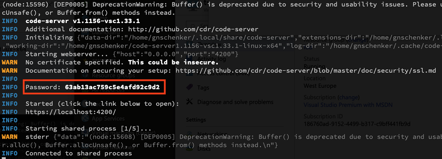
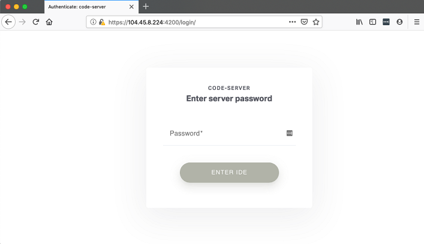
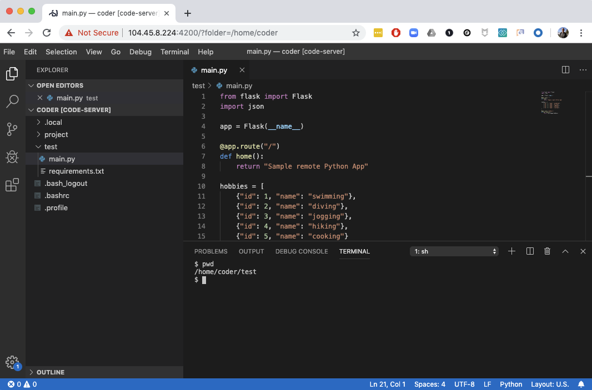

[](../M-06/README.md)
Running your code editor in a remote container and accessing it via HTTPS
In this section, we will show how you can use Visual Studio Code to enable remote development inside a container. This is interesting when you are limited in what you can run on your workstation. Let's follow these steps:

Download and extract the latest version of code-server. You can find out the URL by navigating to https://github.com/cdr/code-server/releases/latest. At the time of writing, it is 1.1156-vsc1.33.1:

```
$ VERSION=<version>
$ wget https://github.com/cdr/code-server/releases/download/${VERSION}/code-server${VERSION}-linux-x64.tar.gz
$ tar -xvzf code-server${VERSION}-linux-x64.tar.gz
```

Make sure to replace **<version>**with your specific version.

Navigate to the folder with the extracted binary, make it executable, and start it:

```
$ cd code-server${VERSION}-linux-x64
$ chmod +x ./code-server
$ sudo ./code-server -p 4200
```

The output should look similar to this:




Starting Visual Studio Code remote-server on a remote VM

Code Server is using self-signed certificates to secure communication, so we can access it over HTTPS. Please make sure you note down the Password output on the screen since you need it when accessing Code Server from within your browser. Also note that we are using port 4200 to expose Code Server on the host, the reason being that we already opened that port for ingress on our VM. You can, of course, select any port you want—just make sure you open it for ingress.

- Open a new browser page and navigate to **https://<public IP>:4200**,where **<public IP>** is the public IP address of your VM. Since we are using self-signed certificates once again, the browser will greet you with a warning similar to what happened when we were using Shell in a Box earlier in this chapter. Accept the warning and you will be redirected to the login page of Code Server:




Login page of Code Server

- Enter the password that you noted down before and click ENTER IDE. Now you will be able to use Visual Studio Code remotely via your browser over a secure HTTPS connection:



Visual Studio Code running in the browser over HTTPS

- Now you can do your development from, for example, a Chrome Book or a locked-down workstation, without restrictions. But wait a minute, you may say now! What does this have to do with containers? You're right—so far, there are no containers involved. I could say, though, that if your remote VM has Docker installed, you can use Code Server to do any container-specific development, and I would have saved the day. But that would be a cheap answer.
- Let's run Code Server itself in a container. That should be easy, shouldn't it? Try using this command, which maps the internal port 8080 to the host port 4200 and mounts host folders containing Code Server settings and possibly your projects into the container:

```
$ docker container run -it \
    -p 4200:8080 \
    -v "${HOME}/.local/share/code-server:/home/coder/.local/share/code-server" \
    -v "$PWD:/home/coder/project" \
    codercom/code-server:v2
```
Note, the preceding command runs Code Server in insecure mode as indicated in the output:

```
info Server listening on http://0.0.0.0:8080
info - No authentication
info - Not serving HTTPS
```

- You can now access Visual Studio Code in your browser at **`http://<public IP>:4200`**. Please note the **HTTP** in the URL instead of **HTTPS**! Similarly to when running Code Server natively on the remote VM, you can now use Visual Studio Code from within your browser:


 Developing within your browser
With this, I hope you have got a feel for the near-unlimited possibilities that the use of containers offers to you.