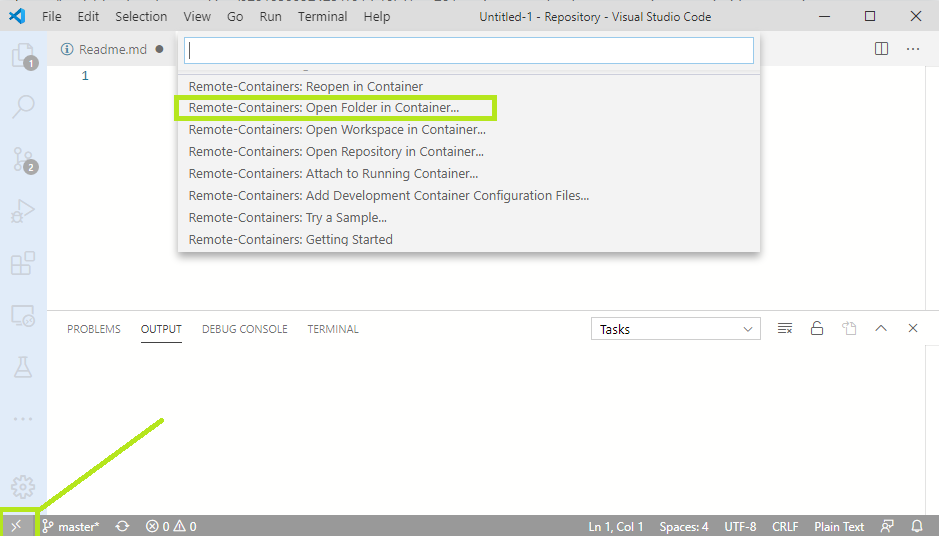
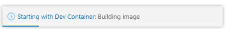
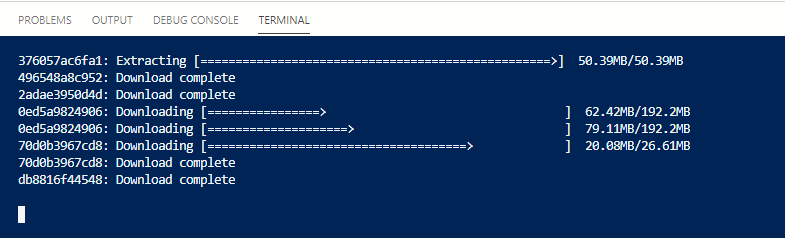
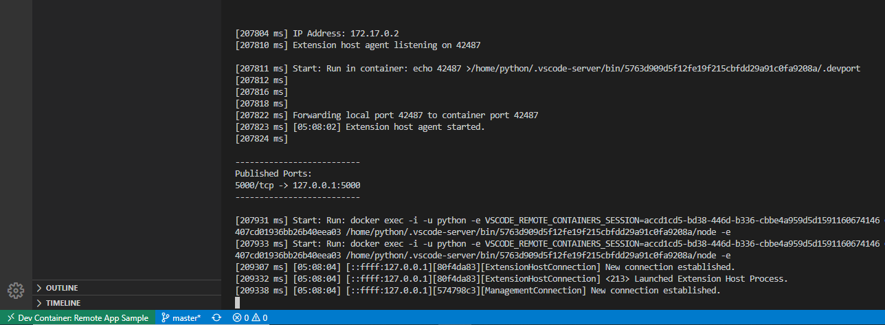
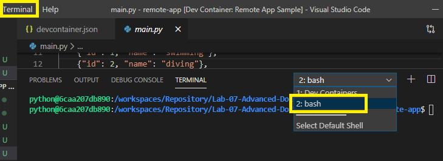
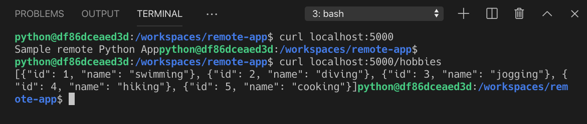

[](../M-06/README.md)
# Running your development environment inside a container
Imagine that you only have access to a workstation with Docker for Desktop installed, but no possibility to add or change anything else on this workstation. Now you want to do some proof of concepts and code some sample application using Python. Unfortunately, Python is not installed on your computer. What can you do? What if you could run a whole development environment inside a container, including code editor and debugger? What if, at the same time, you could still have your code files on your host machine?

Containers are awesome and genius engineers have come up with solutions for exactly this kind of problem.

1. Let's try this for a Python application:

We will be using Visual Studio Code, our favorite code editor, to show how to run a complete Python development environment inside a container. But first, we need to install the necessary Visual Studio Code extension. Open Visual StudioCode and install the extension called Remote Development:


```powershell
code --install-extension ms-vscode-remote.vscode-remote-extensionpack
```
2. Then, click the green quick actions status bar item in the lower-left of the Visual Studio Code window. 

In the popup, select Remote-Containers: **Open Folder in Container...**: 



3. Select the project folder you want to work with in the container. In our case, we selected the **~/remote-app** folder. 

Visual StudioCode will start preparing the environment, which, the very first time, can take a couple of minutes or so. 

You will see a message like this while this is happening:






Visual Studio Code preparing the development container
By default, this development container runs as a non-root user—called python in our case. We learned, in a prior section, that this is a highly recommended best practice. You can change though, and run as root by commenting out the line with "runArgs": [ "-u", "python" ], in the .devcontainer/devcontainer.json file.

Open a Terminal inside Visual Studio Code with Shift + Ctrl + ` and run the Flask app with the env FLASK_APP=main.py flask run command. You should see output like this:



Starting a Python Flask app from Visual Studio Code running inside a container 
The python@df86dceaed3d:/workspaces/remote-app$ prompt indicates that we are not running directly on our Docker host but from within a development container that Visual Studio Code spun up for us. The remote part of Visual Studio Code itself also runs inside that container.



 Only the client part of Visual Studio Code—the UI—continues to run on our host.

Open another Terminal window inside Visual Studio Code by pressing Shift+Ctrl+`. Then, use curl to test the application:


```bash
curl localhost:5000
```

