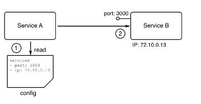
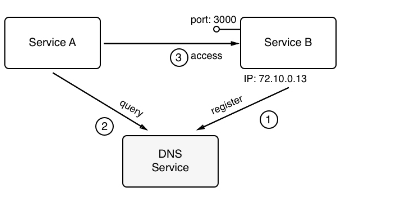
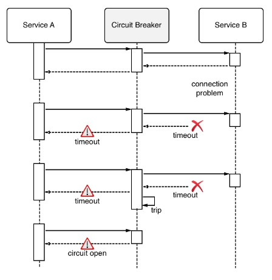

# **Patterns and best practices**

A distributed application architecture has many compelling benefits, but it also has one very significant drawback compared to a monolithic application architecture – the former is way more complex. To tame this complexity, the industry has come up with some important best practices and patterns. In the following sections, we are going to look into some of the most important ones in more detail.

# Loosely coupled components

The best way to address a complex subject has always been to divide it into smaller subproblems that are more manageable. As an example, it would be insanely complex to build a house in one single step. It is much easier to build the house from simple parts that are then combined into the final result.

The same also applies to software development. It is much easier to develop a very complex application if we divide this application into smaller components that interoperate and make up the overall application. Now, it is much easier to develop these components individually if they are only loosely coupled to each other. What this means is that component A makes no assumptions about the inner workings of, say, components B and C, and is only interested in how it can communicate with those two components across a well-defined interface.

If each component has a well-defined and simple public interface through which communication with the other components in the system and the outside world happens, then this enables us to develop each component individually, without implicit dependencies to other components. During the development process, other components in the system can easily be replaced by stubs or mocks to allow us to test our components. 

# Stateful versus stateless
Every meaningful business application creates, modifies, or uses data. In IT, a synonym for data is state. An application service that creates or modifies persistent data is called a stateful component. Typical stateful components are database services or services that create files. On the other hand, application components that do not create or modify persistent data are called stateless components.

In a distributed application architecture, stateless components are much simpler to handle than stateful components. Stateless components can be easily scaled up and down. Furthermore, they can be quickly and painlessly torn down and restarted on a completely different node of the cluster – all of this because they have no persistent data associated with them.

Given that fact, it is helpful to design a system in a way that most of the application services are stateless. It is best to push all the stateful components to the boundary of the application and limit their number. Managing stateful components is hard.

# Service discovery
As we build applications that consist of many individual components or services that communicate with each other, we need a mechanism that allows the individual components to find each other in the cluster. Finding each other usually means that you need to know on which node the target component is running and on which port it is listening for communication. Most often, nodes are identified by an IP address and a port, which is just a number in a well-defined range.

Technically, we could tell **Service A**, which wants to communicate with a target, **Service B**, what the **IP** address and **port** of the target are. This could happen, for example, through an entry in a configuration file:

Components are hardwired

While this might work very well in the context of a monolithic application that runs on one or only a few well-known and curated servers, it totally falls apart in a distributed application architecture. First of all, in this scenario, we have many components, and keeping track of them manually becomes a nightmare. This is definitely not scalable. Furthermore, **Service A ** typically should or will never know on which node of the cluster the other components run. Their location may not even be stable as component B could be moved from node X to another node Y, due to various reasons external to the application. Thus, we need another way in which **Service A** can locate **Service B** , or any other service, for that matter. What is most commonly used is an external authority that is aware of the topology of the system at any given time.

This external authority or service knows all the nodes and their IP addresses that currently pertain to the cluster; it knows about all the services that are running and where they are running. Often, this kind of service is called a **DNS service**, where DNS stands for **Domain Name System**. As we will see, Docker has a **DNS** service implemented as part of the underlying engine. Kubernetes – the number one container orchestration system, which we'll discuss in , Orchestrators – also uses a **DNS** service to facilitate communication between components running in the cluster:

Components consulting an external locator service

In the preceding diagram, we can see how **Service A** wants to communicate with **Service B**, but it can't do this directly. First, it has to query the external authority, a registry service (here, called a **DNS Service**), about the whereabouts of **Service B**. The registry service will answer with the requested information and hand out the IP address and port number that Service A can use to reach **Service B. Service A** then uses this information and establishes a communication with **Service B** . Of course, this is a naive picture of what's really happening on a low level, but it is a good picture to help us understand the architectural pattern of service discovery.

# Routing
Routing is the mechanism of sending packets of data from a source component to a target component. Routing is categorized into different types. The so-called OSI model (see the reference to this in the Further reading section of this chapter for more information) is used to distinguish between different types of routing. 

In the context of containers and container orchestration, routing at layers 2, 3, 4, and 7 is relevant. We will dive into more detail about routing in subsequent chapters. Here, let's just say that layer 2 routing is the most low-level type of routing, which connects a MAC address to another MAC address, while layer 7 routing, which is also called application-level routing, is the most high-level one. 

The latter is, for example, used to route requests that have a target identifier, that is, a URL such as https://acme.com/pets, to the appropriate target component in our system.

# Load balancing
Load balancing is used whenever **Service A** needs to communicate with **Service B** , say in a request-response pattern, but the latter is running in more than one instance, as shown in the following diagram:

### The request of Service A being load balanced to Service B 
If we have multiple instances of a service such as Service B running in our system, we want to make sure that every one of those instances gets an equal amount of workload assigned to it. This task is a generic one, which means that we don't want the caller to have to do the load balancing, but rather an external service that intercepts the call and takes over the part of deciding which of the target service instances to forward the call to. This external service is called a load balancer. Load balancers can use different algorithms to decide how to distribute incoming calls to target service instances. The most common algorithm that's used is called round-robin. This algorithm just assigns requests in a repetitive way, starting with instance 1, then 2, until instance n. After the last instance has been served, the load balancer starts over with instance number 1. 

In the preceding example, a load balancer also facilitates high availability since a request from service A will be forwarded to a healthy instance of Service B. The load balancer also takes the role of periodically checking the health of each instance of B.

# Defensive programming
When developing a service for a distributed application, it is important to remember that this service is not going to be standalone and that it's dependent on other application services or even on external services provided by third parties, such as credit card validation services or stock information services, to just name two. All these other services are external to the service we are developing. We have no control over their correctness or their availability at any given time. Thus, when coding, we always need to assume the worst and hope for the best. Assuming the worst means that we have to deal with potential failures explicitly. 

# Retries
When there is a possibility that an external service might be temporarily unavailable or not responsive enough, then the following procedure can be used. When the call to the other service fails or times out, the calling code should be structured in such a way that the same call is repeated after a short wait time. If the call fails again, the wait should be a bit longer before the next trial. The calls should be repeated up until a maximum number of times, each time increasing the wait time. After that, the service should give up and provide a degraded service, which could mean returning some stale cached data or no data at all, depending on the situation.

# Logging
Important operations that are performed on a service should always be logged. Logging information needs to be categorized to be of any real value. A common list of categories includes debug, info, warning, error, and fatal. Logging information should be collected by a central log aggregation service and not be stored on an individual node of the cluster. Aggregated logs are easy to parse and filter for relevant information. This information is essential to quickly pinpoint the root cause of a failure or unexpected behavior in a distributed system consisting of many moving parts, running in production.

# Error handling
As we mentioned earlier, each application service in a distributed application is dependent on other services. As developers, we should always expect the worst and have appropriate error handling in place. One of the most important best practices is to fail fast. Code the service in such a way that unrecoverable errors are discovered as early as possible and, if such an error is detected, have the service fail immediately. But don't forget to log meaningful information to STDERR or STDOUT, which can be used by developers or system operators later to track malfunctions of the system. Also, return a helpful error to the caller, indicating as precisely as possible why the call failed.

One sample of fail fast is to always check the input values provided by the caller. Are the values in the expected ranges and complete? If not, then do not try to continue processing; instead, immediately abort the operation.

# Redundancy
A mission-critical system has to be available at all times, around the clock, 365 days a year. Downtime is not acceptable since it might result in a huge loss of opportunities or reputation for the company. In a highly distributed application, the likelihood of a failure of at least one of the many involved components is non-neglectable. We can say that the question is not whether a component will fail, but rather when a failure will occur.

To avoid downtime when one of the many components in the system fails, each individual part of the system needs to be redundant. This includes the application components, as well as all infrastructure parts. What that means is that if we, say, have a payment service as part of our application, then we need to run this service redundantly. The easiest way to do that is to run multiple instances of this very service on different nodes of our cluster. The same applies, say, for an edge router or a load balancer. We cannot afford for this to ever go down. Thus, the router or load balancer must be redundant.

# Health checks
We have mentioned various times that in a distributed application architecture, with its many parts, the failure of an individual component is highly likely and that it is only a matter of time until it happens. For that reason, we run every single component of the system redundantly. Proxy services then load balance the traffic across the individual instances of a service.

But now, there is another problem. How does the proxy or router know whether a certain service instance is available? It could have crashed or it could be unresponsive. To solve this problem, we can use so-called health checks. The proxy, or some other system service on behalf of the proxy, periodically polls all the service instances and checks their health. The questions are basically, Are you still there? Are you healthy? The answer to each service is either Yes or No, or the health check times out if the instance is not responsive anymore.

If the component answers with No or a timeout occurs, then the system kills the corresponding instance and spins up a new instance in its place. If all this happens in a fully automated way, then we say that we have an auto-healing system in place.

Instead of the proxy periodically polling the status of the components, responsibility can also be turned around. The components could be required to periodically send live signals to the proxy. If a component fails to send live signals over a predefined, extended period of time, it is assumed to be unhealthy or dead.

There are situations where either of the described ways is more appropriate.

# Circuit breaker pattern
A circuit breaker is a mechanism that is used to avoid a distributed application going down due to the cascading failure of many essential components. Circuit breakers help to avoid one failing component tearing down other dependent services in a domino effect. Like circuit breakers in an electrical system, which protect a house from burning down due to the failure of a malfunctioning plugged-in appliance by interrupting the power line, circuit breakers in a distributed application interrupt the connection from Service A to Service B if the latter is not responding or is malfunctioning. 

This can be achieved by wrapping a protected service call in a circuit breaker object. This object monitors for failures. Once the number of failures reaches a certain threshold, the circuit breaker trips. All subsequent calls to the circuit breaker will return with an error, without the protected call being made at all:

Circuit breaker pattern

In the preceding diagram, we have a circuit breaker that tips over after the second timeout is received when calling **Service B**.