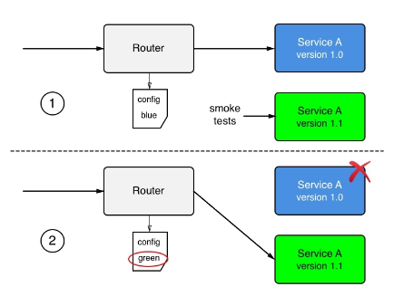

# **Running in production**

To successfully run a distributed application in production, we need to consider a few more aspects beyond the best practices and patterns presented in the preceding sections. One specific area that comes to mind is introspection and monitoring. Let's go through the most important aspects in detail.

# Logging
Once a distributed application is in production, it is not possible to live debug it. But how can we then find out what exactly is the root cause of the application malfunctioning? The solution to this problem is that the application produces abundant and meaningful logging information while running. Developers need to instrument their application services in such a way that they output helpful information, such as when an error happens or a potentially unexpected or unwanted situation is encountered. Often, this information is output to STDOUT and STDERR, where it is then collected by system daemons that write the information to local files or forward it to a central log aggregation service.

If there is sufficient information in the logs, developers can use those logs to track down the root cause of the errors in the system.

In a distributed application architecture, with its many components, logging is even more important than in a monolithic application. The paths of execution of a single request through all the components of the application can be very complex. Also, remember that the components are distributed across a cluster of nodes. Thus, it makes sense to log everything of importance, and to add things to each log entry such as the exact time when it happened, the component in which it happened, and the node on which the component ran, to name just a few. Furthermore, the logging information should be aggregated in a central location so that it is readily available for developers and system operators to analyze.

# Tracing
Tracing is used to find out how an individual request is funneled through a distributed application and how much time is spent overall for the request and in every individual component. This information, if collected, can be used as one of the sources for dashboards that shows the behavior and health of the system.

# Monitoring
Operation engineers like to have dashboards showing live key metrics of the system, which show them the overall health of the application at a glance. These metrics can be non-functional metrics, such as memory and CPU usage, the number of crashes of a system or application component, and the health of a node, as well as functional and, hence, application-specific metrics, such as the number of checkouts in an ordering system or the number of items out of stock in an inventory service.

Most often, the base data that's used to aggregate the numbers that are used for a dashboard is extracted from logging information. This can either be system logs, which will mostly be used for non-functional metrics, or application-level logs, for functional metrics.

# Application updates
One of the competitive advantages for a company is to be able to react in a timely manner to changing market situations. Part of this is to be able to quickly adjust an application to fulfill new and changed needs or to add new functionality. The faster we can update our applications, the better. Many companies these days roll out new or changed features multiple times per day.

Since application updates are so frequent, these updates have to be non-disruptive. We cannot allow the system to go down for maintenance when upgrading. It all has to happen seamlessly and transparently. 

# Rolling updates
One way of updating an application or an application service is to use rolling updates. The assumption here is that the particular piece of software that has to be updated runs in multiple instances. Only then can we use this type of update.

What happens is that the system stops one instance of the current service and replaces it with an instance of the new service. As soon as the new instance is ready, it will be served traffic. Usually, the new instance is monitored for some time to see whether or not it works as expected and, if it does, the next instance of the current service is taken down and replaced with a new instance. This pattern is repeated until all the service instances have been replaced.

Since there are always a few instances running at any given time, current or new, the application is operational all the time. No downtime is needed.

# Blue-green deployments
In blue-green deployments, the current version of the application service, called blue, handles all the application traffic. We then install the new version of the application service, called green, on the production system. The new service is not wired with the rest of the application yet.

Once green is installed, we can execute smoke tests against this new service and, if those succeed, the router can be configured to funnel all traffic that previously went to blue to the new service, green. The behavior of green is then observed closely and, if all success criteria are met, blue can be decommissioned. But if, for some reason, green shows some unexpected or unwanted behavior, the router can be reconfigured to return all traffic to blue. Green can then be removed and fixed, and a new blue-green deployment can be executed with the corrected version:

### Blue-green deployment
Next, let's look at canary releases.

# Canary releases
Canary releases are releases where we have the current version of the application service and the new version installed on the system in parallel. As such, they resemble blue-green deployments. At first, all traffic is still routed through the current version. We then configure a router so that it funnels a small percentage, say 1%, of the overall traffic to the new version of the application service. Subsequently, the behavior of the new service is monitored closely to find out whether it works as expected. If all the criteria for success are met, then the router is configured to funnel more traffic, say 5% this time, through the new service. Again, the behavior of the new service is closely monitored and, if it is successful, more and more traffic is routed to it until we reach 100%. Once all the traffic has been routed to the new service and it has been stable for some time, the old version of the service can be decommissioned.

Why do we call this a canary release? It is named after the coal miners who would use canary birds as an early warning system in the mines. Canary birds are particularly sensitive to toxic gas and if such a canary bird died, the miners knew they had to abandon the mine immediately.

# Irreversible data changes
If part of our update process is to execute an irreversible change in our state, such as an irreversible schema change in a backing relational database, then we need to address this with special care. It is possible to execute such changes without downtime if we use the right approach. It is important to recognize that, in such a situation, we cannot deploy the code changes that require the new data structure in the data store at the same time as the changes to the data. Rather, the whole update has to be separated into three distinct steps. In the first step, we roll out a backward-compatible schema and data change. If this is successful, then we roll out the new code in the second step. Again, if that is successful, we clean up the schema in the third step and remove the backward compatibility:

Rolling out an irreversible data or schema change
The preceding diagram shows how the data and its structure are updated, then how the application code is updated, and finally, in the third step, how the data and data structure are cleaned up.

# Rollback
If we have frequent updates for our application services that run in production, sooner or later, there will be a problem with one of those updates. Maybe a developer, while fixing a bug, introduced a new one, which was not caught by all the automated, and maybe manual, tests, so the application is misbehaving and it is imperative that we roll back the service to the previous good version. In this regard, a rollback is a recovery from a disaster.

Again, in a distributed application architecture, it is not a question of whether a rollback will ever be needed, but rather when a rollback will have to occur. Thus, we need to be absolutely sure that we can always roll back to a previous version of any service that makes up our application. Rollbacks cannot be an afterthought; they have to be a tested and proven part of our deployment process.

If we are using blue-green deployments to update our services, then rollbacks should be fairly simple. All we need to do is switch the router from the new green version of the service back to the previous blue version.