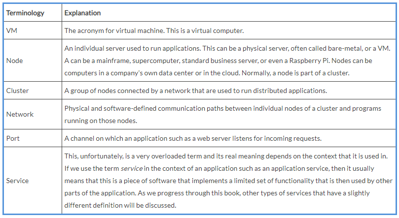
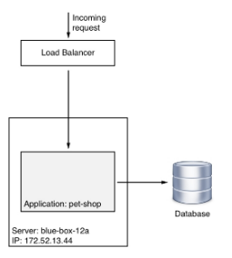
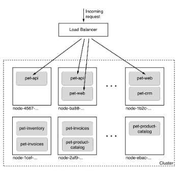

## Distributed Application Architecture

# Defining the terminology

In this and subsequent chapters, we will talk about a lot about concepts that might not be familiar to everyone. To make sure we're all talking the same language, let's briefly introduce and describe the most important of these concepts or words:

Naively said, a distributed application architecture is the opposite of a monolithic application architecture, but it's not unreasonable to look at this monolithic architecture first. Traditionally, most business applications have been written in such a way that the result can be seen as one single, tightly coupled program that runs on a named server somewhere in a data center. All its code is compiled into a single binary or a few very tightly coupled binaries that need to be co-located when running the application. The fact that the server, or more general host, that the application is running on has a well-defined name or static IP address is also important in this context. Let's look at the following diagram to illustrate this type of application architecture a bit more clearly:

Monolithic application architecture
In the preceding diagram, we can see a Server named **blue-box-12a**with an IP address of **172.52.13.44** running an application called **pet-shop**, which is a monolith consisting of a main module and a few tightly coupled libraries.

Now, let's look at the following diagram:

Distributed application architecture

Here, all of a sudden, we don't have only a single named server anymore; instead, we have a lot of them, and they don't have human-friendly names, but rather some unique IDs that can be something like a **Universal Unique Identifier (UUID)**. The pet shop application, all of a sudden, also does not consist of a single monolithic block anymore, but rather a plethora of interacting, yet loosely coupled, services such as **pet-api**, **pet-web**, and **pet-inventory**. 

Furthermore, each service runs in multiple instances in this cluster of servers or hosts.

You might be wondering why we are discussing this in a book about Docker containers, and you are right to ask. While all the topics we're going to investigate apply equally to a world where containers do not (yet) exist, it is important to realize that containers and container orchestration engines help address all these problems in a much more efficient and straightforward way. Most of the problems that used to be very hard to solve in a distributed application architecture become quite simple in a containerized world.