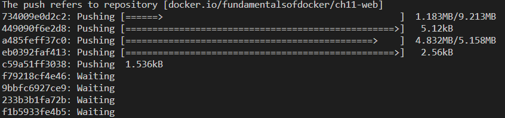

[](../M-08/README.md)
# **Building and pushing an application**

Navigate to :

```
cd ~\M-08\sample\build
```

We have seen earlier that we can also use the **docker-compose build** command to just build the images of an application defined in the underlying docker-compose file. But to make this work, we'll have to add the build information to the docker-compose file. In the folder, we have a file, **docker-compose.dev.yml**, which has those instructions already added. It is basically a copy of the **docker-compose.yml** file we have used so far:

```
version: "2.4"
services:
  web:
    build: web
    image: fredysa/web:1.0
    ports:
      - 80:3000
  db:
    build: db
    image: fredysa/db:1.0
    volumes:
      - pets-data:/var/lib/postgresql/data

volumes:
  pets-data:
```

Please note the **build** key for each service. The value of that key indicates the context or folder where Docker is expecting to find the **Dockerfile** to build the corresponding image. If we wanted to use a **Dockerfile** that is named differently, say **Dockerfile-dev**, for the **web**service, then the **build** block in the **docker-compose** file would look like this:

```
build:
    context: web
    dockerfile: Dockerfile-dev
```

Let's use that alternative **docker-compose-dev.yml** file now:

```
docker-compose -f docker-compose.yml build
docker-compose -f docker-compose.dev.yml build
```

The **-f** parameter will tell the Docker Compose application which **compose**file to use.

To push all images to Docker Hub, we can use docker-compose push. We need to be logged in to Docker Hub so that this succeeds, otherwise we get an authentication error while pushing. Thus, in my case, I do the following:

```
docker login -u <user> -p <password>
```
If you are autenthicated in Docker just use :
```
docker login
```
Assuming the login succeeds, I can then push the following code:

```
docker-compose -f docker-compose.yml push
docker-compose -f docker-compose.dev.yml push
```

This may take a while, depending on the bandwidth of your internet connection. While pushing, your screen may look similar to this:



Pushing images with docker-compose to Docker Hub

The preceding command pushes the two images to your account on Docker Hub. 

You can find these two images at the following URL: https://hub.docker.com/u/fredysa/
