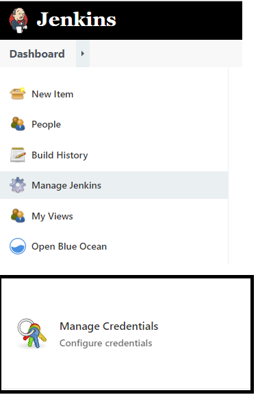
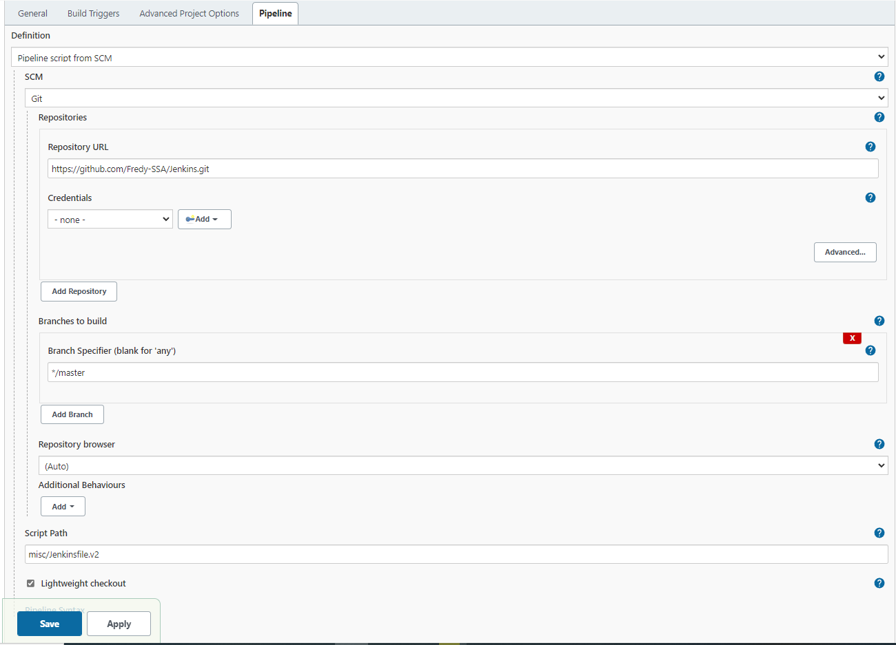

[](../M-09/README.md)
# Jenkins example 

Git repository : https://github.com/Fredy-SSA/jenkins-pipeline.git

Setup credential for Docker Hub :




Configure pipeline




# Demo Jenkins file 1

- Jenkinsfile

```yml
node {
   def commit_id
   stage('Preparation') {
     checkout scm
     sh "git rev-parse --short HEAD > .git/commit-id"                        
     commit_id = readFile('.git/commit-id').trim()
   }
   stage('test') {
     def myTestContainer = docker.image('node:4.6')
     myTestContainer.pull()
     myTestContainer.inside {
       sh 'npm install --only=dev'
       sh 'npm test'
     }
   }
   stage('docker build/push') {
     docker.withRegistry('', 'dockerhub') {
       def app = docker.build("fredysa/docker-nodejs-demo:${commit_id}", '.').push()
     }
   }
}
```


# Demo jenkins file 2

- Jenkinsfile.v2

```yml
node {
   def commit_id
   stage('Preparation') {
     checkout scm
     sh "git rev-parse --short HEAD > .git/commit-id"
     commit_id = readFile('.git/commit-id').trim()
   }
   stage('test') {
     def myTestContainer = docker.image('node:4.6')
     myTestContainer.pull()
     myTestContainer.inside {
       sh 'npm install --only=dev'
       sh 'npm test'
     }
   }
   stage('test with a DB') {
     def mysql = docker.image('mysql').run("-e MYSQL_ALLOW_EMPTY_PASSWORD=yes") 
     def myTestContainer = docker.image('node:4.6')
     myTestContainer.pull()
     myTestContainer.inside("--link ${mysql.id}:mysql") { // using linking, mysql will be available at host: mysql, port: 3306
          sh 'npm install --only=dev' 
          sh 'npm test'                     
     }                                   
     mysql.stop()
   }                                     
   stage('docker build/push') {   
          
     docker.withRegistry('', 'dockerhub') {
       def app = docker.build("fredysa/docker-nodejs-demo:${commit_id}", '.').push()
     }                                     
   }                                       
}                                          

```

more info : https://dzone.com/articles/building-docker-images-to-docker-hub-using-jenkins
