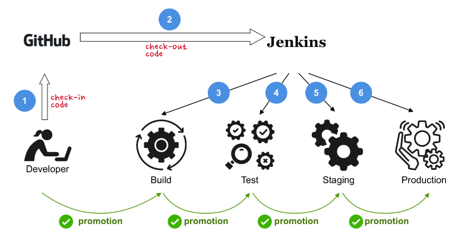
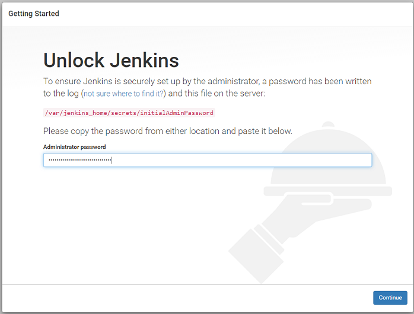
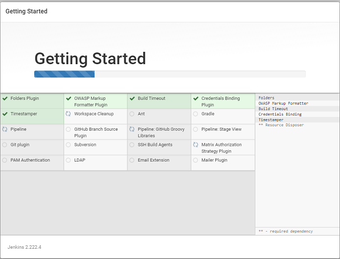
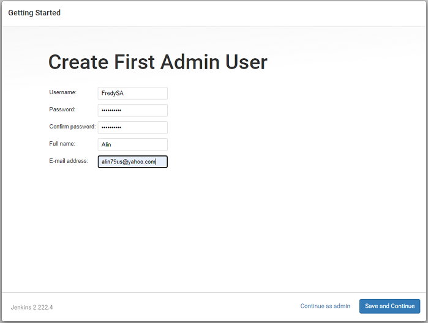
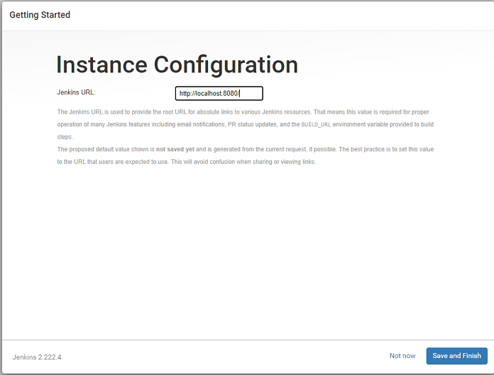
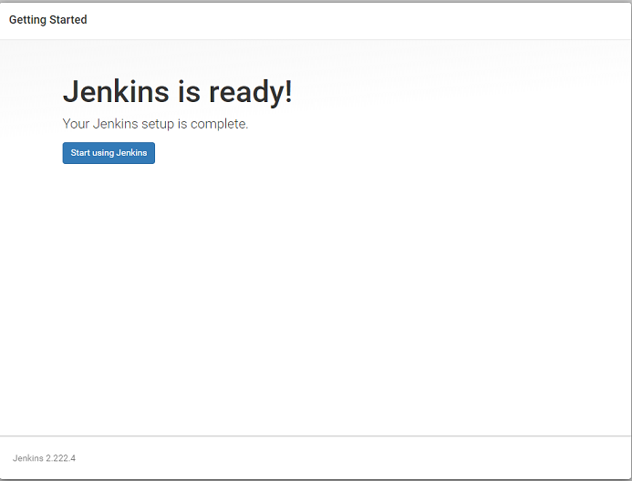
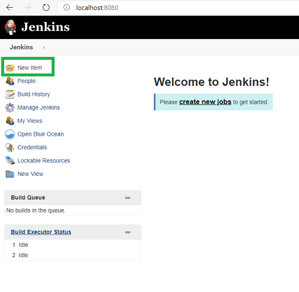
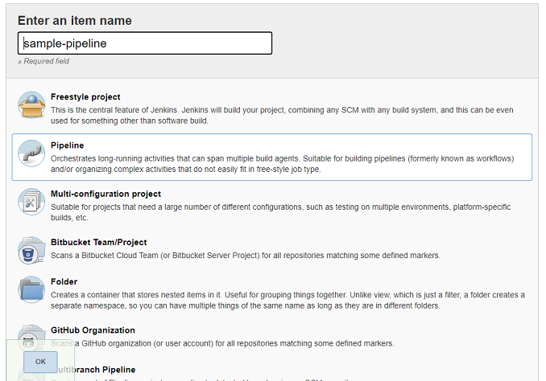
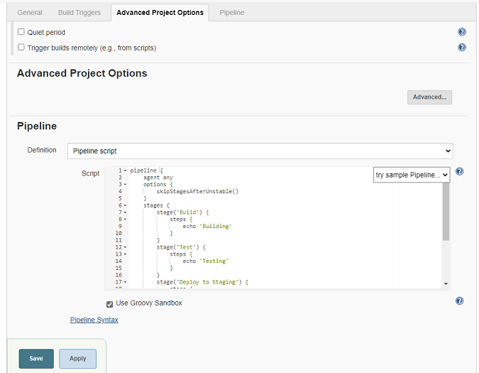
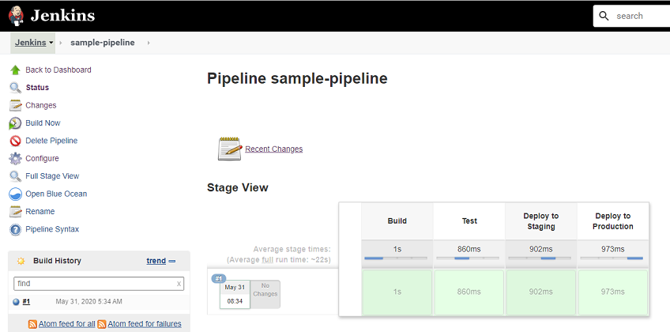

[](../M-09/README.md)
# Prepare/ Install Jenkins
## The goal of this section is to build a CI/CD pipeline that looks like this:



We are going to use Jenkins (https://jenkins.io) as our automation server. Other automation servers such as TeamCity (https://www.jetbrains.com/teamcity) work equally well. When using Jenkins, the central document is the Jenkinsfile, which will contain the definition of the pipeline with its multiple stages.


Of course, the preceding pipeline just outputs a message during each stage and does nothing else. It is useful though as a starting point from which to build up our pipeline:

**1. Create a project folder named jenkins-pipeline and navigate to it:** - (Outside the LAB)

```

mkdir jenkins-pipeline 
cd jenkins-pipeline 
git init
git pull https://github.com/Fredy-SSA/jenkins-pipeline.git

```


**2. Now, let's run Jenkins in a Docker container. Use the following command to do so:**

- wsl\bash
```
docker run  -d \
   --name jenkins \
   -u root \
   -p 8080:8080 \
   -v jenkins-data:/var/jenkins_home \
   -v /var/run/docker.sock:/var/run/docker.sock \
   jenkins/jenkins:2.391
```

- PS
```powershell

docker run -d `
   --name jenkins `
   -u root `
   -p 8080:8080 `
   -v jenkins-data:/var/jenkins_home `
   -v /var/run/docker.sock:/var/run/docker.sock `
   jenkins/jenkins:2.391

```
Note that we are running as the root user inside the container and that we are mounting the Docker socket into the container (-v /var/run/docker.sock:/var/run/docker.sock) so that Jenkins can access Docker from within the container. Data produced and used by Jenkins will be stored in the Docker volume, **jenkins-data**.


3. In your browser, navigate to **http://localhost:8080** to access the graphical UI of Jenkins.



5. Unlock Jenkins with the admin password that you retrieved with the command.

```
docker container exec jenkins cat /var/jenkins_home/secrets/initialAdminPassword
```

6. Next, choose Install suggested plugins to have Jenkins automatically install the most useful plugins. Plugins include the GitHub integration, an email extension, Maven and Gradle integration, and so on.





As soon as the plugins are installed, create your first admin account. When asked to restart Jenkins, do so.









Once you have configured your Jenkins server, start by creating a new project; you may need to click New Item in the main menu:


**7. Add a new project in Jenkins**

- Give the project the name sample-pipeline, select the Pipeline type, and click OK.
- In the configuration view, select the Pipeline tab and add the pipeline definition from the preceding into the Script textbox:



```json
pipeline {
    agent any
    options {
        skipStagesAfterUnstable()
    }
    stages {
        stage('Build') {
            steps {
                echo 'Building'
            }
        }
        stage('Test') {
            steps {
                echo 'Testing'
            }
        }
        stage('Deploy to Staging') {
            steps {
                echo 'Deploying to Staging'
            }
        }
        stage('Deploy to Production') {
            steps {
                echo 'Deploying to Production'
            }
        }
    }
}
```




8. Click Save and then, in the main menu of Jenkins, select Build Now. After a short moment, you should see this:




