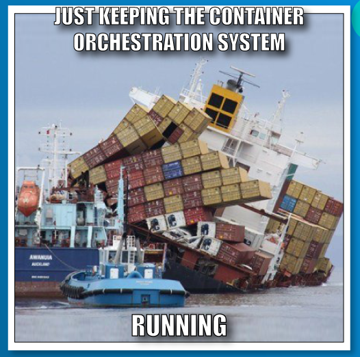

# **What are orchestrators and why do we need them?**

Similar to what Docker did with containers—standardizing the packaging and shipping of software with the introduction of those containers—we would like to have some tool or infrastructure software that handles all or most of the challenges mentioned. This software turns out to be what we call container orchestrators or, as we also call them, orchestration engines.

If what I just said doesn't make much sense to you yet, then let's look at it from a different angle. Take an artist who plays an instrument. They can play wonderful music to an audience all on their own—just the artist and their instrument. But now take an orchestra of musicians.

Put them all in a room, give them the notes of a symphony, ask them to play it, and leave the room. Without any director, this group of very talented musicians would not be able to play this piece in harmony; it would more or less sound like a cacophony. Only if the orchestra has a conductor, who orchestrates the group of musicians, will the resulting music of the orchestra be enjoyable to our ears.

Instead of musicians, we now have containers, and instead of different instruments, we have containers that have different requirements to the container hosts to run. And instead of the music being played at varying tempi, we have containers that communicate with each other in particular ways, and have to scale up and scale down. In this regard, a container orchestrator has very much the same role as a conductor in an orchestra. It makes sure that the containers and other resources in a cluster play together in harmony.

I hope that you can now see more clearly what a container orchestrator is, and why we need one. Assuming that you confirm this question, we can now ask ourselves how the orchestrator is going to achieve the expected outcome, namely, to make sure that all the containers in the cluster play with each other in harmony. Well, the answer is, the orchestrator has to execute very specific tasks, similar to the way in which the conductor of an orchestra also has a set of tasks that they execute in order to tame and, at the same time, elevate the orchestra. 

