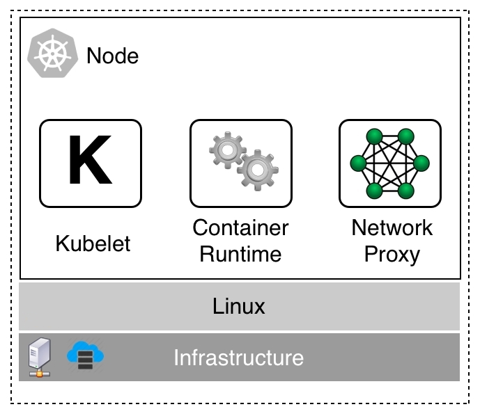

# Cluster nodes

Cluster nodes are the nodes with which Kubernetes schedules application workloads. They are the workhorses of the cluster. A Kubernetes cluster can have a few, dozens, hundreds, or even thousands of cluster nodes. Kubernetes has been built from the ground up for high scalability. Don't forget that Kubernetes was modeled after Google Borg, which has been running tens of thousands of containers for years:

Kubernetes worker node

A worker node can run on a VM, bare metal, on-premise, or in the cloud. Originally, worker nodes could only be configured on Linux. But since version 1.10 of Kubernetes, worker nodes can also run on Windows Server. It is perfectly fine to have a mixed cluster with Linux and Windows worker nodes.

On each node, we have three services that need to run, as follows:

- Kubelet: This is the first and foremost service. ...