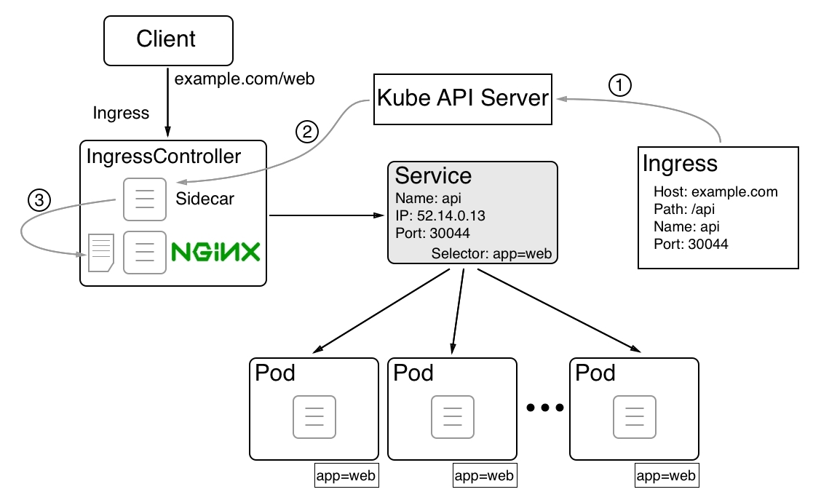

# Context-based routing

Often, we want to configure context-based routing for our Kubernetes cluster. Kubernetes offers us various ways to do this. The preferred and most scalable way at this time is to use an **IngressController**. The following diagram tries to illustrate how this ingress controller works:

 Context-based routing using a Kubernetes ingress controller

In the preceding diagram, we can see how context-based (or layer 7) routing works when using an **IngressController**, such as Nginx.

Here, we have the deployment of an application service called **web**. All the pods of this application service have the following label: **app=web**. Then, we have a Kubernetes service called **web** that provides a stable endpoint to those pods. The service has a (virtual) **IP** of **52.14.0.13** and exposes port **30044**. That is, if a request comes to any node of the Kubernetes cluster for the name **web** and port **30044**, then it is forwarded to this service. The service then load-balances the request to one of the pods. 

So far, so good, but how is an ingress request from a client to the **http[s]://example.com/web** URL routed to our web service? First, we have to define routing from a context-based request to a corresponding **<service name>/<port> request**. This is done through an **Ingress** object:

- In the **Ingress** object, we define the **Host** and **Path** as the source and the (service) name, and the port as the target. When this Ingress object is created by the Kubernetes API server, then a process that runs as a sidecar in **IngressController** picks this change up.

- The process modifies the configuration the configuration file of the Nginx reverse proxy.

- By adding the new route, Nginx is then asked to reload its configuration and thus will be able to correctly route any incoming requests to **http[s]://example.com/web.**

# Summary
In this chapter, we learned about the basics of Kubernetes. We took an overview of its architecture and introduced the main resources that are used to define and run applications in a Kubernetes cluster. We also introduced Minikube and Kubernetes support in Docker for Desktop.

In the next chapter, we're going to deploy an application into a Kubernetes cluster. Then, we're going to be updating one of the services of this application using a zero downtime strategy. Finally, we're going to instrument application services running in Kubernetes with sensitive data using secrets. Stay tuned!