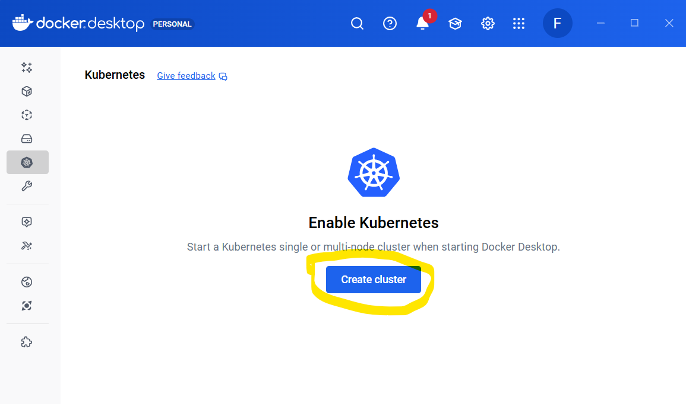
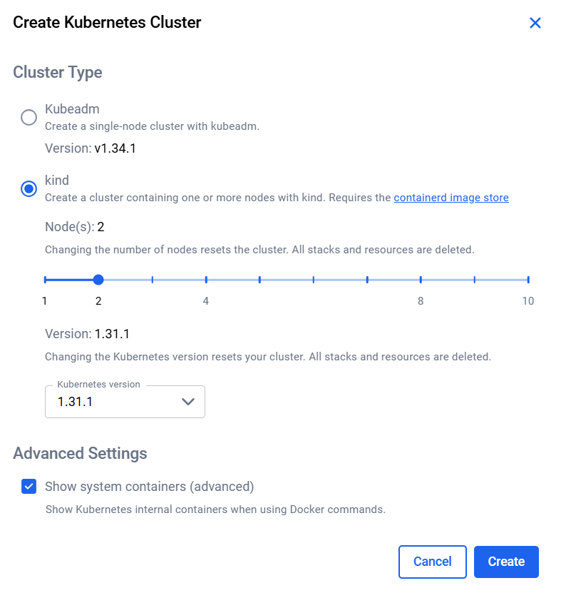
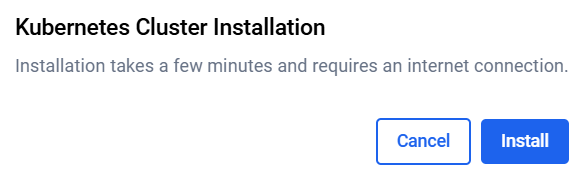
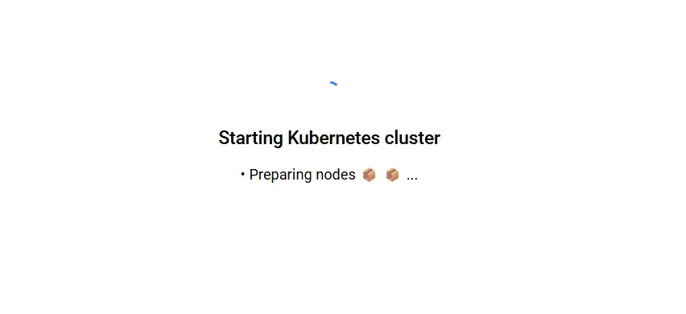
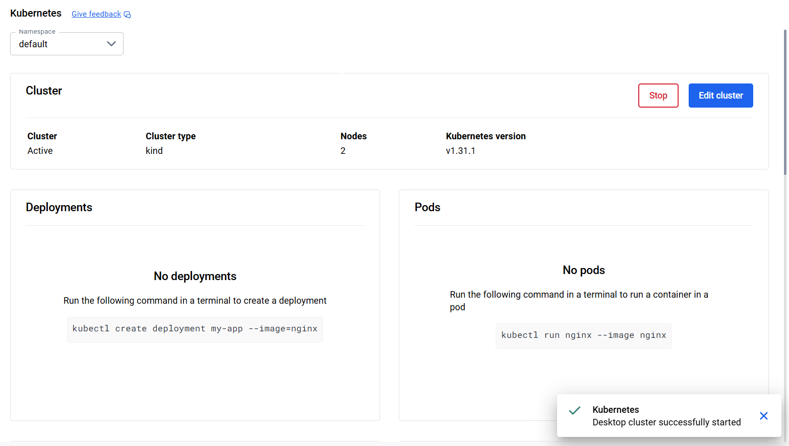

[](../M-11/README.md)
# Introduction to Docker Kubernets

## Install Kubernets



##



##


##


## 



## Verify that Kubernetes is Running

```
kubectl get all
kubectl get nodes
```
Install Kubernetes Dashboard

```
kubectl apply -f https://raw.githubusercontent.com/kubernetes/dashboard/v2.7.0/aio/deploy/recommended.yaml
```
## Create a Temporary Admin User

```
kubectl create serviceaccount dashboard-admin-sa -n kubernetes-dashboard
```

## Generate an Authentication Token (for the temporary admin user)

```
kubectl create token dashboard-admin-sa -n kubernetes-dashboard
```

## Start Local Access (Proxy)

```
kubectl proxy
```

## Access the Dashboard

Open the following URL in your browser:
http://localhost:8001/api/v1/namespaces/kubernetes-dashboard/services/https:kubernetes-dashboard:/proxy/


