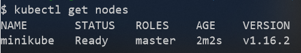

[](../M-11/README.md)
# Introduction to Docker Kubernets

Install Kubernets


Let's make sure that Kubernetsis running with the following command:

```
kubectl get all
```


Once Minikube is ready, we can access its single node cluster using kubectl. We should see something similar to the following:
```
kubectl get nodes
```



