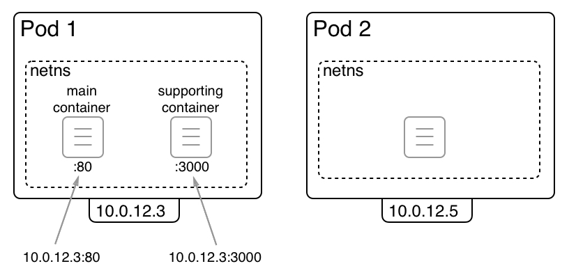
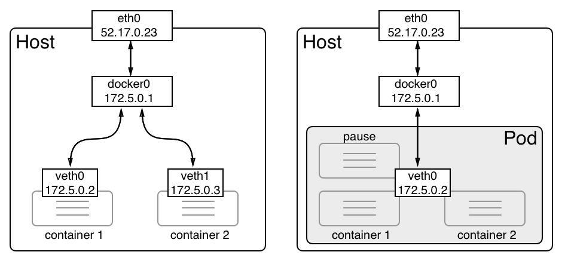
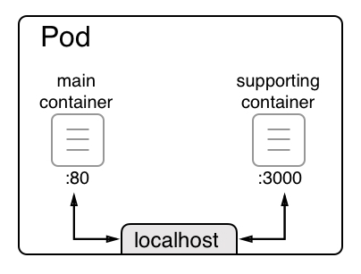
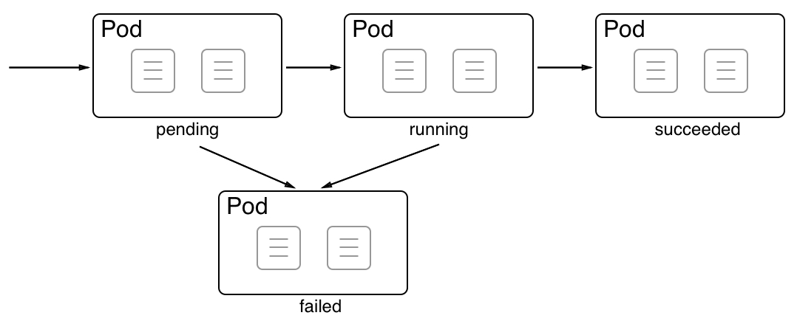

[](../M-11/README.md)
# Introduction to pods

Contrary to what is possible in Docker Swarm, you cannot run containers directly in a Kubernetes cluster. In a Kubernetes cluster, you can only run pods. Pods are the atomic units of deployment in Kubernetes. A pod is an abstraction of one or many co-located containers that share the same Kernel namespaces, such as the network namespace. No equivalent exists in Docker SwarmKit. The fact that more than one container can be co-located and share the same network namespace is a very powerful concept. The following diagram illustrates two pods:



Kubernetes pods

In the preceding diagram, we have two pods, **Pod 1** and **Pod 2**. The first pod contains two containers, while the second one only contains a single container. Each pod gets an IP address assigned by Kubernetes that is unique in the whole Kubernetes cluster. In our case, these are the following IP addresses: **10.0.12.3** and **10.0.12.5**. Both are part of a private subnet managed by the Kubernetes network driver.

A pod can contain one to many containers. All those containers share the same Linux kernel namespaces, and in particular, they share the network namespace. This is indicated by the dashed rectangle surrounding the containers. Since all containers running in the same pod share the network namespace, each container needs to make sure to use their own port since duplicate ports are not allowed in a single network namespace. In this case, in **Pod 1**, the **main container** is using port **80** while the **supporting container** is using port **3000**.

Requests from other pods or nodes can use the pod's IP address combined with the corresponding port number to access the individual containers. For example, you could access the application running in the main container of **Pod 1** through **10.0.12.3:80**.

Comparing Docker container and Kubernetes pod networking
Now, let's compare Docker's container networking and Kubernetes pod networking. In the following diagram, we have the former on the left-hand side and the latter on the right-hand side:




Containers in a pod sharing the same network namespace

When a Docker container is created and no specific network is specified, then the Docker engine creates a **virtual ethernet (veth)** endpoint. The first container gets **veth0**, the next one gets **veth1**, and so on. These virtual ethernet endpoints are connected to the Linux bridge, **docker0**, that Docker automatically creates upon installation. Traffic is routed from the **docker0** bridge to every connected **veth** endpoint. Every container has its own network namespace. No two containers use the same namespace. This is on purpose, to isolate applications running inside the containers from each other.

For a Kubernetes pod, the situation is different. When creating a new pod, Kubernetes first creates a so-called **pause** container whose only purpose is to create and manage the namespaces that the pod will share with all containers. Other than that, it does nothing useful; it is just sleeping. The **pause** container is connected to the **docker0** bridge through **veth0**. Any subsequent container that will be part of the pod uses a special feature of the Docker engine that allows it to reuse an existing network namespace. The syntax to do so looks like this:

PS>
```
docker container create --net container:pause ... 
```

The important part is the **--net** argument, which uses **container:<container name>**as a value. If we create a new container this way, then Docker does not create a new veth endpoint; the container uses the same one as the **pause** container.

Another important consequence of multiple containers sharing the same network namespace is the way they communicate with each other. Let's consider the following situation: a pod containing two containers, one listening at port **80**and the other at port **3000**:



Containers in pods communicating via localhost

When two containers use the same Linux kernel network namespace, they can communicate with each other through localhost, similarly to how, when two processes are running on the same host, they can communicate with each other through localhost too. This is illustrated in the preceding diagram. From the main container, the containerized application inside it can reach out to the service running inside the supporting container through **http://localhost:3000**.

# Sharing the network namespace

After all this theory, you might be wondering how a pod is actually created by Kubernetes. Kubernetes only uses what Docker provides. So, how does this network namespace share work? First, Kubernetes creates the so-called pause container, as mentioned previously. This container has no other function than to reserve the kernel namespaces for that pod and keep them alive, even if no other container inside the pod is running. Let's simulate the creation of a pod, then. We start by creating the pause container and use Nginx for this purpose:

```
docker container run -d --name pause nginx:alpine
```
Now, we add a second container called main, attaching it to the same network namespace as the pause container:

```
Bash
$ docker container run --name main -dit \
    --net container:pause \
    alpine:latest /bin/sh

Ps
$ docker container run --name main -dit `
    --net container:pause `
    alpine:latest /bin/sh
```

Since pause and the sample container are both parts of the same network namespace, they can reach each other through localhost. To show this, we have to exec into the main container:

```
$ docker exec -it main /bin/sh
```

Now, we can test the connection to Nginx running in the **pause**container and listening on port **80**. The following what we get if we use the **wget** utility to do so:

```
/ # wget -qO - localhost
<!DOCTYPE html>
<html>
<head>
<title>Welcome to nginx!</title>
<style>
    body {
        width: 35em;
        margin: 0 auto;
        font-family: Tahoma, Verdana, Arial, sans-serif;
    }
</style>
</head>
<body>
<h1>Welcome to nginx!</h1>
<p>If you see this page, the nginx web server is successfully installed and
working. Further configuration is required.</p>

<p>For online documentation and support please refer to
<a href="http://nginx.org/">nginx.org</a>.<br/>
Commercial support is available at
<a href="http://nginx.com/">nginx.com</a>.</p>

<p><em>Thank you for using nginx.</em></p>
</body>
</html>
```

Two containers sharing the same network namespace

The output shows that we can indeed access Nginx on **localhost**. This is proof that the two containers share the same namespace. If that is not enough, we can use the **ip** tool to show **eth0**inside both containers and we will get the exact same result, specifically, the same IP address, which is one of the characteristics of a pod where all its containers share the same IP address:

```
ip a show eth0

/ # ip a show eth0
34: eth0@if35: <BROADCAST,MULTICAST,UP,LOWER_UP,M-DOWN> mtu 1500 qdisc noqueue state UP 
    link/ether 02:42:ac:11:00:02 brd ff:ff:ff:ff:ff:ff
    inet 172.17.0.2/16 brd 172.17.255.255 scope global eth0
       valid_lft forever preferred_lft forever

```
Displaying the properties of eth0 with the ip tool


If we inspect the **bridge** network, we can see that only the **pause container** is listed. The other container didn't get an entry in the **Containers**list since it is reusing the pause container's endpoint:

```
docker network inspect bridge

[
....
        "Containers": {
            "2f02c801c6378316042a73f310edb88831a5a01ff2985ce1a5b3a023a38f22e4": {
                "Name": "pause",
                "EndpointID": "95867c23829c3d20bd8536d2e5dc442eb07d5eed01dd9d4b7cd9ae9ebb9b4e03",
                "MacAddress": "02:42:ac:11:00:02",
                "IPv4Address": "172.17.0.2/16",
                "IPv6Address": ""
            }
....
]

```

Inspecting the Docker default bridge network

Next, we will be looking at the pod life cycle.

# Pod life cycle

Earlier in this book, we learned that containers have a life cycle. A container is initialized, run, and ultimately exited. When a container exits, it can do this gracefully with an exit code zero or it can terminate with an error, which is equivalent to a nonzero exit code.

Similarly, a pod has a life cycle. Due to the fact that a pod can contain more than one container, this life cycle is slightly more complicated than that of a single container. The life cycle of a pod can be seen in the following diagram:




The life cycle of Kubernetes pods

When a **Pod** is created on a cluster node, it first enters into the **pending** status. Once all the containers of the pod are up and running, the pod enters into the **running**status. The pod only enters into this state if all its containers run successfully. If the pod is asked to terminate, it will request all its containers to terminate. If all containers terminate with exit code zero, then the pod enters into the **succeeded** status. This is the happy path.

Now, let's look at some scenarios that lead to the pod being in the **failed**state. There are three possible scenarios:

- If, during the startup of the pod, at least one container is not able to run and fails (that is, it exits with a nonzero exit code), the pod goes from the **pending** state into the **failed** state.

- If the pod is in the running status and one of the containers suddenly crashes or exits with a nonzero exit code, then the pod transitions from the **running** state into the **failed** state.

- If the pod is asked to terminate and, during the shutdown at least one of the containers, exits with a nonzero exit code, then the pod also enters into the **failed**state.

Now, let's look at the specifications for a pod.

# Pod specifications

When creating a pod in a Kubernetes cluster, we can use either an imperative or a declarative approach. We discussed the difference between the two approaches earlier in this book but, to rephrase the most important aspect, using a declarative approach signifies that we write a manifest that describes the end state we want to achieve. We'll leave out the details of the orchestrator. The end state that we want to achieve is also called the **desired state**. In general, the declarative approach is strongly preferred in all established orchestrators, and Kubernetes is no exception.

Thus, in this chapter, we will exclusively concentrate on the declarative approach. Manifests or specifications for a pod can be written using either the YAML or JSON formats. In this chapter, we will concentrate on YAML since it is easier to read for us humans. 

Let's look at a sample specification. Here is the content of the **pod.yaml** file, which can be found in the **~/lab-11-../sample** subfolder of our labs folder:

```
apiVersion: v1
kind: Pod
metadata:
  name: web-pod
spec:
  containers:
  - name: web
    image: nginx:alpine
    ports:
    - containerPort: 80
```

Each specification in Kubernetes starts with the version information. Pods have been around for quite some time and thus the API version is **v1**. The second line specifies the type of Kubernetes object or resource we want to define. Obviously, in this case, we want to specify a **Pod**. Next follows a block containing metadata. At a bare minimum, we need to give the pod a name. Here, we call it **web-pod**. The next block that follows is the spec block, which contains the specification of the pod. The most important part (and the only one in this simple sample) is a list of all containers that are part of this pod. We only have one container here, but multiple containers are possible. The name we choose for our container is **web** and the container image is **nginx:alpine**. Finally, we define a list of ports the container is exposing.

Once we have authored such a specification, we can apply it to the cluster using the Kubernetes CLI, **kubectl**. In a Terminal, navigate to the ~\sample subfolder and execute the following command:

```
kubectl create -f pod.yaml
```

This will respond with **pod "web-pod" created**. We can then list all the pods in the cluster with **kubectl get pods**:

```
$ kubectl get pods
NAME      READY   STATUS    RESTARTS   AGE
web-pod   1/1     Running   0          2m
```

As expected, we have one of one pods in the running status. The pod is called **web-pod**, as defined. We can get more detailed information about the running pod by using the **describe** command:

```
kubectl describe pod/web-pod


Name:         web-pod
Namespace:    default
Priority:     0
Node:         docker-desktop/192.168.65.3
Start Time:   Sun, 14 Jun 2020 08:42:16 +0300
Labels:       <none>
Annotations:  <none>
Status:       Running
IP:           10.1.0.35
IPs:
  IP:  10.1.0.35
Containers:
  web:
    Container ID:   docker://a3b3a3798149f405bf5ef019dcbc0c1d0c5428f14d26cebcf930f72565ac7a92
    Image:          nginx:alpine
    Image ID:       docker-pullable://nginx@sha256:b89a6ccbda39576ad23fd079978c967cecc6b170db6e7ff8a769bf2259a71912
    Port:           80/TCP
    Host Port:      0/TCP
    State:          Running
      Started:      Sun, 14 Jun 2020 08:42:16 +0300
    Ready:          True
    Restart Count:  0
    Environment:    <none>
    Mounts:
      /var/run/secrets/kubernetes.io/serviceaccount from default-token-7j7kl (ro)
Conditions:
  Type              Status
  Initialized       True
  Ready             True
  ContainersReady   True
  PodScheduled      True
Volumes:
  default-token-7j7kl:
    Type:        Secret (a volume populated by a Secret)
    SecretName:  default-token-7j7kl
    Optional:    false
QoS Class:       BestEffort
Node-Selectors:  <none>
Tolerations:     node.kubernetes.io/not-ready:NoExecute for 300s
                 node.kubernetes.io/unreachable:NoExecute for 300s
Events:
  Type    Reason     Age    From                     Message
  ----    ------     ----   ----                     -------
  Normal  Scheduled  3m39s  default-scheduler        Successfully assigned default/web-pod to docker-desktop
  Normal  Pulled     3m39s  kubelet, docker-desktop  Container image "nginx:alpine" already present on machine
  Normal  Created    3m39s  kubelet, docker-desktop  Created container web
  Normal  Started    3m39s  kubelet, docker-desktop  Started container web
```

Describing a pod running in the cluster

Please note the **pod/web-pod** notation in the previous **describe** command. Other variants are possible; for example, **pods/web-pod**, **po/web-pod**. **pod** and **po** are aliases of pods. The **kubectl** tool defines many aliases to make our lives a bit easier.

The **describe** command gives us a plethora of valuable information about the pod, not the least of which is a list of events that happened and affected this pod. The list is shown at the end of the output.

The information in the **Containers** section is very similar to what we find in a **docker container inspect** output.

We can also see a **Volumes** section with an entry of the **Secret** type. We will discuss Kubernetes secrets in the next chapter. Volumes, on the other hand, will be discussed next.

# Pods and volumes
 Since containers can mount volumes, pods can do so as well. In reality, it is really the containers inside the pod that mount the volumes, but that is just a semantic detail. First, let's see how we can define a volume in Kubernetes. Kubernetes supports a plethora of volume types, so we won't delve into too much detail about this. Let's just create a local volume implicitly by defining a **PersistentVolumeClaim** called **my-data-claim**:

```
apiVersion: v1
kind: PersistentVolumeClaim
metadata:
  name: my-data-claim
spec:
  accessModes:
    - ReadWriteOnce
  resources:
    requests:
      storage: 2Gi
```
We have defined a claim that requests 2 GB of data. Let's create this 

```
$ kubectl create -f volume-claim.yaml
```

We can list the claim using **kubectl** (**pvc** is a shortcut for **PersistentVolumeClaim**):

```
kubectl get pvc
```


List of PersistentStorageClaim objects in the cluster

```
kubectl get pods
kubectl delete po/web-pod
```
In the output, we can see that the claim has implicitly created a volume called **pvc-<ID>**. We are now ready to use the volume created by the claim in a pod. Let's use a modified version of the pod specification that we used previously. We can find this updated specification in the **pod-with-vol.yaml** file in the **~\sample** folder. Let's look at this specification in detail:

```
apiVersion: v1
kind: Pod
metadata:
  name: web-pod
spec:
  containers:
  - name: web
    image: nginx:alpine
    ports:
    - containerPort: 80
    volumeMounts:
    - name: my-data
      mountPath: /data
  volumes:
  - name: my-data
    persistentVolumeClaim:
      claimName: my-data-claim
```

In the last four lines, in the **volumes**block, we define a list of volumes we want to use for this pod. The volumes that we list here can be used by any of the containers of the pod. In our particular case, we only have one volume. We specify that we have a volume called **my-data**, which is a persistent volume claim whose claim name is the one we just created. Then, in the container specification, we have the **volumeMounts** block, which is where we define the volume we want to use and the (absolute) path inside the container where the volume will be mounted. In our case, we mount the volume to the **/data** folder of the container filesystem. 

Let's create this pod:

```
$ kubectl create -f pod-with-vol.yaml
```

Then, we can **exec** into the container to double-check that the volume has mounted by navigating to the **/data** folder, creating a file there, and exiting the container:

```
$ kubectl exec -it web-pod -- /bin/sh
/ # cd /data
/data # echo "Hello world!" > sample.txt
/data # exit
```

If we are right, then the data in this container must persist beyond the life cycle of the pod. Thus, let's delete the pod and then recreate it and exec into it to make sure the data is still there. This is the result:

```
kubectl delete po/web-pod
pod "web-pod" deleted
kubectl create -f pod-with-vol.yaml
pod/web-pod created
kubectl exec -it web-pod -- /bin/sh
cat /data/sample.txt
Hello world!
```

Data stored in volume survives pod recreation
Now that we have a good understanding of pods, let's look into how those pods are managed with the help of ReplicaSets.
