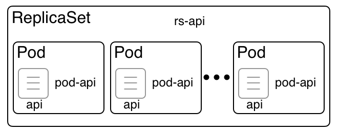

[](../M-11/README.md)
# Kubernetes ReplicaSet

A single pod in an environment with high availability requirements is insufficient. What if the pod crashes? What if we need to update the application running inside the pod but cannot afford any service interruption? These questions and more indicate that pods alone are not enough and we need a higher-level concept that can manage multiple instances of the same pod. In Kubernetes, the **ReplicaSet** is used to define and manage such a collection of identical pods that are running on different cluster nodes. Among other things, a ReplicaSet defines which container images are used by the containers running inside a pod and how many instances of the pod will run in the cluster. These properties and many others are called the desired state. 

The ReplicaSet is responsible for reconciling the desired state at all times, if the actual state ever deviates from it. Here is a Kubernetes ReplicaSet:



Kubernetes ReplicaSet

In the preceding diagram, we can see a **ReplicaSet** called **rs-api**, which governs a number of pods. The pods are called **pod-api**. The **ReplicaSet** is responsible for making sure that, at any given time, there are always the desired number of pods running. If one of the pods crashes for whatever reason, the **ReplicaSet** schedules a new pod on a node with free resources instead. If there are more pods than the desired number, then the **ReplicaSet** kills superfluous pods. With this, we can say that the **ReplicaSet** guarantees a self-healing and scalable set of pods. There is no limit to how many pods a **ReplicaSet** can hold.

# ReplicaSet specification
Similar to what we have learned about pods, Kubernetes also allows us to either imperatively or declaratively define and create a **ReplicaSet**. Since the declarative approach is by far the most recommended one in most cases, we're going to concentrate on this approach. Here is a sample specification for a Kubernetes **ReplicaSet**:

```
apiVersion: apps/v1
kind: ReplicaSet
metadata:
  name: rs-web
spec:
  selector:
    matchLabels:
      app: web
  replicas: 3
  template: 
    metadata:
      labels:
        app: web
    spec:
      containers:
      - name: nginx
        image: nginx:alpine
        ports:
        - containerPort: 80
```


This looks an awful lot like the pod specification we introduced earlier. 

Let's concentrate on the differences, then. First, on **line 2**, we have the **kind**, which was **Pod** and is now **ReplicaSet**. Then, on lines 6–8, we have a selector, which determines the pods that will be part of the **ReplicaSet**. In this case, it is all the pods that have app as a label with the value **web**. Then, on line 9, we define how many replicas of the pod we want to run; three, in this case. Finally, we have the **template** section, which first defines the **metadata** and then the **spec**, which defines the containers that run inside the pod. In our case, we have a single container using the **nginx:alpine** image and exporting port **80**.

The really important elements are the number of replicas and the selector, which specifies the set of pods governed by the **ReplicaSet.**

In our **~/lab-11-../Sample** folder, we have a file called **replicaset.yaml** that contains the preceding specification. Let's use this file to create the **ReplicaSet**:

```
kubectl create -f replicaset.yaml
replicaset "rs-web" created
```

If we list all the ReplicaSets in the cluster, we get the following (**rs** is a shortcut for **replicaset**):

```
kubectl get rs
NAME     DESIRED   CURRENT   READY   AGE
rs-web   3         3         3       51s
```

In the preceding output, we can see that we have a single ReplicaSet called **rs-web** whose desired state is three (pods). The current state also shows three pods and tell us that all three pods are ready. We can also list all the pods in the system. This results in the following output:

```
kubectl get pods
NAME           READY   STATUS    RESTARTS   AGE
rs-web-6qzld   1/1     Running   0          4m
rs-web-frj2m   1/1     Running   0          4m
rs-web-zd2kt   1/1     Running   0          4m
```

Here, we can see our three expected pods. The names of the pods use the name of the ReplicaSet with a unique ID appended for each pod. In the **READY** column, we can see how many containers have been defined in the pod and how many of them are ready. In our case, we only have a single container per pod and, in each case, it is ready. Thus, the overall status of the pod is **Running.** We can also see how many times each pod had to be restarted. In our case, we don't have any restarts.

# Self-healing
Now, let's test the magic powers of the self-healing ReplicaSet by randomly killing one of its pods and observing what happens. Let's delete the first pod from the previous list:

```
kubectl delete po/rs-web-j7rm4 
pod "rs-web-j7rm4" deleted

 
```

Now, let's list all the pods again. We expect to see only two pods, right? Wrong:
```
kubectl get pods
NAME           READY   STATUS    RESTARTS   AGE
rs-web-67spk   1/1     Running   0          12s
rs-web-tszzv   1/1     Running   0          2m15s
rs-web-zpf5r   1/1     Running   0          2m15s
web-pod        1/1     Running   0          19m
```

List of pods after killing a pod of the ReplicaSet
OK; evidently, the second pod in the list has been recreated, as we can see from the **AGE** column. This is auto-healing in action. Let's see what we discover if we describe the ReplicaSet:


```
kubectl describe rs/rs-web

kubectl describe rs/rs-web
Name:         rs-web
Namespace:    default
Selector:     app=web
Labels:       <none>
Annotations:  <none>
Replicas:     3 current / 3 desired
Pods Status:  3 Running / 0 Waiting / 0 Succeeded / 0 Failed
Pod Template:
  Labels:  app=web
  Containers:
   nginx:
    Image:        nginx:alpine
    Port:         80/TCP
    Host Port:    0/TCP
    Environment:  <none>
    Mounts:       <none>
  Volumes:        <none>
Events:
  Type    Reason            Age    From                   Message
  ----    ------            ----   ----                   -------
  Normal  SuccessfulCreate  6m31s  replicaset-controller  Created pod: rs-web-tszzv
  Normal  SuccessfulCreate  6m31s  replicaset-controller  Created pod: rs-web-zpf5r
  Normal  SuccessfulCreate  6m31s  replicaset-controller  Created pod: rs-web-j7rm4
  Normal  SuccessfulCreate  5m29s  replicaset-controller  Created pod: rs-web-6kcbz
  ---------------------------------------------------------------------------------
  Normal  SuccessfulCreate  4m28s  replicaset-controller  Created pod: rs-web-67spk
  ---------------------------------------------------------------------------------
```
Describe the ReplicaSet
And indeed, we find an entry under **Events** that tells us that the **ReplicaSet** created the new pod called **rs-web-67spk** .

## Clean Up
```
kubectl delete -f .\replicaset.yaml
kubectl delete -f .\pod-with-vol.yaml

kubectl get all

kubectl get pods
```
