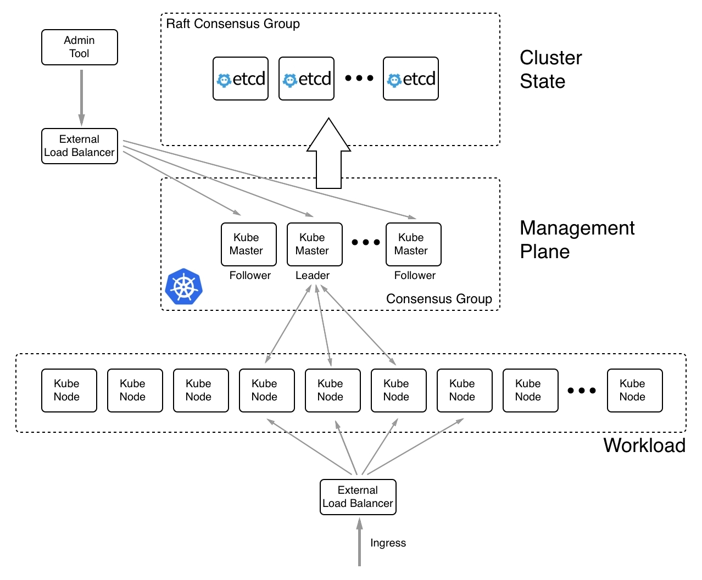

# Kubernetes architecture

A Kubernetes cluster consists of a set of servers. These servers can be VMs or physical servers. The latter are also called bare metal. Each member of the cluster can have one of two roles. It is either a Kubernetes master or a (worker) node. The former is used to manage the cluster, while the latter will run an application workload. I have put the worker in parentheses since, in Kubernetes parlance, you only talk about a node when you're talking about a server that runs application workloads. But in Docker parlance and in Swarm, the equivalent is a worker node. I think that the notion of a worker node better describes the role of the server than a simple node.

In a cluster, you have a small and odd number of masters and as many worker nodes as needed. Small clusters might only have a few worker nodes, while more realistic clusters might have dozens or even hundreds of worker nodes. Technically, there is no limit to how many worker nodes a cluster can have; in reality, though, you might experience a significant slowdown in some management operations when dealing with thousands of nodes. All members of the cluster need to be connected by a physical network, the so-called **underlay network**.

Kubernetes defines one flat network for the whole cluster. Kubernetes does not provide any networking implementation out of the box; instead, it relies on plugins from third parties. Kubernetes just defines the **Container Network Interface (CNI)** and leaves the implementation to others. The CNI is pretty simple. It basically states that each pod running in the cluster must be able to reach any other pod also running in the cluster without any **Network Address Translation (NAT)** happening in-between. The same must be true between cluster nodes and pods, that is, applications or daemons running directly on a cluster node must be able to reach each pod in the cluster and vice versa.

The following diagram illustrates the high-level architecture of a Kubernetes cluster:

High-level architecture diagram of Kubernetes

## The preceding diagram is explained as follows:

- On the top, in the middle, we have a cluster of **etcd** nodes. **etcd**is a distributed key-value store that, in a Kubernetes cluster, is used to store all the state of the cluster. The number of **etcd** nodes has to be odd, as mandated by the Raft consensus protocol, which states which nodes are used to coordinate among themselves. When we talk about the **Cluster State**, we do not include data that is produced or consumed by applications running in the cluster; instead, we're talking about all the information on the topology of the cluster, what services are running, network settings, secrets used, and more. That said, this **etcd** cluster is really mission-critical to the overall cluster and thus, we should never run only a single **etcd**server in a production environment or any environment that needs to be highly available.
- Then, we have a cluster of Kubernetes **master** nodes, which also form a **Consensus Group** among themselves, similar to the **etcd** nodes. The number of master nodes also has to be odd. We can run cluster with a single master but we should never do that in a production or mission-critical system. There, we should always have at least three master nodes. Since the master nodes are used to manage the whole cluster, we are also talking about the management plane. Master nodes use the **etcd** cluster as their backing store. It is good practice to put a **load balancer (LB)** in front of master nodes with a well-known Fully Qualified Domain Name (FQDN), such as https://admin.example.com. All tools that are used to manage the Kubernetes cluster should access it through this LB rather than using the public IP address of one of the master nodes. This is shown on the left upper side of the preceding diagram.
- Toward the bottom of the diagram, we have a cluster of **worker** nodes. The number of nodes can be as low as one and does not have an upper limit. Kubernetes master and worker nodes communicate with each other. It is a bidirectional form of communication that is different from the one we know from Docker Swarm. In Docker Swarm, only manager nodes communicate with worker nodes and never the other way around. All ingress traffic accessing applications running in the cluster should go through another **load balancer**. This is the application **load balancer** or reverse proxy. We never want external traffic to directly access any of the worker nodes.

Now that we have an idea about the high-level architecture of a Kubernetes cluster, let's delve a bit more deeply and look at the Kubernetes master and worker nodes. 