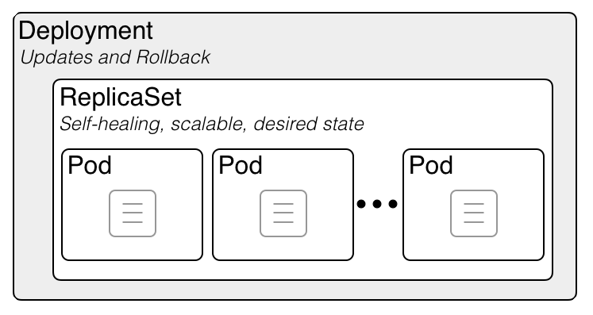

# Kubernetes deployment

Kubernetes takes the single-responsibility principle very seriously. All Kubernetes objects are designed to do one thing and one thing only, and they are designed to do this one thing very well. In this regard, we have to understand Kubernetes **ReplicaSets** and **Deployments**. A **ReplicaSet**, as we have learned, is responsible for achieving and reconciling the desired state of an application service. This means that the **ReplicaSet** manages a set of pods.

**Deployment** augments a **ReplicaSet** by providing rolling updates and rollback functionality on top of it. In Docker Swarm, the Swarm service incorporates the functionality of both **ReplicaSet** and **Deployment**. In this regard, SwarmKit is much more monolithic than Kubernetes. The following diagram shows the relationship of a **Deployment** to a **ReplicaSet**:

Kubernetes deployment

In the preceding diagram, the **ReplicaSet** is defining and governing a set of identical pods. The main characteristics of the ReplicaSet are that it is **self-healing**, **scalable**, and always does its best to reconcile the **desired state**. Kubernetes Deployment, in turn, adds rolling updates and rollback functionality to this. In this regard, a deployment is really a wrapper object to a ReplicaSet.

We will learn more about rolling updates and rollbacks in the , *Deploying, Updating, and Securing an Application with Kubernetes*.

In the next section, we will learn more about Kubernetes services and how they enable service discovery and routing.