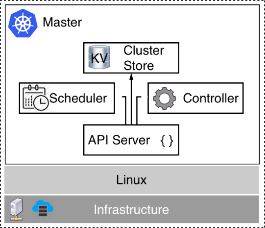

# Kubernetes master nodes

Kubernetes master nodes are used to manage a Kubernetes cluster. The following is a high-level diagram of such a master:

Kubernetes master

At the bottom of the preceding diagram, we have the **Infrastructure**, which can be a VM on-premise or in the cloud or a server (often called bare metal) on-premise or in the cloud. Currently, Kubernetes masters only run on **Linux.** The most popular Linux distributions, such as RHEL, CentOS, and Ubuntu, are supported. On this Linux machine, we have at least the following four Kubernetes services running:

- **API server**: This is the gateway to Kubernetes. All requests to list, create, modify, or delete any resources in the cluster must go through this service. It exposes a REST interface that tools such as kubectl use to manage the cluster and applications in the cluster.
- **Controller**: The controller, or more precisely the controller manager, is a control loop that observes the state of the cluster through the API server and makes changes, attempting to move the current or effective state toward the desired state if they differ. 
- **Scheduler**: The scheduler is a service that tries its best to schedule pods on worker nodes while considering various boundary conditions, such as resource requirements, policies, quality of service requirements, and more.
- **Cluster Store**: This is an instance of etcd that is used to store all information about the state of the cluster.

To be more precise, etcd, which is used as a cluster store, does not necessarily have to be installed on the same node as the other Kubernetes services. Sometimes, Kubernetes clusters are configured to use standalone clusters of etcd servers, as shown in the architecture diagram in the previous section. But which variant to use is an advanced management decision and is outside the scope of this book.

We need at least one master, but to achieve high availability, we need three or more master nodes. This is very similar to what we have learned about the manager nodes of a Docker Swarm. In this regard, a Kubernetes master is equivalent to a Swarm manager node.

Kubernetes masters never run application workloads. Their sole purpose is to manage the cluster. Kubernetes masters build a Raft consensus group. The Raft protocol is a standard protocol used in situations where a group of members needs to make decisions. It is used in many well-known software products such as MongoDB, Docker SwarmKit, and Kubernetes. For a more thorough discussion of the Raft protocol, see the link in the Further reading section.

As we mentioned in the previous section, the state of the Kubernetes cluster is stored in etcd. If the Kubernetes cluster is supposed to be highly available, then etcd must also be configured in HA mode, which normally means that we have at least three etcd instances running on different nodes.

Let's state once again that the whole cluster state is stored in etcd. This includes all the information about all the cluster nodes, all the replica sets, deployments, secrets, network policies, routing information, and so on. It is, therefore, crucial that we have a robust backup strategy in place for this key-value store.

Now, let's look at the nodes that will be running the actual workload of the cluster.