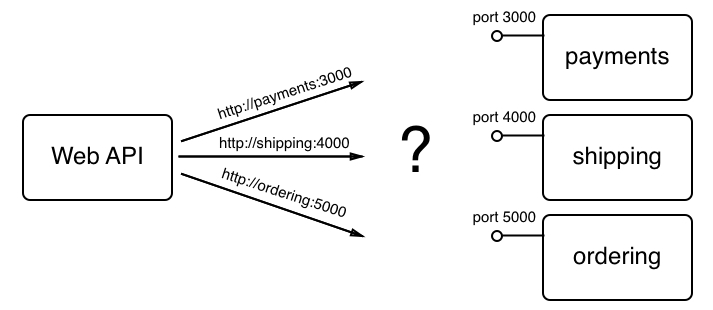
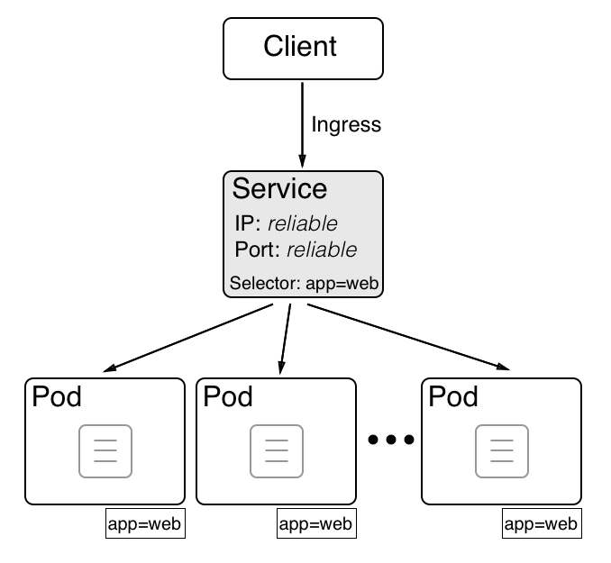

# Kubernetes service

The moment we start to work with applications consisting of more than one application service, we need service discovery. The following diagram illustrates this problem:

Service discovery

In the preceding diagram, we have a **Web API** service that needs access to three other services: **payments, shipping**, and **ordering**. The **Web API** should never have to care about how and where to find those three services. In the API code, we just want to use the name of the service we want to reach and its port number. A sample would be the following URL **http://payments:3000**, which is used to access an instance of the payments service. 

In Kubernetes, the payments application service is represented by a ReplicaSet of pods. Due to the nature of highly distributed systems, we cannot assume that pods have stable endpoints. A pod can come and go on a whim. But that's a problem if we need to access the corresponding application service from an internal or external client. If we cannot rely on pod endpoints being stable, *what else can we do?*

This is where Kubernetes services come into play. They are meant to provide stable endpoints to ReplicaSets or Deployments, as follows:

Kubernetes service providing stable endpoints to clients

In the preceding diagram, in the center, we can see such a Kubernetes **Service**. It provides a **reliable** cluster-wide **IP** address, also called a **virtual IP (VIP)**, as well as a **reliable Port** that's unique in the whole cluster. The pods that the Kubernetes service is proxying are determined by the **Selector** defined in the service specification. Selectors are always based on labels. Every Kubernetes object can have zero to many labels assigned to it. In our case, the **Selector is app=web**; that is, all pods that have a label called app with a value of web are proxied.

In the next section, we will learn more about context-based routing and how Kubernetes alleviates this task.