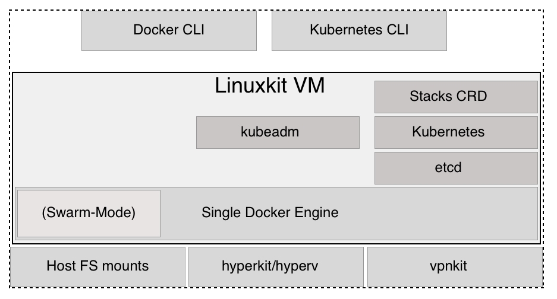
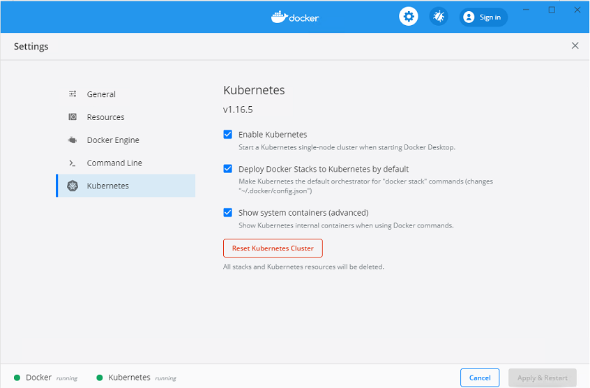
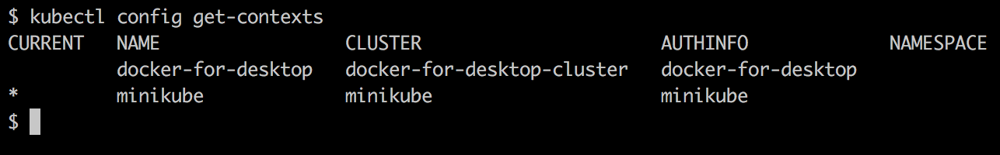
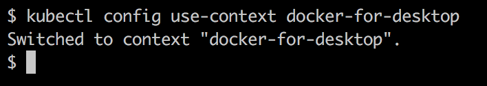
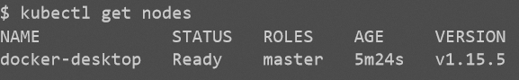
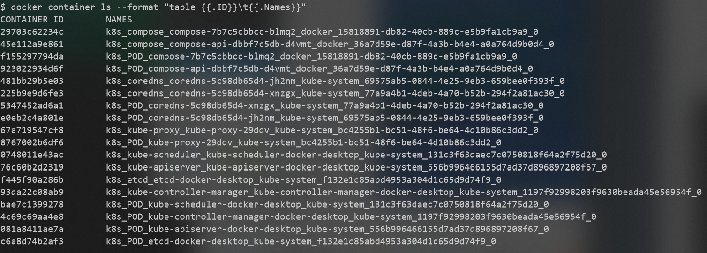

[](../M-11/README.md)
# Kubernetes support in Docker for Desktop 

Starting from version 18.01-ce, Docker for macOS and Docker for Windows have started to support Kubernetes out of the box. Developers who want to deploy their containerized applications to Kubernetes can use this orchestrator instead of SwarmKit. Kubernetes support is turned off by default and has to be enabled in the settings. The first time Kubernetes is enabled, Docker for macOS or Windows will need a moment to download all the components that are needed to create a single-node Kubernetes cluster. Contrary to Minikube, which is also a single-node cluster, the version provided by the Docker tools uses containerized versions of all Kubernetes components:



Kubernetes support in Docker for macOS and Windows
The preceding diagram gives us a rough overview of how Kubernetes support has been added to Docker for macOS and Windows. Docker for macOS uses hyperkit to run a LinuxKit-based VM. Docker for Windows uses Hyper-V to achieve the result. Inside the VM, the Docker engine is installed. Part of the engine is SwarmKit, which enables Swarm-Mode. Docker for macOS or Windows uses the kubeadm tool to set up and configure Kubernetes in that VM. The following three facts are worth mentioning: Kubernetes stores its cluster state in etcd, thus we have etcd running on this VM. Then, we have all the services that make up Kubernetes and, finally, some services that support the deployment of Docker stacks from the Docker CLI into Kubernetes. This service is not part of the official Kubernetes distribution, but it is Docker-specific.

All Kubernetes components run in containers in the LinuxKit VM. These containers can be hidden through a setting in Docker for macOS or Windows. Later in this section, we'll provide a complete list of Kubernetes system containers that will be running on your laptop, if you have Kubernetes support enabled. To avoid repetition, from now on, I will only talk about Docker for Desktop instead of Docker for macOS and Docker for Windows. Everything that I will be saying equally applies to both editions.

One big advantage of Docker for Desktop with Kubernetes enabled over Minikube is that the former allows developers to use a single tool to build, test, and run a containerized application targeted at Kubernetes. It is even possible to deploy a multi-service application into Kubernetes using a Docker Compose file.

Now, let's get our hands dirty:

1. First, we have to enable Kubernetes. On macOS, click on the Docker icon in the menu bar; or, on Windows, go to the command tray and select Preferences. In the dialog box that opens, select Kubernetes, as shown in the following screenshot: 



Enabling Kubernetes in Docker for Desktop

2. Then, tick the Enable Kubernetes checkbox. Also, tick the Deploy Docker Stacks to Kubernetes by default and Show system containers (advanced) checkboxes. Then, click the Apply & Restart button. Installing and configuring of Kubernetes takes a few minutes. Now, it's time to take a break and enjoy a nice cup of tea.
3. Once the installation is finished (which Docker notifies us of by showing a green status icon in the Settings dialog), we can test it. Since we now have two Kubernetes clusters running on our laptop, that is, Minikube and Docker for Desktop, we need to configure kubectl to access the latter.

First, let's list all the contexts that we have:



List of contexts for kubectl

Here, we can see that, on my laptop, I have the two contexts we mentioned previously. Currently, the Minikube context is still active, flagged by the asterisk in the **CURRENT** column. We can switch to the **docker-for-desktop** context using the following command:



Changing the context for the Kubernetes CLI
Now, we can use **kubectl** to access the cluster that Docker for Desktop just created. We should see the following:



The single-node Kubernetes cluster created by Docker for Desktop
OK, this looks very familiar. It is pretty much the same as what we saw when working with Minikube. The version of Kubernetes that my Docker for Desktop is using is **1.15.5**. We can also see that the node is a master node.

If we list all the containers that are currently running on our Docker for Desktop, we get the list shown in the following screenshot (note that I use the **--format** argument to output the **Container ID** and **Names** of the containers):



Kubernetes system containers

In the preceding list, we can identify all the now-familiar components that make up Kubernetes, as follows:

- API server
- etcd
- Kube proxy
- DNS service
- Kube controller
- Kube scheduler


There are also containers that have the word **compose** in them. These are Docker-specific services and allow us to deploy Docker Compose applications onto Kubernetes. Docker translates the Docker Compose syntax and implicitly creates the necessary Kubernetes objects, such as deployments, pods, and services.

Normally, we don't want to clutter our list of containers with these system containers. Therefore, we can uncheck the Show system containers (advanced) checkbox in the settings for Kubernetes.

Now, let's try to deploy a Docker Compose application to Kubernetes. Navigate to the ch15 subfolder of our **~/Lab-12-Kubernets/Sample ** folder. We deploy the app as a stack using the **docker-compose.yml** file:

```
$ docker stack deploy -c docker-compose.yml stackdemo
```
We should see the following:

```
Waiting for the stack to be stable and running...
redis: Ready            [pod status: 1/1 ready, 0/1 pending, 0/1 failed]
web: Ready              [pod status: 1/1 ready, 0/1 pending, 0/1 failed]

Stack stackdemo is stable and running
```


Deploying the stack to Kubernetes

We can test the application, for example, using **curl**, and we will see that it is running as expected:

```
curl http://localhost:8000


StatusCode        : 200
StatusDescription : OK
Content           : Hello World! I have been seen 8 times.

RawContent        : HTTP/1.0 200 OK
                    Content-Length: 39
                    Content-Type: text/html; charset=utf-8
                    Date: Sun, 14 Jun 2020 04:53:22 GMT
                    Server: Werkzeug/1.0.1 Python/3.8.3

                    Hello World! I have been seen 8 times.

Forms             : {}
Headers           : {[Content-Length, 39], [Content-Type, text/html; charset=utf-8], [Date, Sun, 14 Jun 2020 04:53:22
                    GMT], [Server, Werkzeug/1.0.1 Python/3.8.3]}
Images            : {}
InputFields       : {}
Links             : {}
ParsedHtml        : mshtml.HTMLDocumentClass
RawContentLength  : 39
```


Pets application running in Kubernetes on Docker for Desktop

Now, let's see exactly what Docker did when we executed the **docker stack deploy** command. We can use **kubectl** to find out:

```
kubectl get all

NAME                         READY   STATUS    RESTARTS   AGE
pod/redis-64f9c45dfb-sgwwm   1/1     Running   0          8m9s
pod/web-854cfdfc8-x9vbt      1/1     Running   0          8m9s

NAME                    TYPE           CLUSTER-IP       EXTERNAL-IP   PORT(S)          AGE
service/kubernetes      ClusterIP      10.96.0.1        <none>        443/TCP          21h
service/redis           ClusterIP      None             <none>        55555/TCP        8m9s
service/web             ClusterIP      None             <none>        55555/TCP        8m9s
service/web-published   LoadBalancer   10.100.125.210   localhost     8000:30658/TCP   8m9s

NAME                    READY   UP-TO-DATE   AVAILABLE   AGE
deployment.apps/redis   1/1     1            1           8m9s
deployment.apps/web     1/1     1            1           8m9s

NAME                               DESIRED   CURRENT   READY   AGE
replicaset.apps/redis-64f9c45dfb   1         1         1       8m9s
replicaset.apps/web-854cfdfc8      1         1         1       8m9s
```


Listing all Kubernetes objects created by docker stack deploy


Docker created a deployment for the **web** service and a stateful set for the **db** service. It also automatically created Kubernetes services for **web** and **db** so that they can be accessed inside the cluster. It also created the Kubernetes **svc/web-published** service, which is used for external access.

This is pretty cool, to say the least, and tremendously decreases friction in the development process for teams targeting Kubernetes as their orchestration platform

Before you continue, please remove the stack from the cluster:

```
$ docker stack rm stackdemo
```
Also, make sure you reset the context for **kubectl** back to Minikube, as we will be using Minikube for all our samples in this chapter:

```
$ kubectl config use-context minikube
```

Now that we have had an introduction to the tools we can use to develop applications that will eventually run in a Kubernetes cluster, it is time to learn about all the important Kubernetes objects that are used to define and manage such an application. We will start with pods.