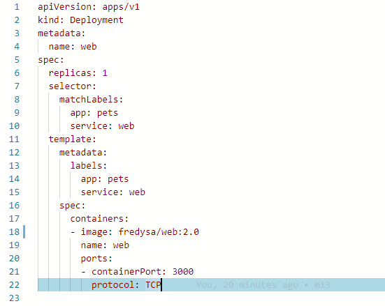
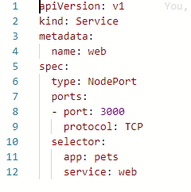
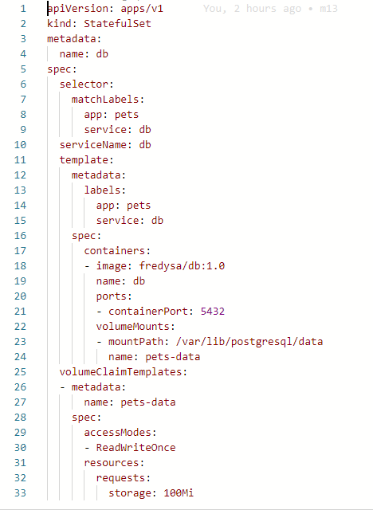
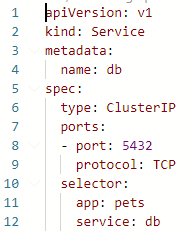
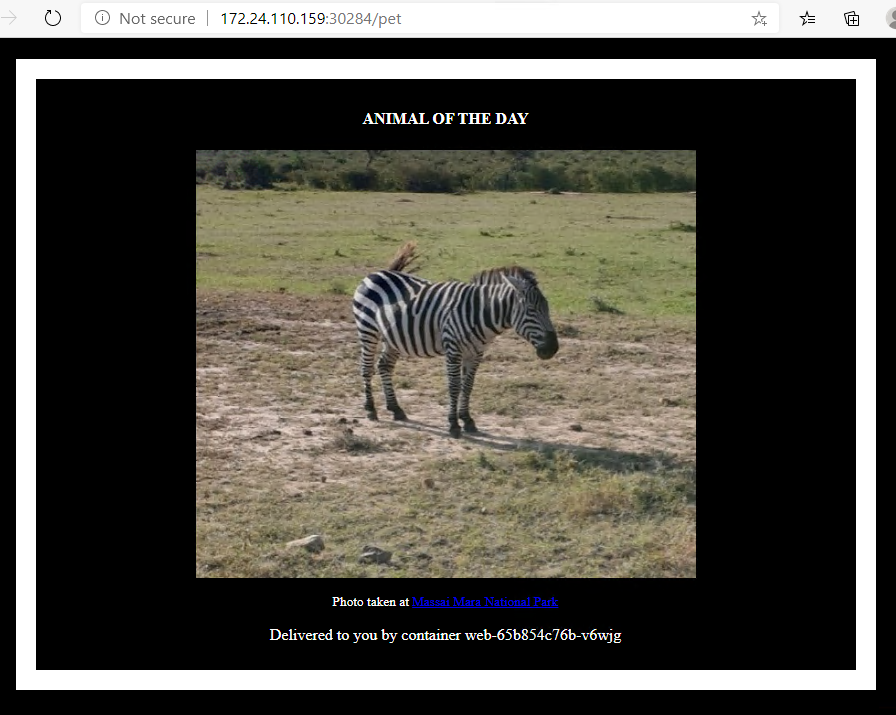
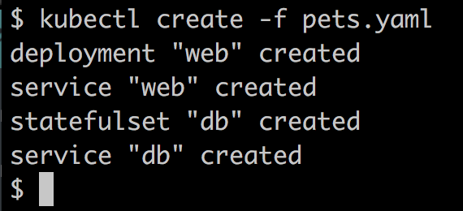

# Deploying a first application
We will take our pets application, which we first introduced in Chapter, Docker Compose, and deploy it into a Kubernetes cluster. Our cluster will be Minikube, which, as you know, is a single-node cluster. However, from the perspective of a deployment, it doesn't really matter how big the cluster is and where the cluster is located in the cloud, in your company's data center, or on your personal workstation.

# Deploying the web component

Just as a reminder, our application consists of two application services: the Node-based web component and the backing PostgreSQL database. In the previous chapter, we learned that we need to define a Kubernetes Deployment object for each application service we want to deploy. Let's do this first for the web component. As always in this book, we will choose the declarative way of defining our objects. Here is the YAML defining a Deployment object for the web component:



Kubernetes deployment definition for the web component 
The preceding deployment definition can be found in the **web-deployment.yaml** file in the **~/lab-13-../sample** folder. The lines of code are as follows:

- On line **4**: We define the name for our **Deployment** object as **web**.
- On line **6**: We declare that we want to have one instance of the **web** component running.
- From line **8 to 10**: We define which pods will be part of our deployment, namely those that have the **app** and **service** labels with values of pets and web, respectively.
- On line **11**: In the template for the pods starting at line 11, we define that each pod will have the **app** and **service** labels applied to them.
- From line **17**: We define the single container that will be running in the pod. The image for the container is our well-known **fredysa/web:2.0** image and the name of the container will be **web**.
- **ports**: Finally, we declare that the container exposes port **3000** for TCP-type traffic.


Please make sure that you have set the context of kubectl to Minikube. See, Setting Up a Working Environment, for details on how to do that.

We can deploy this Deployment object using kubectl:

```
$ kubectl create -f web-deployment.yaml
```
We can double-check that the deployment has been created again using our Kubernetes CLI. We should see the following output:
```
kubectl get all

NAME                      READY   STATUS             RESTARTS   AGE      
pod/web-f795fc765-2b64d   0/1     ImagePullBackOff   0          5m35s    

NAME                 TYPE        CLUSTER-IP   EXTERNAL-IP   PORT(S)   AGE
service/kubernetes   ClusterIP   10.96.0.1    <none>        443/TCP   24h

NAME                  READY   UP-TO-DATE   AVAILABLE   AGE
deployment.apps/web   0/1     1            0           5m35s

NAME                            DESIRED   CURRENT   READY   AGE
replicaset.apps/web-f795fc765   1         1         0       5m35s     
```

Listing all resources running in Minikube

In the preceding output, we can see that Kubernetes created three objects – the deployment, a pertaining ReplicaSet, and a single pod (remember that we specified that we want one replica only). The current state corresponds to the desired state for all three objects, so we are fine so far.

Now, the web service needs to be exposed to the public. For this, we need to define a Kubernetes Service object of the NodePort type. Here is the definition, which can be found in the web-service.yaml file in the ~/lab-13-../sample folder:




Definition of the Service object for our web component

The preceding lines of codes are as follows:

- On line 4: We set the name of this Service object to web.
- On line 6: We define the type of Service object we're using. Since the web component has to be accessible from outside of the cluster, this cannot be a Service object of the ClusterIP type and must be either of the NodePort or LoadBalancer type. We discussed the various types of Kubernetes services in the previous chapter, so will not go into further detail about this. In our sample, we're using a NodePort type of service.
- On lines 8 and 9: We specify that we want to expose port 3000 for access through the TCP protocol. Kubernetes will map container port 3000 automatically to a free host port in the range of 30,000 to 32,768. Which port Kubernetes effectively chooses can be determined using the kubectl get service or kubectl describe command for the service after it has been created. 
- From line 10 to 12: We define the filter criteria for the pods that this service will be a stable endpoint for. In this case, it is all the pods that have the app and service labels with the pets and web values, respectively.
Now that we have this specification for a Service object, we can create it using kubectl:

```
$ kubectl create -f web-service.yaml
```

We can list all the services to see the result of the preceding command:

```
kubectl get services
NAME         TYPE        CLUSTER-IP      EXTERNAL-IP   PORT(S)          AGE
kubernetes   ClusterIP   10.96.0.1       <none>        443/TCP          24h
web          NodePort    10.97.252.130   <none>        3000:30284/TCP   6s
```

The Service object created for the web component
In the preceding output, we can see that a service called **web** has been created. A unique clusterIP of **10.97.252.130** has been assigned to this service, and the container port **3000** has been published on port **31058** on all cluster nodes.

If we want to test this deployment, we need to find out what IP address Minikube has, and then use this IP address to access our web service. The following is the command that we can use to do this:


```
$ip = minikube ip
start http://$($ip):30284


StatusCode        : 200
StatusDescription : OK
Content           : Pets Demo Application
RawContent        : HTTP/1.1 200 OK
                    Connection: keep-alive
                    Content-Length: 21
                    Content-Type: text/html; charset=utf-8
                    Date: Sun, 14 Jun 2020 09:44:45 GMT
                    ETag: W/"15-ufiShH1pxfs9SzrR7nrlwC+H7eA"
                    X-Powered-By: Expres...
Forms             : {}
Headers           : {[Connection, keep-alive], [Content-Length, 21], [Content-Type, text/html; charset=utf-8], [Date, Sun, 14 Jun 2020 09:44:45 GMT]...}
Images            : {}
InputFields       : {}
Links             : {}
ParsedHtml        : mshtml.HTMLDocumentClass
RawContentLength  : 21
```

OK, the response is **Pets Demo Application**, which is what we expected. The web service is up and running in the Kubernetes cluster. Next, we want to deploy the database.

# Deploying the database
A database is a stateful component and has to be treated differently to stateless components, such as our web component. We discussed the difference between stateful and stateless components in a distributed application architecture in detail in , Distributed Application Architecture, and , Orchestrators.

Kubernetes has defined a special type of **ReplicaSet** object for stateful components. The object is called a **StatefulSet**. Let's use this kind of object to deploy our database. The definition can be found in the **~Lab-13-.../sample/db-stateful-set.yaml** file. The details are as follows:



A StatefulSet for the DB component

OK, this looks a bit scary, but it isn't. It is a bit longer than the definition of the deployment for the **web** component due to the fact that we also need to define a volume where the PostgreSQL database can store the data. The volume claim definition is on lines **25** to **33**. We want to create a volume with the name **pets-data** that has a maximum size equal to **100 MB**. On lines 22 to 24, we use this volume and mount it into the container at /var/lib/postgresql/data, where PostgreSQL expects it. On line 21, we also declare that PostgreSQL is listening at port 5432.

As always, we use kubectl to deploy the StatefulSet:

```
$ kubectl create -f db-stateful-set.yaml
```

Now, if we list all the resources in the cluster, we will be able to see the additional objects that were created:

```
kubectl get all
NAME                       READY   STATUS    RESTARTS   AGE
pod/db-0                   1/1     Running   0          12m
pod/web-65b854c76b-v6wjg   1/1     Running   0          12m

NAME                 TYPE        CLUSTER-IP       EXTERNAL-IP   PORT(S)          AGE
service/db           ClusterIP   10.97.141.101    <none>        5432/TCP         12m
service/kubernetes   ClusterIP   10.96.0.1        <none>        443/TCP          60m
service/web          NodePort    10.101.218.194   <none>        3000:30284/TCP   12m

NAME                  READY   UP-TO-DATE   AVAILABLE   AGE
deployment.apps/web   1/1     1            1           12m

NAME                             DESIRED   CURRENT   READY   AGE
replicaset.apps/web-65b854c76b   1         1         1       12m

NAME                  READY   AGE
statefulset.apps/db   1/1     12m
```

The StatefulSet and its pod

Here, we can see that a **StatefulSet** and a pod have been created. For both, the current state corresponds to the desired state and thus the system is healthy. But that doesn't mean that the web component can access the database at this time. Service discovery won't work so far. Remember that the web component wants to access the **db** service under the name **db**.

To make service discovery work inside the cluster, we have to define a Kubernetes Service object for the database component too. Since the database should only ever be accessible from within the cluster, the type of Service object we need is ClusterIP. Here is the specification, which can be found in the **~/Lab-13-.../sample/db-service.yaml** file:



Definition of the Kubernetes Service object for the database

The database component will be represented by this Service object and it can be reached by the name **db**, which is the name of the service, as defined on line 4. The database component does not have to be publicly accessible, so we decided to use a Service object of the **ClusterIP**type. The selector on lines **10** to **12** defines that this service represents a stable endpoint for all the pods that have the according labels defined, that is, **app: pets** and service: **db**.

Let's deploy this service with the following command:

```
$ kubectl create -f db-service.yaml
```

Now, we should be ready to test the application. We can use the browser this time to enjoy the beautiful animal images:



Testing the pets application running in Kubernetes

172.24.110.159  is the IP address of my Minikube. Verify your address using the **minikube ip** command. Port number 32722 is the number that Kubernetes automatically selected for my web Service object . Replace this number with the port that Kubernetes assigned to your service. You can get the number by using the **kubectl get services** command.

Now, we have successfully deployed the pets application to Minikube, which is a single-node Kubernetes cluster. We had to define four artifacts to do so, which are as follows:

- A Deployment and a Service object for the web component 
- A StatefulSet and a Service object for the database component
To remove the application from the cluster, we can use the following small script:

```
kubectl delete svc/web
kubectl delete deploy/web
kubectl delete svc/db
kubectl delete statefulset/db
```
Next, we will be streamlining the deployment.

# Streamlining the deployment
So far, we have created four artifacts that needed to be deployed to the cluster. This is only a very simple application, consisting of two components. Imagine having a much more complex application. It would quickly become a maintenance nightmare. Luckily, we have several options as to how we can simplify the deployment. The method that we are going to discuss here is the possibility of defining all the components that make up an application in Kubernetes in a single file.

Other solutions that lie outside of the scope of this book would include the use of a package manager, such as Helm.

If we have an application consisting of many Kubernetes objects such as Deployment and Service objects, then we can keep them all in one single file and separate the individual object definitions by three dashes. For example, if we wanted to have the Deployment and the Service definition for the web component in a single file, this would look as follows:

```
apiVersion: extensions/v1beta1
kind: Deployment
metadata:
  name: web
spec:
  replicas: 1
  selector:
    matchLabels:
      app: pets
      service: web
  template:
    metadata:
      labels:
        app: pets
        service: web
    spec:
      containers:
      - image: fredysa/web:2.0
        name: web
        ports:
        - containerPort: 3000
          protocol: TCP
---
apiVersion: v1
kind: Service
metadata:
  name: web
spec:
  type: NodePort
  ports:
  - port: 3000
    protocol: TCP
  selector:
    app: pets
    service: web
```

Here, we have collected all four object definitions for the pets application in the ~/Lab-13-.../pets.yaml file, and we can deploy the application in one go:

```
kubectl create -f pets.yaml
```


Using a single script to deploy the pets application

Similarly, we have created a script called ~/Lab-13-...//remove-pets.sh to remove all the artifacts of the pets application from the Kubernetes cluster:
```
.\remove-pets.ps1
service "web" deleted
service "db" deleted
deployment.apps "web" deleted
statefulset.apps "db" deleted
persistentvolumeclaim "pets-data-db-0" deleted
```
Removing pets from the Kubernetes cluster

With this, we have taken our pets application we introduced in Docker Compose, and defined all the Kubernetes objects that are necessary to deploy this application into a Kubernetes cluster. In each step, we have made sure that we got the expected result, and once all the artifacts existed in the cluster, we showed the running application. 