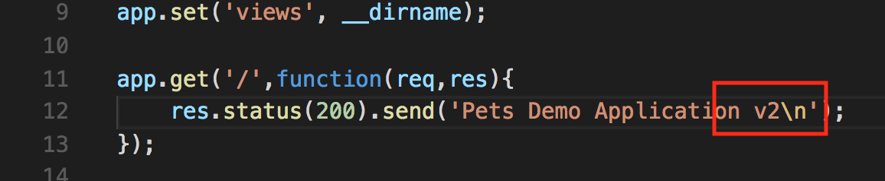
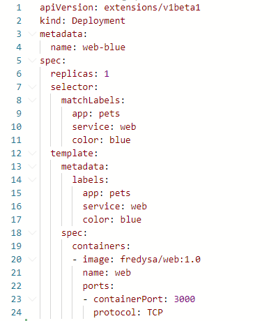
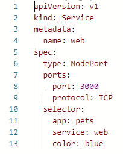
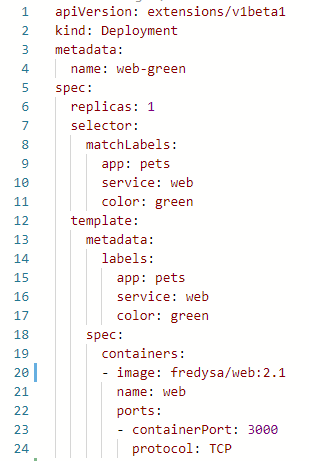

[](../M-12/README.md)
# Zero downtime deployments
In a mission-critical environment, it is important that the application is always up and running. These days, we cannot afford any downtime anymore. Kubernetes gives us various means of achieving this. Performing an update on an application in the cluster that causes no downtime is called a zero downtime deployment. In this section, we will present two ways of achieving this. These are as follows:

- Rolling updates
- Blue-green deployments

Let's start by discussing rolling updates.

# Rolling updates
In the previous chapter, we learned that the Kubernetes Deployment object distinguishes itself from the ReplicaSet object in that it adds rolling updates and rollbacks on top of the latter's functionality. Let's use our web component to demonstrate this. Evidently, we will have to modify the manifest or description of the deployment for the web component.

We will use the same deployment definition as in the previous section, with one important difference – we will have five replicas of the web component running. The following definition can also be found in the **~\M-12\sample\web-deploy-rolling-v1.yaml**file:

```
apiVersion: apps/v1
kind: Deployment
metadata:
  name: web
spec:
  replicas: 5
  selector:
    matchLabels:
      app: pets
      service: web
  template:
    metadata:
      labels:
        app: pets
        service: web
    spec:
      containers:
      - image: fredysa/web:1.0
        name: web
        ports:
        - containerPort: 3000
          protocol: TCP
```

Now, we can create this deployment as usual and also, at the same time, the service that makes our component accessible:

```
$ kubectl create -f web-deploy-rolling-v1.yaml
$ kubectl create -f web-service.yaml
```

Once we have deployed the pods and the service, we can test our web component with the following command:

```
PS:
$Port = kubectl get svc/web -o yaml | ? {$_ -like "*- nodePort*"}
$Port = $port.Substring("14","5")
$IP=minikube ip
$Uri = "$($IP):$($Port)"
curl $Uri/
Pets Demo Application
```

As we can see, the application is up and running and returns the expected message, **Pets Demo Application**.

Now. our developers have created a new version, 2.1, of the web component. The code of the new version of the web component can be found in the **~/M-12/sample/web**folder, and the only change is located on line 12 of the server.js file:



Code change for version 2.0 of the web component
The developers have built the new image as follows:
```
docker image build -t fredysa/web:2.1 .
```
Subsequently, they pushed the image to Docker Hub, as follows:

```
docker image push fredysa/web:2.1
```
Now, we want to update the image that's used by our pods that are part of the web Deployment object. We can do this by using the set image command of kubectl:

```
kubectl set image deployment/web  web=fredysa/web:2.1

```

If we test the application again, we'll get a confirmation that the update has indeed happened:

```
PS:
$Port = kubectl get svc/web -o yaml | ? {$_ -like "*- nodePort*"}
$Port = $port.Substring("14","5")
$IP=minikube ip
$Uri = "$($IP):$($Port)"
curl $Uri/
Pets Demo Application v2
```
Now, how do we know that there hasn't been any downtime during this update? Did the update really happen in a rolling fashion? What does rolling update mean at all? Let's investigate. First, we can get a confirmation from Kubernetes that the deployment has indeed happened and was successful by using the rollout status command:

```
$ kubectl rollout status deploy/web
deployment "web" successfully rolled out
```

If we describe the deployment web with kubectl describe deploy/web, we get the following list of events at the end of the output:

```
kubectl describe deploy/web

....
Events:
  Type    Reason             Age    From                   Message
  ----    ------             ----   ----                   -------
  Normal  ScalingReplicaSet  13m    deployment-controller  Scaled up replica set web-65b854c76b to 5
  Normal  ScalingReplicaSet  2m43s  deployment-controller  Scaled up replica set web-844bc97664 to 2
  Normal  ScalingReplicaSet  2m43s  deployment-controller  Scaled down replica set web-65b854c76b to 4
  Normal  ScalingReplicaSet  2m43s  deployment-controller  Scaled up replica set web-844bc97664 to 3
  Normal  ScalingReplicaSet  2m38s  deployment-controller  Scaled down replica set web-65b854c76b to 3
  Normal  ScalingReplicaSet  2m38s  deployment-controller  Scaled up replica set web-844bc97664 to 4
  Normal  ScalingReplicaSet  2m37s  deployment-controller  Scaled down replica set web-65b854c76b to 2
  Normal  ScalingReplicaSet  2m37s  deployment-controller  Scaled up replica set web-844bc97664 to 5
  Normal  ScalingReplicaSet  2m36s  deployment-controller  Scaled down replica set web-65b854c76b to 1
  Normal  ScalingReplicaSet  2m36s  deployment-controller  Scaled down replica set web-65b854c76b to 0
```

 List of events found in the output of the deployment description of the web component
The first event tells us that, when we created the deployment, a ReplicaSet called **web-769b88f67** with five replicas was created. Then, we executed the update command. The second event in the list tells us that this meant creating a new ReplicaSet called **web-55cdf67cd** with, initially, one replica only. Thus, at that particular moment, six pods existed on the system: the five initial pods and one pod with the new version. But, since the desired state of the Deployment object states that we want five replicas only, Kubernetes now scales down the old ReplicaSet to four instances, which we can see in the third event.

Then, again, the new ReplicaSet is scaled up to two instances and, subsequently, the old ReplicaSet scaled was down to three instances, and so on, until we had five new instances and all the old instances were decommissioned. Although we cannot see any precise time (other than 3 minutes) when that happened, the order of the events tells us that the whole update happened in a rolling fashion.

During a short time period, some of the calls to the web service would have had an answer from the old version of the component, and some calls would have received an answer from the new version of the component, but, at no time would the service have been down.

We can also list the ReplicaSet objects in the cluster and will get confirmation of what I said in the preceding section:

```
kubectl get rs
NAME             DESIRED   CURRENT   READY   AGE
web-65b854c76b   0         0         0       16m
web-844bc97664   5         5         5       6m9s
```

Listing all the ReplicaSet objects in the cluster

Here, we can see that the new ReplicaSet has five instances running and that the old one has been scaled down to zero instances. The reason that the old ReplicaSet object is still lingering is that Kubernetes provides us with the possibility of rolling back the update and, in that case, will reuse that ReplicaSet.

To roll back the update of the image in case some undetected bug sneaked into the new code, we can use the rollout undo command: 

```
kubectl rollout undo deploy/web
deployment "web"

$Port = kubectl get svc/web -o yaml | ? {$_ -like "*- nodePort*"}
$Port = $port.Substring("14","5")
$IP=minikube ip
$Uri = "$($IP):$($Port)"
curl $Uri/
```

I have also listed the test command using **curl** in the preceding snippet to verify that the rollback indeed happened. If we list the ReplicaSets, we will see the following output:

```
kubectl get rs
```

Listing ReplicaSet objects after rollback

This confirms that the old ReplicaSet (**web-769b88f67**) object has been reused and that the new one has been scaled down to zero instances.

Sometimes, though, we cannot, or do not want to, tolerate the mixed state of an old version coexisting with the new version. We want an **all-or-nothing strategy**. This is where **blue-green deployments** come into play, which we will discuss next.

# Blue-green deployment
If we want to do a blue-green style deployment for our component web of the pets application, then we can do so by using labels creatively. First, let's remind ourselves how blue-green deployments work. Here is a rough step-by-step instruction:

- Deploy the first version of the **web** component as **blue**. We will label the pods with a label of **color: blue** to do so.
- Deploy the Kubernetes service for these pods with the **color: blue** label in the selector section.
- Now, we can deploy version 2 of the web component, but, this time, the pods have a label of **color: green**.
- We can test the green version of the service to check that it works as expected.
- Now, we flip traffic from blue to green by updating the Kubernetes service for the web component. We modify the selector so that it uses the **color: green** label.

Let's define a Deployment object for version 1, blue:



Specification of the blue deployment for the web component
The preceding definition can be found in the **~/M-12./sample/web-deploy-blue.yaml** file. Please take note of line **4**, where we define the name of the deployment as **web-blue** to distinguish it from the upcoming deployment, **web-green**. Also, note that we have added the label **color: blue** on lines **11** and **17**. Everything else remains the same as before.

Now, we can define the Service object for the web component. It will be the same as the one we used before but with a minor change, as shown in the following screenshot:



Kubernetes service for the web component supporting blue-green deployments
The only difference regarding the definition of the service we used earlier in this chapter is line **13**, which adds the **color: blue**label to the selector. We can find the preceding definition in the **~/M-12/sample/web-svc-blue-green.yaml** file.

Then, we can deploy the blue version of the web component with the following command:

```
kubectl create -f web-deploy-blue.yaml
kubectl create -f web-svc-blue-green.yaml
```
Once the service is up and running, we can determine its IP address and port number and test it:

```
PS:
$Port = kubectl get svc/web -o yaml | ? {$_ -like "*- nodePort*"}
$Port = $port.Substring("14","5")
$IP=minikube ip
$Uri = "$($IP):$($Port)"
curl $Uri/
Pets Demo Application
```

As expected, we get the response Pets Demo Application. Now, we can deploy the green version of the web component. The definition of its Deployment object can be found in the **~/M-12/sample/web-deploy-green.yaml** file and looks as follows:



Specification of the deployment green for the web component
The interesting lines are as follows:

- Line **4**: Named web-green to distinguish it from web-blue and allow for parallel installation
- Lines **11** and **17**: Have the color green
- Line **20:** Now using version 2.1 of the image
- 
Now, we're ready to deploy this green version of the service. It should run separately from the blue service:

```
kubectl create -f web-deploy-green.yaml
```
We can make sure that both deployments coexist like so:

```
kubectl get deploy 
```

Displaying the list of Deployment objects running in the cluster

As expected, we have both blue and green running. We can verify that blue is still the active service:
```
PS:
$Port = kubectl get svc/web -o yaml | ? {$_ -like "*- nodePort*"}
$Port = $port.Substring("14","5")
$IP=minikube ip
$Uri = "$($IP):$($Port)"
curl $Uri/
Pets Demo Application
```

Now comes the interesting part. We can flip traffic from blue to green by editing the existing service for the web component. To do so, execute the following command:

```
kubectl edit svc/web
```

Change the value of the label color from blue to green. Then, save and quit the editor. The Kubernetes CLI will automatically update the service. When we now query the web service again, we get this:
```
PS:
$Port = kubectl get svc/web -o yaml | ? {$_ -like "*- nodePort*"}
$Port = $port.Substring("14","5")
$IP=minikube ip
$Uri = "$($IP):$($Port)"
curl $Uri/
Pets Demo Application v2
```
This confirms that the traffic has indeed switched to the green version of the web component (note the **v2** at the end of the response to the **curl** command).

If we realize that something went wrong with our green deployment and the new version has a defect, we can easily switch back to the blue version by editing the service web again and replacing the value of the label color with blue. This rollback is instantaneous and should always work. Then, we can remove the buggy green deployment and fix the component. When we have corrected the problem, we can deploy the green version once again.

Once the green version of the component is running as expected and performing well, we can decommission the blue version:

```
kubectl delete deploy/web-blue
kubectl delete deployment.apps/web-green 
kubectl delete service/web 

kubectl get all 
```

When we're ready to deploy a new version, **3.0**, this one becomes the blue version. We update the **~/M-12/sample//web-deploy-blue.yaml** file accordingly and deploy it. Then, we flip the service web from **green** to **blue**, and so on.

We have successfully demonstrated, with our component web of the pets application, how blue-green deployment can be achieved in a Kubernetes cluster.
