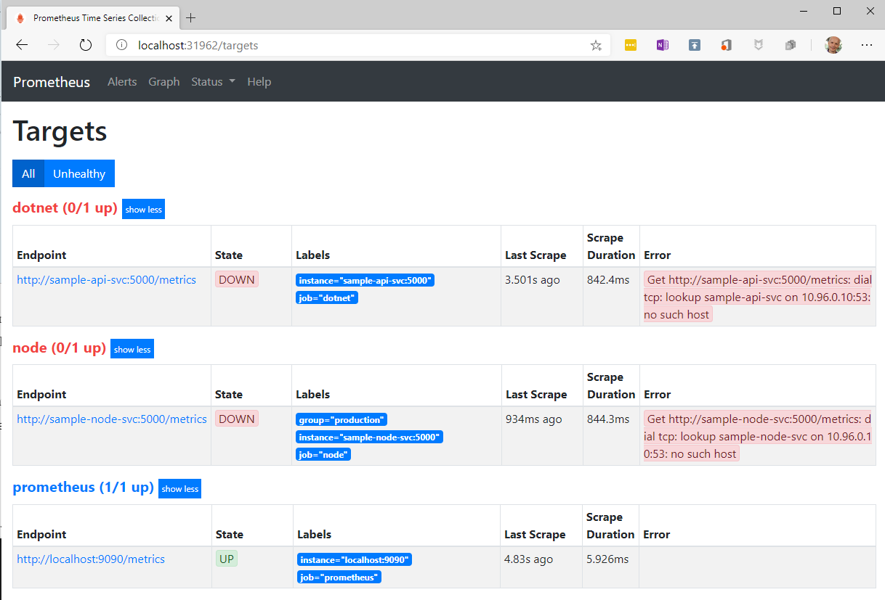
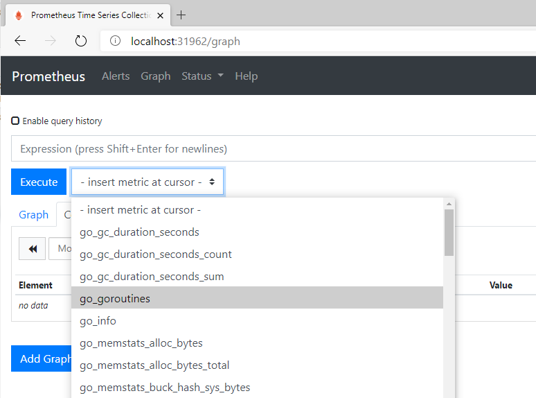
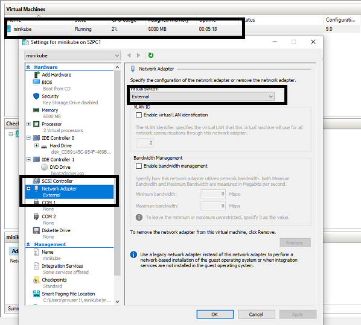
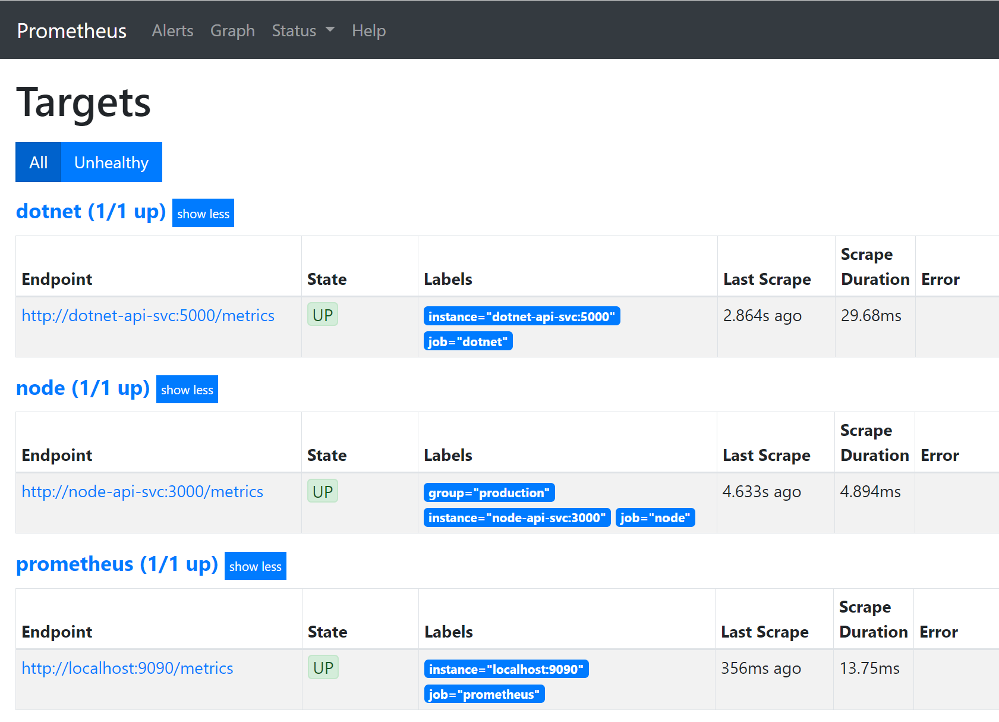
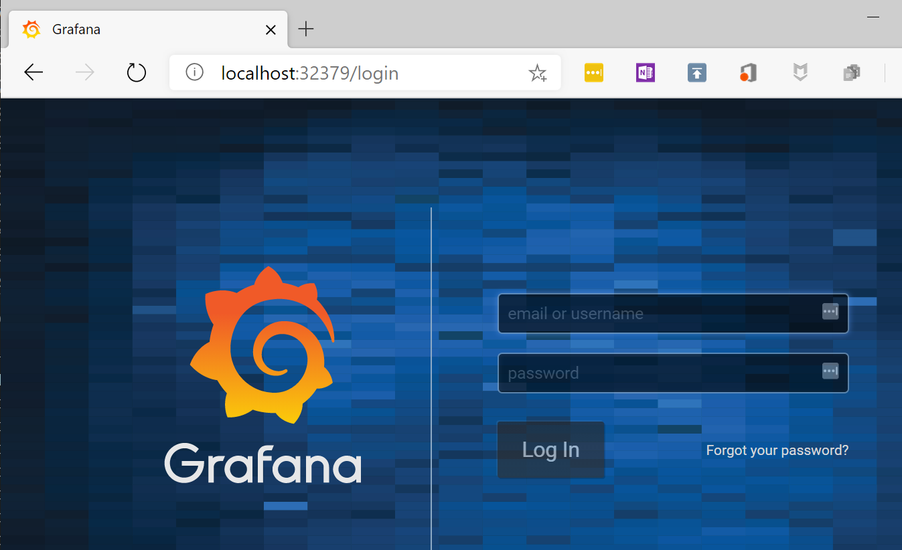
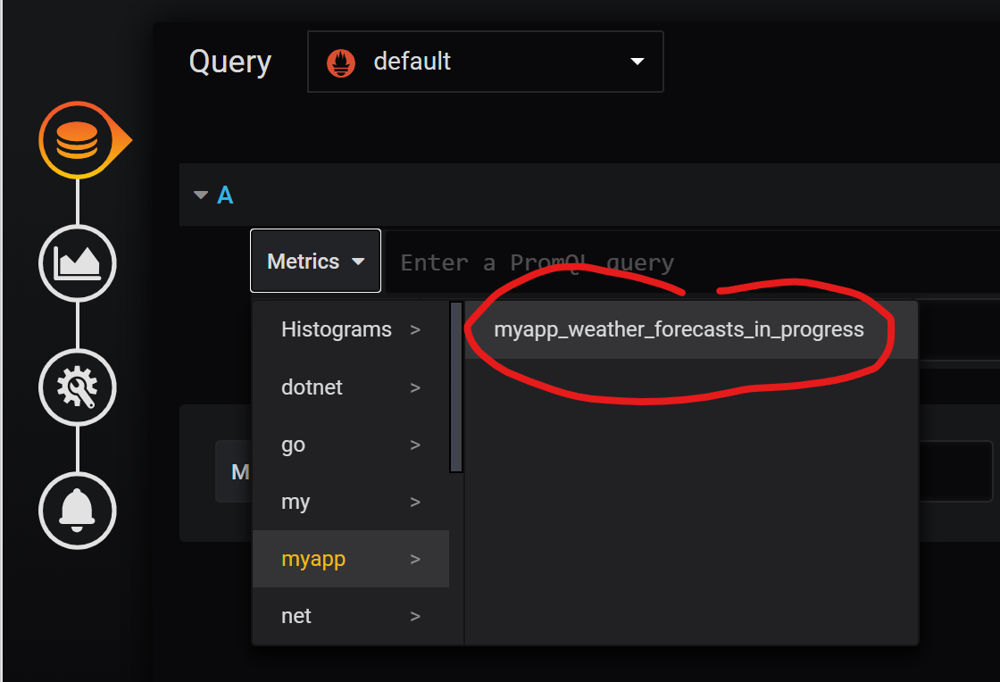
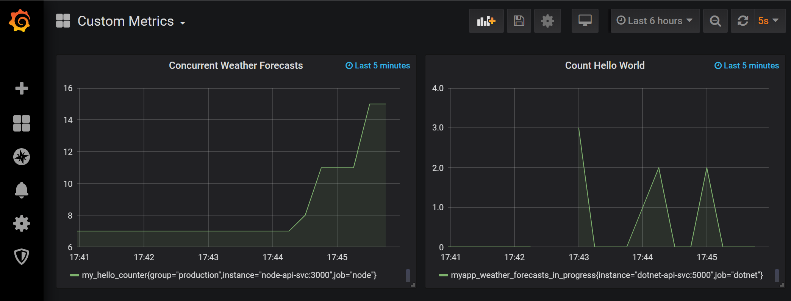

[](../M-13/README.md)
# Using Prometheus to monitor a distributed application
Now that we have learned how to instrument an application service to expose Prometheus metrics, it's time to show how we can collect the metrics and forward them to a Prometheus server where all metrics will be aggregated and stored. We can then either use the (simple) web UI of Prometheus or a more sophisticated solution like Grafana to display important metrics on a dashboard.

Unlike most other tools that are used to collect metrics from application services and infrastructure components, the Prometheus server takes the load of work and periodically scrapes all the defined targets. This way applications and services don't need to worry about forwarding data. You can also describe this as pulling metrics versus pushing them. This makes Prometheus servers an excellent fit for our case.

We will now discuss how to deploy Prometheus to Kubernetes, followed by our two sample application services. Finally, we will deploy Grafana to the cluster, and use it to display our customer metrics on a dashboard.

# Architecture
Let's have a quick overview of the architecture of the planned system. As mentioned before, we have our microservices, the Prometheus server, and Grafana. Furthermore, everything will be deployed to Kubernetes. The following diagram shows the relationships:


High-level overview of an application using Prometheus and Grafana for monitoring

In the top center of the diagram, we have Prometheus, which periodically scrapes metrics from Kubernetes, shown on the left. It also periodically scrapes metrics from the services, in our case from the Node.js and the .NET sample services we created and instrumented in the previous section. Finally, on the right-hand side of the diagram, we have Grafana that is pulling data periodically from Prometheus to then display it on graphical dashboards.

# Deploying Prometheus to Kubernetes
As indicated, we start by deploying Prometheus to Kubernetes. Let's first define the Kubernetes YAML file that we can use to do so. First, we need to define a Kubernetes Deployment that will create a ReplicaSet of Prometheus server instances, and then we will define a Kubernetes service to expose Prometheus to us, so that we can access it from within a browser tab or that Grafana can access it. Let's do it:

Locate a ~/M-13/sample/kube folder, and navigate to it:

- prometheus.yaml 
Add the following code snippet to this file; it defines Deployment for Prometheus:
```
apiVersion: apps/v1
kind: Deployment
metadata:
  name: prometheus-deployment
  labels:
    app: prometheus
    purpose: monitoring-demo
spec:
  replicas: 2
  selector:
    matchLabels:
      app: prometheus
      purpose: monitoring-demo
  template:
    metadata:
      labels:
        app: prometheus
        purpose: monitoring-demo
    spec:
      containers:
      - name: prometheus
        image: prom/prometheus
        volumeMounts:
          - name: config-volume
            mountPath: /etc/prometheus/prometheus.yml
            subPath: prometheus.yml
        ports:
        - containerPort: 9090
      volumes:
        - name: config-volume
          configMap:
           name: prometheus-cm
```
We are defining a replica set with two instances of Prometheus. Each instance is assigned the two labels: **app: prometheus** and **purpose: monitoring-demo** for identification purposes. The interesting part is in the **volumeMounts** of container spec. There we mount a Kubernetes **ConfigMap** object, called **prometheus-cm** containing the Prometheus configuration, into the container to the location where Prometheus expects its configuration file(s). The volume of the **ConfigMap** type is defined on the last four lines of the above code snippet.

- **Note:** that we will define the config map later on.

- Now let's define the Kubernetes service for Prometheus. Append this snippet to the file:
```
---
kind: Service
apiVersion: v1
metadata:
  name: prometheus-svc
spec:
  type: NodePort
  selector:
    app: prometheus
    purpose: monitoring-demo
  ports:
  - name: promui
    protocol: TCP
    port: 9090
    targetPort: 9090
```

- **Note :** Please note the three dashes (---) at the beginning of the snippet are needed to separate individual object definitions in our YAML file.

We call our service **prometheus-svc** and make it a **NodePort** (and not just a service of the **ClusterIP** type) to be able to access the Prometheus web UI from the host.

- Now we can define a simple configuration file for Prometheus. This file basically instructs the Prometheus server which services to scrape metrics from and how often to do so. First, create a **~/M-13/sample/kube/config** folder:

Please add a file called **prometheus.yml** to the last folder, and add the following content to it:
```
scrape_configs:
    - job_name: 'prometheus'
      scrape_interval: 5s
      static_configs:
        - targets: ['localhost:9090']
  
    - job_name: dotnet
      scrape_interval: 5s
      static_configs:
        - targets: ['dotnet-api-svc:5000']
  
    - job_name: node
      scrape_interval: 5s
      static_configs:
        - targets: ['node-api-svc:3000']
          labels:
            group: 'production'
```

In the preceding file, we define three jobs for Prometheus:

- The first one called **prometheus** scrapes metrics every five seconds from the Prometheus server itself. It finds those metrics the at **localhost:9090** target. Note that by default the metrics should be exposed at the **/metrics** endpoint.
- The second job called **dotnet** scrapes metrics from a service found at **dotnet-api-svc:5000**, which will be our .NET Core service that we have defined and instrumented previously.
- Finally, the third job does the same for our Node service. Note that we also have added a **group: 'production'**label to this job. This allows for further grouping of jobs or tasks.


- Now we can define the ConfigMap object in our Kubernetes cluster, with the next command. From within the **../kube** folder execute the following:
```
kubectl create configmap prometheus-cm  --from-file config/prometheus.yml
```

- We can now deploy Prometheus to our Kubernetes server with the following:

```
$ kubectl apply -f prometheus.yaml
deployment.apps/prometheus-deployment created
service/prometheus-svc created
```

- Let's double-check that the deployment succeeded:

```
 kubectl get all
```
```
NAME                                        READY  STATUS   RESTARTS  AGE
pod/prometheus-deployment-779677977f-727hb  1/1    Running  0         24s
pod/prometheus-deployment-779677977f-f5l7k  1/1    Running  0         24s

NAME                    TYPE       CLUSTER-IP      EXTERNAL-IP  PORT(S)         AGE
service/kubernetes      ClusterIP  10.96.0.1       <none>       443/TCP         28d
service/prometheus-svc  NodePort   10.110.239.245  <none>       9090:31962/TCP  24s

NAME                                   READY  UP-TO-DATE  AVAILABLE  AGE
deployment.apps/prometheus-deployment  2/2    2           2          24s

NAME                                              DESIRED  CURRENT  READY  AGE
replicaset.apps/prometheus-deployment-779677977f  2        2        2      24s
```

Keep a close eye on the list of pods, and make sure they are all up and running. Please also note the port mapping of the **prometheus-svc** object. In my case, the **9090** port is mapped to the **31962** host port. In your case, the latter may be different, but it will also be in the **3xxxx** range. 


- We can now access the web UI of Prometheus. Open a new browser tab, and navigate to **`http://localhost:<port>/targets`** where **<port>** in my case is **31962**. You should see something like this:
```
$Port = kubectl get service/prometheus-svc -o yaml | ? {$_ -like "*nodePort:*"} 
$Port = $port.Substring("14","5")
$IP=minikube ip
$Uri = "http://$($IP):$($Port)"
start $Uri/targets
```


Prometheus web UI showing the configured targets

In the last screenshot, we can see that we defined three targets for Prometheus. Only the third one in the list is up and accessible by Prometheus. It is the endpoint we defined in the configuration file for the job that scrapes metrics from Prometheus itself. The other two services are not running at this time, and thus their state is down.

- Now navigate to Graph by clicking on the respective link in the top menu of the UI.
- Open the metrics drop-down list, and inspect all the listed metrics that Prometheus found. In this case, it is only the list of metrics defined by the Prometheus server itself:



Prometheus web UI showing available metrics

With that, we are ready to deploy the .NET and the Node sample services, we created earlier, to Kubernetes.

# Deploying our application services to Kubernetes

Before we can use the sample services we created earlier and deploy them to Kubernetes, we must create Docker images for them and push them to a container registry. In our case, we will just push them to Docker Hub.

Let's start with the .NET Core sample:

- Locate the Program.cs file in the .NET project and open it.
- Modify the CreateHostBuilder method so it looks like this:

```
Host.CreateDefaultBuilder(args)
    .ConfigureWebHostDefaults(webBuilder =>
    {
        webBuilder.UseStartup<Startup>();
        webBuilder.UseUrls("http://*:5000");
    });
```
Add **Dockerfile**with the following content to the **~/M-13/sample/dotnet/sample-api** project folder:

```
FROM mcr.microsoft.com/dotnet/core/aspnet:3.1 AS base
WORKDIR /app
EXPOSE 5000

FROM mcr.microsoft.com/dotnet/core/sdk:3.1 AS builder
WORKDIR /src
COPY sample-api.csproj ./
RUN dotnet restore
COPY . .
RUN dotnet build -c Release -o /src/build

FROM builder AS publisher
RUN dotnet publish -c Release -o /src/publish

FROM base AS final
COPY --from=publisher /src/publish .
ENTRYPOINT ["dotnet", "sample-api.dll"]
```

- Create a Docker image by using this command from within the dotnet/sample-api project folder:

```
docker image build -t fredysa/dotnet-api:1.0 .
```

- **Note** that you may want to replace fredysa with your own Docker Hub username in the preceding and subsequent command.
Push the image to Docker Hub:

```
docker image push fredysa/dotnet-api:1.0
```
Now we do the same with the Node sample API:

- Add **Dockerfile** with the following content to the **~/node** project folder:

```
FROM node:13.5-alpine
WORKDIR /app
COPY package.json ./
RUN npm install
COPY . .
EXPOSE 3000
CMD ["npm", "start"]
```

Create a **Docker**image by using this command from within the **~/node** project folder:

```
docker image build -t fredysa/node-api:1.0 .
```

- **Note** once again that you may want to replace fredysa with your own Docker Hub username in the preceding and subsequent command.
Push the image to Docker Hub:

```
$ docker image push fredysa/node-api:1.0
```

- With this, we are ready to define the necessary Kubernetes objects for the deployment of the two services. The definition is somewhat lengthy and can be found in the **~/../kube/app-services.yaml** file in the repository. Please open that file and analyze its content.

Let's use this file to deploy the services:

Use the following command:

```
$ kubectl apply -f app-services.yaml
deployment.apps/dotnet-api-deployment created
service/dotnet-api-svc created
deployment.apps/node-api-deployment created
service/node-api-svc created
```

Double-check that the services are up and running using the **kubectl get all** command. Make sure all the pods of the Node and .NET sample API services are up and running.
List all Kubernetes services to find out the host ports for each application service:
```
$ kubectl get services

NAME             TYPE        CLUSTER-IP       EXTERNAL-IP   PORT(S)          AGE
dotnet-api-svc   NodePort    10.98.137.249    <none>        5000:30822/TCP   5m29s
grafana-svc      NodePort    10.107.232.211   <none>        8080:31461/TCP   33m
kubernetes       ClusterIP   10.96.0.1        <none>        443/TCP          28d
node-api-svc     NodePort    10.110.15.131    <none>        5000:31713/TCP   5m29s
prometheus-svc   NodePort    10.110.239.245   <none>        9090:31962/TCP   77m
```

In my case, the .NET API is mapped to port **30822** , and the Node API to port **31713**. Your ports may differ.

! If failing on downloading image check external network for minikube



Use PS to access the /metrics endpoint for both services:

dotnet-api-svc
```
$Port = kubectl get service/dotnet-api-svc -o yaml | ? {$_ -like "*nodePort:*"} 
$Port = $port.Substring("14","5")
$IP=minikube ip
$dotnetapi = "http://$($IP):$($Port)"
start $dotnetapi/metrics
```

node-api-svc 
```
$Port = kubectl get service/node-api-svc -o yaml | ? {$_ -like "*nodePort:*"} 
$Port = $port.Substring("14","5")
$IP=minikube ip
$nodeapi  = "http://$($IP):$($Port)"
start $nodeapi/metrics

```
```
start http://localhost:30822/metrics
# HELP process_working_set_bytes Process working set
# TYPE process_working_set_bytes gauge
process_working_set_bytes 95236096
# HELP process_private_memory_bytes Process private memory size
# TYPE process_private_memory_bytes gauge
process_private_memory_bytes 186617856
...

start http://localhost:31713/metrics
# HELP process_cpu_user_seconds_total Total user CPU time spent in seconds.
# TYPE process_cpu_user_seconds_total counter
process_cpu_user_seconds_total 1.0394399999999997 1578294999302
# HELP process_cpu_system_seconds_total Total system CPU time spent in seconds.
# TYPE process_cpu_system_seconds_total counter
process_cpu_system_seconds_total 0.3370890000000001 1578294999302
...
```

Double-check the **/targets** endpoint in Prometheus to make sure the two microservices are now reachable:



Prometheus showing all targets are up and running

- To make sure the custom metrics we defined for our Node.js and .NET services are defined and exposed, we need to access each service at least once. Thus use curl to access the respective endpoints a few times:

```
# access the /weatherforecast endpoint in the .NET service
start $dotnetapi/weatherforecast

# and access the /hello endpoint in the Node service 
start $nodeapi/hello
```

The last step is to deploy Grafana to Kubernetes so that we have the ability to create sophisticated and graphically appealing dashboards displaying key metrics of our application services and/or infrastructure components.

# Deploying Grafana to Kubernetes
Now let's also deploy Grafana to our Kubernetes cluster, so that we can manage this tool the same way as all the other components of our distributed application. As the tool that allows us to create dashboards for monitoring the application, Grafana can be considered mission-critical and thus warrants this treatment.

Deploying Grafana to the cluster is pretty straightforward. Let's do it as follows:

- Add a new file called grafana.yaml to the ch17/kube folder.
- To this file, add the definition for a Kubernetes Deployment for Grafana:
```
apiVersion: apps/v1
kind: Deployment
metadata:
  name: grafana-deployment
  labels:
    app: grafana
    purpose: monitoring-demo
spec:
  replicas: 1
  selector:
    matchLabels:
      app: grafana
      purpose: monitoring-demo
  template:
    metadata:
      labels:
        app: grafana
        purpose: monitoring-demo
    spec:
      containers:
      - name: grafana
        image: grafana/grafana
```

There are no surprises in that definition. In this example, we are running a single instance of Grafana, and it uses the **app** and **purpose** labels for identification, similar to what we used for Prometheus. No special volume mapping is needed this time since we are only working with defaults.

- We also need to expose Grafana, and thus add the following snippet to the preceding file to define a service for Grafana:
```
---
kind: Service
apiVersion: v1
metadata:
  name: grafana-svc
spec:
  type: NodePort
  selector:
    app: grafana
    purpose: monitoring-demo
  ports:
  - name: grafanaui
    protocol: TCP
    port: 3000
    targetPort: 3000
```

Once again, we are using a service of the **NodePort** type to be able to access the Grafana UI from our host.

We can now deploy Grafana with this command:

```
$ kubectl apply -f grafana.yaml
deployment.apps/grafana-deployment created
service/grafana-svc created
```

Let's find out what the port number will be, over which we can access Grafana:
```
$ kubectl get services

NAME             TYPE        CLUSTER-IP      EXTERNAL-IP   PORT(S)          AGE
dotnet-api-svc   NodePort    10.100.250.40   <none>        5000:30781/TCP   16m
grafana-svc      NodePort    10.102.239.176  <none>        3000:32379/TCP   11m
kubernetes       ClusterIP   10.96.0.1       <none>        443/TCP          28d
node-api-svc     NodePort    10.100.76.13    <none>        3000:30731/TCP   16m
prometheus-svc   NodePort    10.104.205.217  <none>        9090:31246/TCP   16m
```
Open a new browser tab, and navigate to `**http://localhost:<port>**` where **<port>** is the port you identified in the previous step, and in my case is **32379**. You should see something like this:

grafana-svc 
```
$Port = kubectl get service/grafana-svc -o yaml | ? {$_ -like "*nodePort:*"} 
$Port = $port.Substring("14","5")
$IP=minikube ip
$grafana  = "http://$($IP):$($Port)"
start $grafana/

```



Login screen of Grafana

Login with the default **admin** username, and the password is also **admin**. When asked to change the password click the Skip link for now. You will be redirected to the Home dashboard.

On the Home Dashboard, click on Create your first data source, and select Prometheus from the list of data sources.

Add **http://prometheus-svc:9090** for the URL to Prometheus, and click the green Save & Test button.

In Grafana, navigate back to the Home dashboard, and then select the New dashboard.

Click Add query, and then from the Metrics drop-down menu, select the custom metric we defined in the .NET sample service:




Selecting the .NET custom metric in Grafana

Change the value of Relative time from 1h to 5m ( five minutes).

Change the dashboard refresh rate found in the upper-right corner of the view to 5s (five seconds).

Repeat the same for the custom metric defined in the Node sample service, so that you will have two panels on your new dashboard.

Modify the dashboard and its panels to your liking by consulting the documentation at https://grafana.com/docs/grafana/latest/guides/getting_started/.

Access the two endpoints of the sample services, and observe the dashboard. It may look like this:



Grafana dashboard with our two custom metrics

Summarizing, we can say that Prometheus is a good fit to monitor our microservices because we just need to expose a metrics port, and thus don't need to add too much complexity or run additional services. Prometheus then is in charge of periodically scraping the configured targets, so that our services don't need to worry about emitting them.