[](../M-14/README.md)
# Deploying  on AWS

## Setup User Permissions

- Connect to : https://us-east-1.console.aws.amazon.com/iamv2/home?region=us-east-1#/users/details/demots?section=permissions
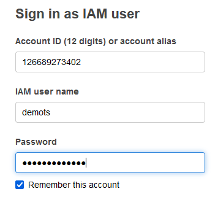
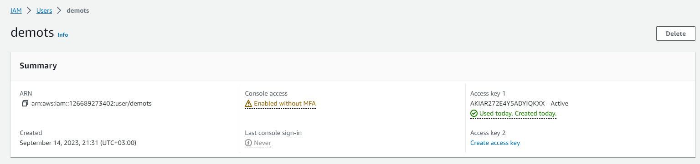

- Create access key (Download access key !)

- Add policy :
  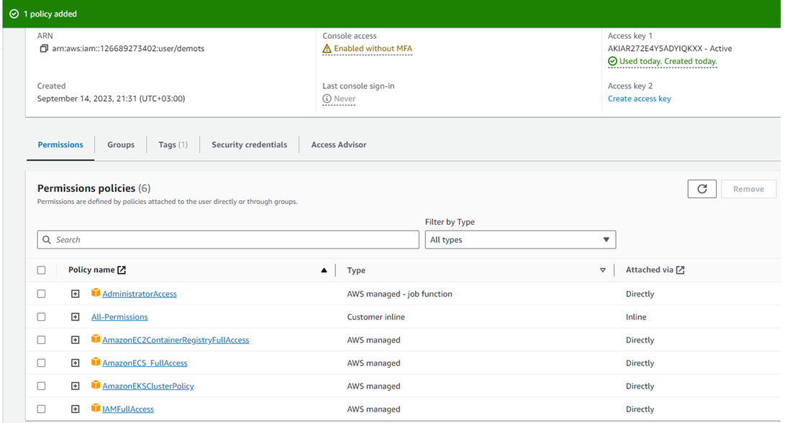

For inline (this will allow IAM User to have permissions for EKS):
```
{
	"Version": "2012-10-17",
	"Statement": [
		{
			"Sid": "eksadministrator",
			"Effect": "Allow",
			"Action": "eks:*",
			"Resource": "*"
		}
	]
}

```


### Download/Install  AWS CLI : https://docs.aws.amazon.com/cli/latest/userguide/getting-started-install.html
```
msiexec.exe /i https://awscli.amazonaws.com/AWSCLIV2.msi
```

- Install Kubectl  
```
curl.exe -O https://s3.us-west-2.amazonaws.com/amazon-eks/1.27.4/2023-08-16/bin/windows/amd64/kubectl.exe
```
https://docs.aws.amazon.com/eks/latest/userguide/install-kubectl.html


 ## Connect to CLI  
- Run :
```
aws configure

- Result:
AWS Access Key ID [****************QKXX]: AKIAR272E4Y5ADSDJGDGGDHD
AWS Secret Access Key [****************ZJcw]: H2y8zrRa71IgPM+6tAKCw4awert34t54twertw34t34
Default region name [None]:
Default output format [None]:

```

# Create cluster 

Help : https://docs.aws.amazon.com/eks/latest/userguide/create-cluster.html

Enter : https://eu-north-1.console.aws.amazon.com/eks/home?region=eu-north-1#/cluster-create

Create Cluster -> Name : Pets  -> follow the screen (Next, Next.... )

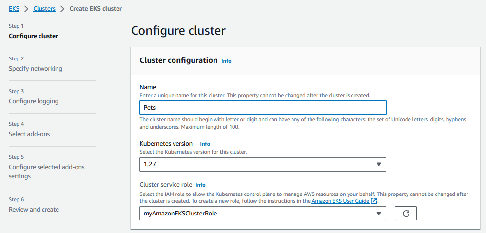

- After cluster is created
Check cluster status :
```
 aws eks --region eu-north-1 describe-cluster --name pets --query cluster.status
```
Set Kubectl to aws session :
```
aws eks update-kubeconfig --region eu-north-1 --name pets
```
Kube config is saved in :C:\Users\{PC-Name}\.kube 

Link to EKS console :  https://eu-north-1.console.aws.amazon.com/eks

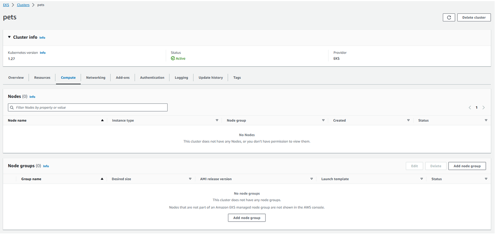

### Create Node in cluster 
Node are in Compute tab

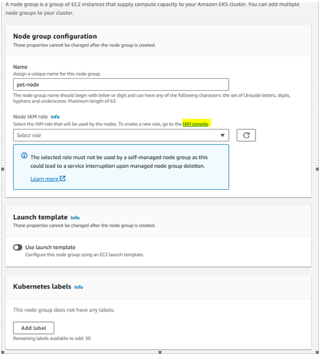
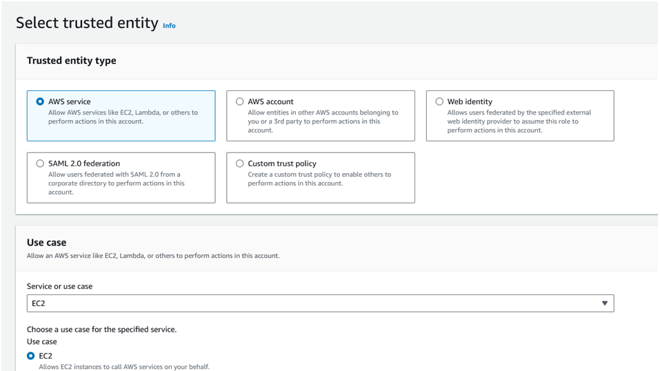

Worker node need 3 permissions :

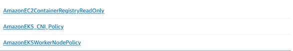

After the Node IAM role is created :

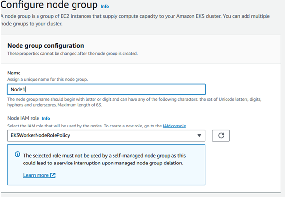


Check if node exist :

```
Kubectl get nodes
```

# Create  Amazon Elastic Container Registry

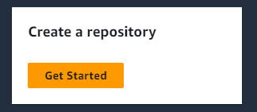

Create Repository

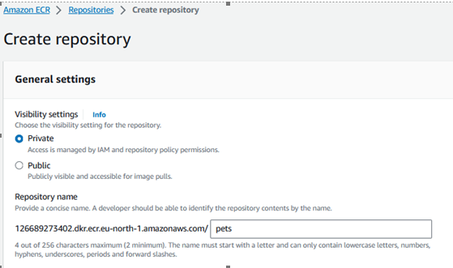

Whait until is finished 

Login to ecr :

```
aws ecr get-login-password --region eu-north-1 | docker login --username AWS --password-stdin 126689273402.dkr.ecr.eu-north-1.amazonaws.com
```

### Upload local image to ECR :

```
docker pull fredysa/web:1.0
docker pull fredysa/db:1.0
```
Modify Tag to be able to upload file in ECR repository
```
docker tag fredysa/web:1.0 126689273402.dkr.ecr.eu-north-1.amazonaws.com/pets:web
docker tag fredysa/db:1.0 126689273402.dkr.ecr.eu-north-1.amazonaws.com/pets:db
```
Push local image to ECR
```
docker push 126689273402.dkr.ecr.eu-north-1.amazonaws.com/pets:web
docker push 126689273402.dkr.ecr.eu-north-1.amazonaws.com/pets:db
```

Go to sample : 
```
cd c:\Docker\_en\M-14\sample\aws
```
Run template

```
kubectl apply -f .\animals.yaml
```

Check deploy :
```
kubectl get all

```

When deploy is complete visit web page from kubectl get all : http://a18329e1773a54018a867672c37186e2-799973039.eu-north-1.elb.amazonaws.com:3000/pet
