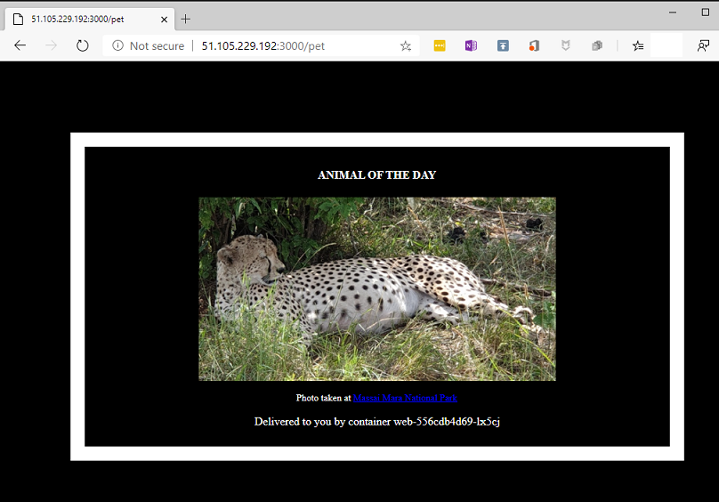

[](../M-14/README.md)
# Exploring Microsoft's Azure Kubernetes Service (AKS)
To experiment with Microsoft's container-related offerings in Azure, we need an account on Azure. You can create a trial account or use an existing account. You can get a free trial account here: **`https://azure.microsoft.com/en-us/free/`**.

Microsoft offers different container-related services on Azure. The easiest one to use is probably Azure Container Instances, which promises the fastest and simplest way to run a container in Azure, without having to provision any virtual machines and without having to adopt a higher-level service. This service is only really useful if you want to run a single container in a hosted environment. The setup is quite easy. In the Azure portal (**portal.azure.com**), you first create a new resource group and then create an Azure container instance. You only need to fill out a short form with properties such as the name of the container, the image to use, and the port to open. The container can be made available on a public or private IP address and will be automatically restarted if it crashes. There is a decent management console available, for example, to monitor resource consumption such as CPU and memory.

The second choice is **Azure Container Service (ACS)**, which provides a way to simplify the creation, configuration, and management of a cluster of VMs that are preconfigured to run containerized applications. ACS uses Docker images and provides a choice between three orchestrators: Kubernetes, Docker Swarm, and DC/OS (powered by Apache Mesos). Microsoft claims that their service can be scaled to tens of thousands of containers. ACS is free and you are only charged for computing resources.

In this section, we will concentrate on the most popular offering, based on Kubernetes. It is called AKS and can be found here: **`https://azure.microsoft.com/en-us/services/kubernetes-service/`**. AKS makes it easy for you to deploy applications into the cloud and run them on Kubernetes. All the difficult and tedious management tasks are handled by Microsoft and you can concentrate fully on your applications. What that means is that you will never have to deal with tasks such as installing and managing Kubernetes, upgrading Kubernetes, or upgrading the operating system of the underlying Kubernetes nodes. All this is handled by the experts at Microsoft Azure. Furthermore, you will never have to deal with etc or Kubernetes master nodes. This is all hidden from you, and the only things you will interact with are the Kubernetes worker nodes that run your applications.

# Preparing the Azure CLI
## Install Azure CLI
```
choco install azure-cli -y
```

# Docker
That said, let's start. We assume that you have created a free trial account or that you are using an existing account on Azure. There are various ways to interact with your Azure account. We will use the Azure CLI running on our local computer. We can either download and install the Azure CLI natively on our computer or run it from within a container running on our local Docker for Desktop. Since this book is all about containers, let's select the latter approach.

The latest version of the Azure CLI can be found on Docker Hub. Let's pull it:

``
docker image pull mcr.microsoft.com/azure-cli:latest
``

We will be running a container from this CLI and executing all subsequent commands from within the shell running inside this container. Now, there is a little problem we need to overcome. This container will not have a Docker client installed. But we will also run some Docker commands, so we have to create a custom image derived from the preceding image, which contains a Docker client. The Dockerfile that's needed to do so can be found in the ~/LAb-15-Cloud/sample/ folder and has this content:

```
FROM mcr.microsoft.com/azure-cli:latest
RUN apk update && apk add docker
```
```
docker build -t fredysa/azure-cli .
docker pull fredysa/azure-cli
```
On line 2, we are just using the Alpine package manager, apk, to install Docker. We can then use Docker Compose to build and run this custom image. The corresponding **docker-compose.yml** file looks like this:

```
version: "2.4"
services:
    az:
        image: fredysa/azure-cli
        build: .
        command: tail -F anything
        working_dir: /app
        volumes:
            - /var/run/docker.sock:/var/run/docker.sock
            - .:/app
```

- **Note:** Please note the command that is used to keep the container running, as well as the mounting of the Docker socket and the current folder in the volumes section. 

- **Tip :** If you are running Docker for Desktop on Windows, then you need to define the **`COMPOSE_CONVERT_WINDOWS_PATHS`**environment variable to be able to mount the Docker socket. Use
export **`COMPOSE_CONVERT_WINDOWS_PATHS=1`**from a Bash shell or **`$Env:COMPOSE_CONVERT_WINDOWS_PATHS=1`**when running PowerShell. Please refer to the following link for more details: https://github.com/docker/compose/issues/4240.
Now, let's build and run this container:

```
docker-compose up --build -d
```

Then, let's execute into the az container and run a Bash shell in it with the following:

```
docker-compose exec az /bin/bash

bash-5.0#
```

We will find ourselves running in a Bash shell inside the container. 

# Azure CLI or Docker Image

Let's first check the version of the CLI:

```
az --version
```
This should result in an output similar to this (shortened):

```
azure-cli 2.0.78
...
Your CLI is up-to-date.
```

OK, we're running on version **2.0.78**. Next, we need to log in to our account. Execute this command:

``
az login
``

You will be presented with the following message:

```
To sign in, use a web browser to open the page https://microsoft.com/devicelogin and enter the code <code> to authenticate.
```

Follow the instructions and log in through the browser. Once you have successfully authenticated your Azure account, you can go back to your Terminal and you should be logged in, as indicated by the output you'll get:


```
[
  {
    "cloudName": "AzureCloud",
    "id": "<id>",
    "isDefault": true,
    "name": "<account name>",
    "state": "Enabled",
    "tenantId": "<tenant-it>",
    "user": {
      "name": "xxx@hotmail.com",
      "type": "user"
    }
  }
]
```
Now, we are ready to first move our container images to Azure.

# Creating a container registry on Azure
First, we create a new resource group named **animal-rg**. In Azure, resource groups are used to logically group a collection of associated resources. To have an optimal cloud experience and keep latency low, it is important that you select a data center located in a region near you. You can use the following command to list all regions:

```
az account list-locations

[
  {
    "displayName": "East Asia",
    "id": "/subscriptions/186760ad-9152-4499-b317-c9bff441fb9d/locations/eastasia",
    "latitude": "22.267",
    "longitude": "114.188",
    "name": "eastasia",
    "subscriptionId": null
  },
  ...
]
```

This will give you a rather long list of all possible regions you can select from. Use the **name**, for example, **eastasia**, to identify the region of your choice. In my case, I will be selecting **westeurope**. Please note that not all locations listed are valid for resource groups.

The command to create a resource group is simple; we just need a name for the group and the location:

```
az group create --name animals-rg --location westeurope

{
  "id": "/subscriptions/186760ad-9152-4499-b317-c9bff441fb9d/resourceGroups/animals-rg",
  "location": "westeurope",
  "managedBy": null,
  "name": "animals-rg",
  "properties": {    
    "provisioningState": "Succeeded"
  },
  "tags": null,
  "type": "Microsoft.Resources/resourceGroups"
}
```

- **Note:** Make sure that your output shows "provisioningState": "Succeeded".

When running a containerized application in production, we want to make sure that we can freely download the corresponding container images from a container registry. So far, we have always downloaded our images from Docker Hub. But this is often not possible. For security reasons, the servers of a production system often have no direct access to the internet and thus are not able to reach out to Docker Hub. Let's follow this best practice and assume the same for our Kubernetes cluster that we are going to create in an instant.

So, what can we do? Well, the solution is to use a container image registry that is close to our cluster and that is in the same security context. In Azure, we can create an **Azure container registry (ACR)** and host our images there. Let's first create such a registry:

```
az acr create --resource-group animals-rg --name fredysa --sku Basic
```

Note that **<acr-name>** needs to be unique. In my case, I have chosen the name **fredysa**. The (shortened) output looks like this:

```
{
  "adminUserEnabled": false,
  "creationDate": "2019-12-22T10:31:14.848776+00:00",
  "id": "/subscriptions/186760ad...",
  "location": "westeurope",
  "loginServer": "fredysa.azurecr.io",
  "name": "fredysa",
  ...
  "provisioningState": "Succeeded",
```

After successfully creating the container registry, we need to log in to that registry using the following:

```
az acr login --name fredysa
Login Succeeded
WARNING! Your password will be stored unencrypted in /root/.docker/config.json.
Configure a credential helper to remove this warning. See
https://docs.docker.com/engine/reference/commandline/login/#credentials-store
```

Once we are successfully logged in to the container registry on Azure, we need to tag our containers correctly so that we can then push them to ACR. Tagging and pushing images to ACR will be described next.

# Pushing our images to ACR
Once we have successfully logged in to ACR, we can tag our images such that they can be pushed to the registry. For this, we need to get the URL of our ACR instance. We can do so with this command:

```
 az acr list --resource-group animals-rg --query "[].{acrLoginServer:loginServer}"  --output table

AcrLoginServer
------------------------
fredysa.azurecr.io
```

We now use the preceding URL to tag our images:

```
docker image tag fredysa/db:1.0 fredysa.azurecr.io/db:1.0
docker image tag fredysa/web:1.0 fredysa.azurecr.io/web:1.0
```

Then, we can push them to our ACR:

```
docker image push fredysa.azurecr.io/db:1.0
docker image push fredysa.azurecr.io/web:1.0
```

To double-check that our images are indeed in our ACR, we can use this command:

```
# az acr repository list --name <acr-name> --output table
az acr repository list --name fredysa --output table

Result
--------
db
web
```
Indeed, the two images we just pushed are listed. With that, we are ready to create our Kubernetes cluster.

# Creating a Kubernetes cluster
Once again, we will be using our custom Azure CLI to create the Kubernetes cluster. We will have to make sure that the cluster can access our ACR instance, which we just created and is where our container images reside. So, the command to create a cluster named **animals-cluster** with two worker nodes looks like this:

```
az aks create \
    --resource-group animals-rg \
    --name animals-cluster \
    --node-count 2 \
    --generate-ssh-keys \
    --attach-acr <acr-name>

az-cli:
az aks create  --resource-group animals-rg --name animals-cluster --node-count 2 --generate-ssh-keys --attach-acr fredysa
```

    
    
This command takes a while, but after a few minutes, we should receive some JSON-formatted output with all the details about the newly created cluster.

    More : https://learn.microsoft.com/en-us/cli/azure/aks?view=azure-cli-latest#az-aks-create
    
To access the cluster, we need **kubectl**. We can easily get it installed in our Azure CLI container using this command:

```
az aks install-cli
```

Having installed kubectl, we need the necessary credentials to use the tool to operate on our new Kubernetes cluster in Azure. We can get the necessary credentials with this:

```
az aks get-credentials --resource-group animals-rg --name animals-cluster
Merged "animals-cluster" as current context in /root/.kube/config
```

After the success of the preceding command, we can list all the nodes in our cluster:

```
kubectl get nodes

NAME                                STATUS   ROLES   AGE     VERSION
aks-nodepool1-12528297-vmss000000   Ready    agent   4m38s   v1.14.8
aks-nodepool1-12528297-vmss000001   Ready    agent   4m32s   v1.14.8
```

As expected, we have two worker nodes up and running. The version of Kubernetes that is running on those nodes is **1.15.11**.

We are now ready to deploy our application to this cluster. In the next section, we are going to learn how we can do this.

# Deploying our application to the Kubernetes cluster
To deploy the application, we can use the **`kubectl apply`** command:

```
kubectl apply -f animals.yaml 
```
The output of the preceding command should look similar to this:

```
deployment.apps/web created
service/web created
deployment.apps/db created
service/db created
```

Now, we want to test the application. Remember that we had created a service of type LoadBalancer for the web component. This service exposes the application to the internet. This process can take a moment, as AKS, among other tasks, needs to assign a public IP address to this service. We can observe this with the following command:

```
 kubectl get service web --watch
```

Please note the --watch parameter in the preceding command. It allows us to monitor the progress of the command over time. Initially, we should see output like this:

```
NAME TYPE        CLUSTER-IP  EXTERNAL-IP  PORT(S)         AGE
web LoadBalancer 10.0.124.0  <pending>    3000:32618/TCP  5s
```

The public IP address is marked as pending. After a few minutes, that should change to this:

```
NAME TYPE        CLUSTER-IP  EXTERNAL-IP    PORT(S)         AGE
web LoadBalancer 10.0.124.0  51.105.229.192 3000:32618/TCP  63s
```

Our application is now ready at the IP address **51.105.229.192** and port number **3000**. Note that the load balancer maps the internal port **32618** to the external port **3000**; this was not evident to me the first time.

Let's check it out. In a new browser tab, navigate to **`http://51.105.229.192:3000/pet`** and you should see our familiar application:




Our sample application running on AKS


With that, we have successfully deployed our distributed application to Kubernetes hosted in Azure. We did not have to worry about installing or managing Kubernetes; we could concentrate on the application itself.

Now that we are done experimenting with the application, we should not forget to delete all resources on Azure to avoid incurring unnecessary costs. We can delete all resources created by deleting the resource group as follows:

```
 az group delete --name animal-rg --yes --no-wait 
```

Azure has a few compelling offerings regarding the container workload, and the lock-in is not as evident as it is on AWS due to the fact that Azure does mainly offer open source orchestration engines, such as Kubernetes, Docker Swarm, DC/OS, and Rancher. Technically, we remain mobile if we initially run our containerized applications in Azure and later decide to move to another cloud provider. The cost should be limited.

- **Note**: It is worth noting that, when you delete your resource group, the Azure Active Directory service principal used by the AKS cluster is not removed. Refer to the online help for details on how to delete the service principal.

Next on the list is Google with their Kubernetes Engine.
