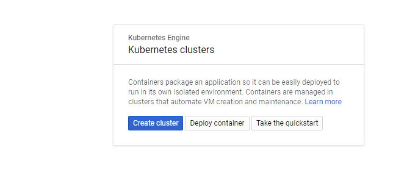
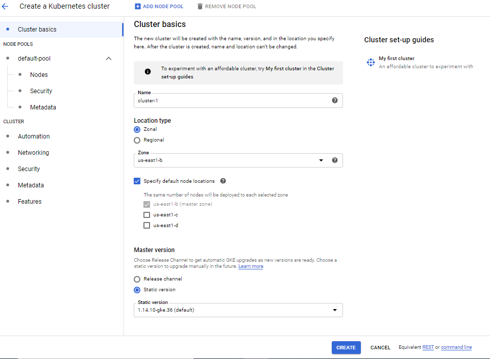
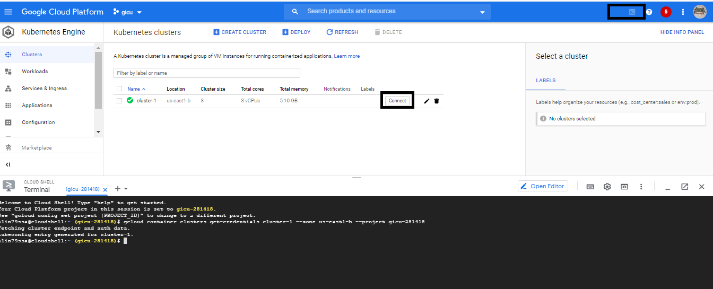

[](../M-14/README.md)
# Understanding GKE
Google is the inventor of Kubernetes and, to this date, the driving force behind it. You would therefore expect that Google has a compelling offering around hosted Kubernetes. Let's have a peek into it now. To continue, you need to either have an existing account with Google Cloud or create a test account here: https://console.cloud.google.com/freetrial. Proceed with the following steps:

- In the main menu, select Kubernetes Engine. The first time you do that, it will take a few moments until the Kubernetes engine is initialized.
- Next, create a new project and name it **massai-mara**; this may take a moment.
- Once this is ready, we can create a cluster by clicking on Create Cluster in the popup.

    

- Select the Your first cluster template on the left-hand side of the form.

    

- Name the cluster **cluster-1**, select the region or zone that's closest to you, leave all other settings in the Create a Kubernetes Cluster form with their default values, and click on Create at the bottom of the form.

It will again take a few moments to provision the cluster for us. Once the cluster has been created, we can open Cloud Shell by clicking on the shell icon in the upper-right corner of the view. This should look similar to the following screenshot:

   

The first Kubernetes cluster ready and Cloud Shell open in GKE

We can now clone our labs GitHub repository to this environment with the following command:

```
 git clone https://github.com/zizo-ro/Docker.git
cd ~/M-14/sample/gke/
```

We should now find an **animals.yaml** file in the current folder, which we can use to deploy the animals application into our Kubernetes cluster. Have a look at the file:
``
less animals.yaml
``

It has pretty much the same content as the same file we used in the previous chapter. The two differences are these:

- We use a service of type **LoadBalancer**(instead of **NodePort**) to publicly expose the web component.
- We do not use volumes for the PostgreSQL database since configuring StatefulSets correctly on GKE is a bit more involved than in Minikube. The consequence of this is that our animals application will not persist the state if the **db** pod crashes. How to use persistent volumes on GKE lies outside the scope of this book.

Also, note that we are not using Google Container Registry to host the container images but are instead directly pulling them from Docker Hub. It is very easy, and similar to what we have learned in the section about AKS, to create such a container registry in Google Cloud.


Having done that, it's time to deploy the application:

```
kubectl create -f animals.yaml

deployment.apps/web created
service/web created
deployment.apps/db created
service/db created
```

Once the objects have been created, we can observe the LoadBalancer service web until it is assigned a public IP address:

```
 kubectl get svc/web --watch

NAME   TYPE           CLUSTER-IP   EXTERNAL-IP     PORT(S)          AGE
web    LoadBalancer   10.0.5.222   <pending>       3000:32139/TCP   32s
web    LoadBalancer   10.0.5.222   146.148.23.70   3000:32139/TCP   39s
```

The second line in the output is showing the situation while the creation of the load balancer is still pending, and the third one gives the final state. Press Ctrl + C to quit the watch command. Apparently, we got the public IP address **146.148.23.70** assigned and the port is **3000**.

We can then use this IP address and navigate to **`http://<IP address>:3000/pet`**, and we should be greeted by the familiar animal image.

Once you are done playing with the application, delete the cluster and the project in the Google Cloud console to avoid any unnecessary costs.

```
gcloud container clusters delete cluster-1
gcloud projects delete massai-mara
```
We have created a hosted Kubernetes cluster in GKE. We have then used Cloud Shell, provided through the GKE portal, to first clone our **labs** GitHub repository and then the **kubectl** tool to deploy the animals application into the Kubernetes cluster. 

When looking into a hosted Kubernetes solution, GKE is a compelling offering. It makes it very easy to start, and since Google is the main driving force behind Kubernetes, we can rest assured that we will always be able to leverage the full functionality of Kubernetes.